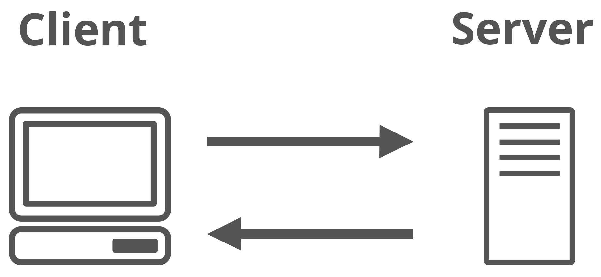

# Tujuan Pembelajaran
Di modul ini, Anda akan mempelajari bagaimana cara:

 - Merangkum manfaat menggunakan AWS.
 - Menjelaskan perbedaan antara penyajian on-demand dan penerapan cloud.
 - Merangkum model harga pay-as-you-go.
Oke, mari kita lanjutkan ke materi berikutnya!

# Selamat Datang di Kedai Kopi
Kelas ini akan mencakup semua informasi penting yang perlu Anda pahami seputar AWS. Dengan begitu, Anda dapat mengetahui mengapa AWS itu bermanfaat bagi kebutuhan perusahaan dan bisnis saat ini.

AWS menawarkan berbagai macam layanan untuk setiap kegunaan. Dimulai dengan elemen dasar, seperti komputasi, penyimpanan, dan keamanan jaringan, hingga solusi kompleks seperti blockchain, machine learning, atau artificial intelligence (kecerdasan buatan), serta platform pengembangan robot.

Bahkan termasuk juga layanan yang sangat terspesialisasi, seperti sistem manajemen produksi video dan satelit orbital yang dapat Anda sewa setiap menit.

Namun semua hal tersebut nampaknya terlalu kompleks dan perlu lebih banyak waktu untuk kita bahas di kelas dasar seperti ini. Jadi, mari kita sederhanakan pembahasan kita dengan memulai dari model komputasi cloud dasar.

Tahukah Anda? Hampir semua model komputasi modern adalah berbentuk client-server.

Dalam dunia komputasi, client dapat berupa web browser atau aplikasi yang dapat membuat permintaan ke server. Sebuah server dapat berupa layanan seperti Amazon Elastic Compute Cloud (Amazon EC2).

Contoh interaksinya adalah client membuat permintaan untuk mengakses sebuah artikel berita, skor dalam game online, atau video lucu lalu server mengevaluasi detail permintaan tersebut dan memenuhinya dengan mengembalikan informasi ke client.

Oke, mungkin pembahasan di atas terlalu teknis ya. Bagaimana kalau kita membuat suatu perumpamaan yang dapat digunakan secara berkelanjutan di setiap modulnya? Tapi perumpamaan seperti apa ya yang dapat mencakup setiap pembahasan di kelas ini?

Bagaimana dengan skenario kedai kopi? Sepertinya menarik. Kedai kopi ini akan memberi kita beberapa metafora dunia nyata untuk membantu Anda memahami mengapa AWS dapat mengubah cara pengoperasian IT di seluruh dunia.

Kita mulai dari sebuah pertanyaan dasar. Apa saja elemen yang ada di sebuah kedai kopi? Kasir dan pelanggan, tentu.

Dalam model client-server. Kasir berperan sebagai server sedangkan pelanggan adalah client. Di kedai kopi pelanggan membuat suatu permintaan berupa segelas kopi. Namun di dunia komputasi, permintaan dapat berbentuk apa pun: analisis pola hujan di negara Afrika Selatan, rontgen terbaru dari lutut Anda, atau mungkin video anak kucing yang menggemaskan.

Apa pun bisnisnya, pada dasarnya client membuat suatu permintaan--tentu dengan telah memiliki izin akses--kemudian server menanggapi permintaan tersebut.

Kembali ke kedai kopi. Kasir adalah server-nya. Di AWS, kasir tersebut diberi nama Amazon Elastic Compute Cloud (EC2), sebuah server virtual dan kita akan memanggilnya instance.

Mari kita lihat proses transaksi yang terjadi antara kasir dan pelanggan ini dari sudut pandang arsitektural.

 1. Pelanggan (client) membuat permintaan ke kasir (server).
 2. Kasir memvalidasi bahwa permintaan tersebut sah, dalam hal ini apakah pelanggan telah membayar atau belum.
 3. Jika ya, maka kasir akan ke belakang untuk membuat kopi sesuai permintaan.
 4. Setelah selesai, kasir tersebut akan kembali kepada pelanggan dengan membawa kopinya, dalam hal ini adalah kapucino dengan ekstra karamel. Yummy!
Di dunia nyata, aplikasi bisa lebih rumit dari sekadar satu transaksi dengan satu server, bahkan bisa menjadi sangat kompleks ketika diterapkan ke dalam solusi bisnis yang mapan.

Nah, untuk menghindari kompleksitas ini, mari kita mulai dengan yang simpel, seperti konsep utama di AWS, yakni pay for what you use (bayar untuk apa yang Anda gunakan).

Prinsip ini sangat tepat dan masuk akal dengan skenario kedai kopi kita. Pegawai hanya dibayar saat mereka bekerja di toko. Jika mereka tidak bekerja, maka tidak ada gaji. Pemilik kedai dapat memutuskan berapa banyak pegawai yang dia butuhkan lalu memberikan mereka upah sesuai jam kerja.

Sebagai contoh, kedai kopi tersebut akan merilis minuman baru, Robusta. Delicioso!

Untuk mengantisipasi peluncuran ini, Anda bisa mempekerjakan selusin pegawai sepanjang hari guna berjaga-jaga jika pelanggan membludak berdatangan secara tak terduga di hari spesial tersebut. Hanya saja, pelanggan tidak selalu akan membludak setiap saat, bukan?

Tapi tahukah Anda? Inilah yang sebenarnya terjadi di data center on-premise (lokal). Anda tidak bisa hanya sekadar menjentikkan jari lalu voila! Kapasitas Anda berlipat ganda dengan sendirinya. Nope. Banyak proses administratif yang perlu Anda lakukan dan berujung pada mahalnya biaya yang perlu Anda keluarkan.

Dengan Amazon Web Service, Anda tidak perlu membayar uang muka untuk apa pun dan tidak perlu khawatir tentang kendala kapasitas.

Oke. Sekarang kita menemukan istilah baru, data center on-premise. Apa itu? Mari kita kupas.

Pertama, data center. Berdasarkan website Cisco--salah satu perusahaan telekomunikasi global--data center adalah fasilitas yang digunakan perusahaan untuk menempatkan aplikasi dan data penting mereka. Komponen utama dari data center adalah router, switch, firewall, sistem penyimpanan, dan juga server [1].

Sementara on-premise mengacu pada penyimpanan dan pemeliharaan data di server lokal atau pribadi.

Lanjut ke prinsip berikutnya, yaitu pay for what you need (bayar untuk apa yang Anda butuhkan). Misal ketika Anda membutuhkan sebuah instance atau mungkin barista, cukup dengan klik sebuah tombol ajaib segera mereka pun seketika tersedia untuk Anda. Dan ketika tak membutuhkannya, klik tombol lagi kemudian mereka akan pergi sesaat kemudian sehingga Anda tak perlu membayarnya lagi.

Prinsip ini menjadi nilai utama di AWS. Itulah alasan sebenarnya kelas ini dihadirkan, yakni untuk membantu Anda memahami bagaimana AWS dibangun untuk membantu Anda menjalankan bisnis dengan lebih baik.

Tetaplah pahami dan ikuti kelas ini dengan saksama karena kita akan segera menyelami konsep-konsep tersebut lebih dalam serta membantu Anda melangkah menuju Cloud Practitioner. Semangat!