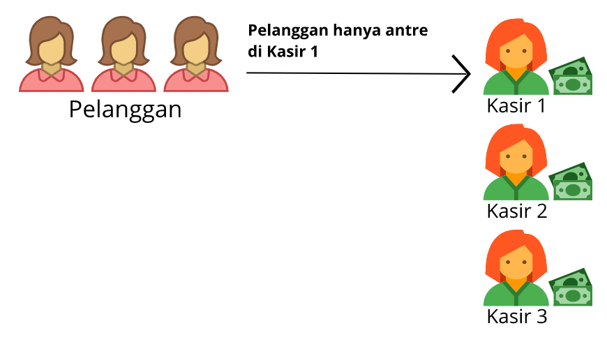
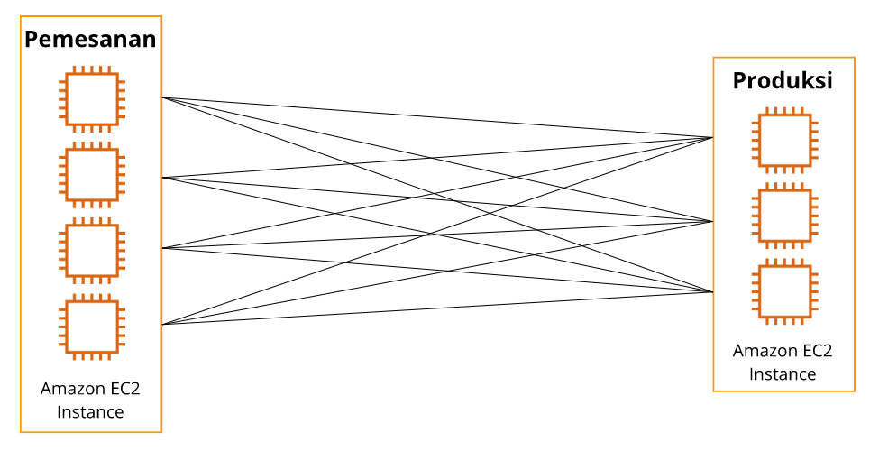
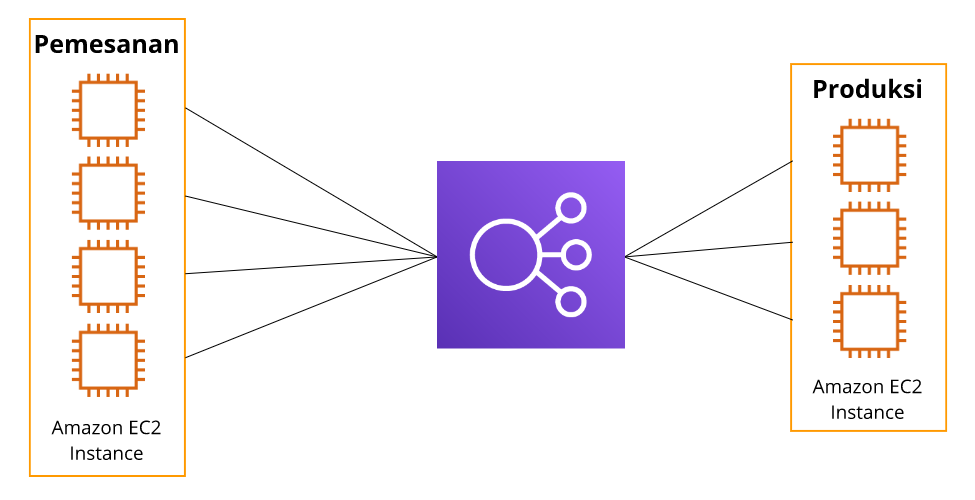

# Mengarahkan Traffic dengan Elastic Load Balancing
Di modul sebelumnya kita telah berhasil memecahkan masalah scaling (penyesuaian kapasitas) dengan Amazon EC2 Auto Scaling. Tapi kita masih punya satu masalah lainnya terkait traffic (lalu lintas).

Mari lihat situasinya di skenario kedai kopi. Sekarang kita memiliki 3 instance kasir yang disiapkan untuk menangani masalah ramainya pelanggan.

Namun anehnya, kebanyakan dari mereka malah mengantre di satu instance kasir saja sehingga menyebabkan distribusi pelanggan yang tidak merata. Ini membuat instance kasir yang lain hanya terdiam dan tak melakukan apa pun sambil terus menunggu pesanan.

Masalah ini bisa terjadi karena saat pelanggan tersebut datang, mereka tak yakin harus menuju ke kasir yang mana.

Lantas apa solusinya?

Akan sangat membantu jika kita mempekerjakan satu pegawai yang bertugas untuk menerima dan mengonfirmasi reservasi dari para pelanggan saat masuk ke kedai kopi. Peran semacam ini biasa disebut dengan nama host--bukan mesin fisik yang kita bahas sebelumnya ya--dan biasanya ditempatkan di depan pintu kedai kopi.

Host akan senantiasa mengarahkan setiap pelanggan yang baru masuk untuk berbaris di kasir dengan antrean terpendek. Dengan demikian, antrean pun akan merata di seluruh kasir sehingga pelanggan dapat terlayani dengan efisien.

Ide yang sama pun berlaku di lingkungan AWS. Katakanlah Anda memiliki beberapa EC2 instance yang menjalankan program serupa. Anda perlu mengarahkan setiap permintaan yang masuk untuk menuju ke EC2 instance tertentu. Anda juga harus memastikan bahwa distribusi beban kerja merata di seluruh EC2 instance sehingga tak ada satu instance pun yang menganggur.

Proses dari apa yang sejak tadi kita bincangkan ini disebut dengan load balancing (menyeimbangkan beban). Sedangkan aplikasi yang dapat menerima permintaan lalu mengarahkannya ke instance untuk diproses disebut dengan load balancer (penyeimbang beban).

Load balancer bertindak sebagai satu titik kontak untuk semua traffic web yang masuk ke Auto Scaling group Anda. Ini berarti saat Anda menambah atau menghapus Amazon EC2 instance sebagai respons terhadap jumlah traffic yang masuk, permintaan ini diarahkan ke load balancer terlebih dahulu. Barulah kemudian permintaan tersebut disebar ke berbagai sumber daya yang akan menanganinya.

# Elastic Load Balancing
AWS memiliki layanan load balancer yang berkinerja tinggi, hemat biaya, highly available (sangat tersedia), dan dapat diskalakan secara otomatis. Tak usah Anda menginstal, mengelola, memperbarui, melakukan scaling, menangani kegagalan, dan ketersediaan layanannya. AWS yang mengurus itu semua.

Perkenalkan Elastic Load Balancing (ELB), yaitu layanan AWS yang secara otomatis mendistribusikan traffic aplikasi yang masuk ke berbagai sumber daya, seperti Amazon EC2 instance.

Elastic Load Balancing merupakan salah satu layanan terkelola pertama yang akan kita telaah dalam kelas ini. Layanan ini dirancang untuk mengatasi undifferentiated heavy lifting--telah kita bahas di modul 1--dari load balancing.

Sebagai permulaan, Elastic Load Balancing adalah regional construct (konstruksi regional). Ini berarti ELB berjalan di tingkat Region, bukan pada individu EC2 instance sehingga membuatnya highly available secara otomatis.

ELB dapat diskalakan secara otomatis sehingga mampu menangani kepadatan traffic tanpa berdampak pada biaya per jamnya. Elastic Load Balancing dapat bekerja sama dengan Amazon EC2 Auto Scaling untuk membantu memastikan aplikasi yang berjalan di Amazon EC2 dapat memberikan kinerja dan ketersediaan tinggi.

Mari kita ilustrasikan penggunaan ELB yang berkolaborasi bersama layanan Amazon EC2 Auto Scaling dalam menangani traffic.

Anggaplah di suatu pagi aplikasi Anda memiliki traffic yang normal. Lalu di siang hari, Anda mengadakan promo flash sale secara besar-besaran di aplikasi bisnis Anda, tak lama kemudian lalu lintas pun semakin meningkat.

Saat traffic membanjiri aplikasi Anda, EC2 instance akan melakukan scaling out. Saat instance siap, Amazon EC2 Auto Scaling akan memberi tahu Elastic Load Balancing bahwa ia siap untuk menangani traffic.

Katakanlah malam tiba dan promo flash sale pun berakhir. Ini membuat traffic pada aplikasi Anda semakin berkurang sehingga Amazon EC2 Auto Scaling harus melakukan scaling in. Artinya, ada beberapa EC2 instance yang akan diakhiri.

Tapi sebelum itu, ELB akan berhenti mengirimkan traffic kepada instance yang akan diakhiri tersebut dan menunggu hingga permintaan selesai ditangani. Setelah selesai, barulah Amazon EC2 Auto Scaling bisa mengakhiri instance tanpa mengganggu aktivitas pelanggan yang ada.

Selain untuk lalu lintas eksternal, Anda juga bisa menggunakan ELB untuk traffic di dalam arsitektur AWS. Mari kita lihat ilustrasikan bagaimana ELB berperan menangani komunikasi untuk setiap instance di antara bidang pemesanan dan produksi.

Sebelum menggunakan ELB, setiap instance di bidang pemesanan mengetahui seluruh instance produksi. Jadi, jika ada instance baru di bidang produksi, dia harus memberi tahu semua instance pemesanan bahwa sekarang dirinya dapat menerima traffic. Huh! Ini cukup rumit ya walau hanya ada 4 instance.

Sekarang bayangkan jika Anda memiliki ratusan instance di kedua bidang tersebut. Ampun! Tak sanggup lagi Anda bayangkan akan betapa kacaunya. Dengan kompleksitas seperti itu, mustahil rasanya membuat mereka tetap terhubung secara efisien.

Nah, di momen inilah ELB hadir memberikan solusi terbaik sehingga sekarang kita bisa menuntaskan kacau balau traffic pada bidang produksi. Mari kita pecahkan!

Kita telah menyinggung di awal bahwa ELB bersifat regional. Ini membuat setiap instance di bidang pemesanan dapat menggunakan satu URL saja dan ELB pun akan mengarahkannya ke instance produksi yang memiliki permintaan paling sedikit.

Lantas, bagaimana jika ada instance baru di bidang produksi? Mudah. Instance tersebut cukup memberi tahu ELB bahwa dirinya siap menerima traffic. Instance di bidang pemesanan tak perlu tahu dan tak akan peduli ada berapa banyak instance yang berjalan di bidang produksi. Sekali lagi, inilah yang dinamakan decoupled architecture (arsitektur yang terpisah).

Ada lebih banyak lagi hal yang dapat dilakukan oleh ELB yang nanti akan kita pelajari. Kesimpulannya, pilihlah layanan yang tepat untuk tugas yang tepat. Itulah salah satu alasan mengapa AWS menawarkan begitu banyak layanan yang beragam.

Selanjutnya, kita akan mengupas beberapa layanan lain yang mungkin bekerja lebih baik untuk beberapa arsitektur.