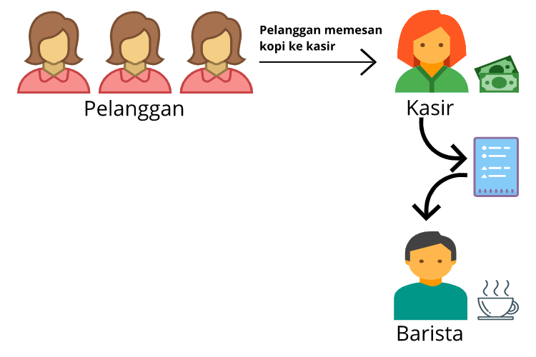
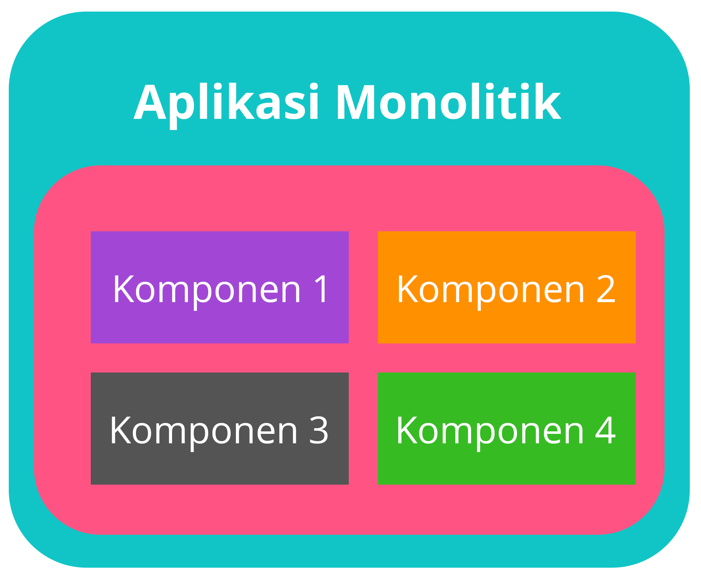
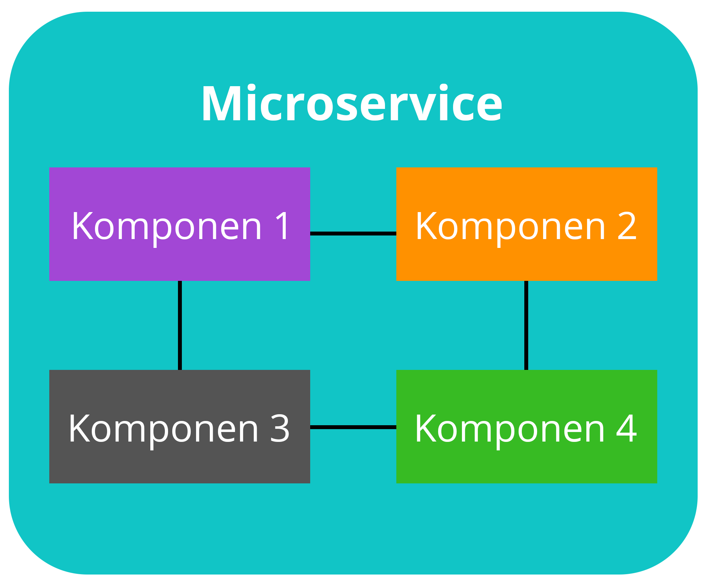

# Messaging dan Queueing
Mari kita membahas tentang perpesanan dan antrean. Di skenario kedai kopi, ada dua jenis peran: kasir--yang menerima pesanan dari pelanggan--dan barista--yang membuat pesanan.

Proses interaksi di antara keduanya adalah seperti ini: kasir mengambil pesanan dari pelanggan, menuliskannya dengan pena dan kertas, dan mengirimkannya ke barista. Kemudian, barista mengambil kertas tersebut dan membuat pesanan.

Saat pesanan berikutnya masuk, prosesnya berulang. Proses ini akan bekerja dengan baik selama kasir dan barista selaras. Tetapi, apa yang akan terjadi jika kasir ingin menyerahkan pesanan pelanggan namun barista sedang istirahat atau sibuk dengan pesanan lain?

Kasir tersebut akan berhenti melayani sampai barista siap mengambil pesanan. Pada titik tertentu pesanan mungkin akan dibatalkan dan kasir pun melayani pelanggan berikutnya.

Coba amati! Kasus tersebut adalah proses yang tak sempurna. Ini karena jika kasir atau barista tidak sinkron, maka keseluruhan prosesnya akan terganggu sehingga menyebabkan lambannya penerimaan pesanan. Bahkan bisa sampai mengakibatkan kegagalan penyelesaian pesanan. Ah! Tentu Anda tak ingin ini terjadi, bukan?

Jadi, bagaimana jalan keluar yang paling efektif untuk kasus ini?

Solusi terbaik untuk menangani masalah ini adalah dengan menyediakan semacam buffer (antrean pesanan) ke dalam sistem. Daripada menyerahkan pesanan langsung ke barista, kasir akan menaruhnya ke semacam papan pesanan. Barista akan memeriksa buffer tersebut dan membuat minuman sesuai pesanan.

Setelah minuman tersaji dan memberikannya kepada pelanggan, barista akan menghapus pesanan yang sudah selesai tersebut dari buffer. Dengan begitu, selagi barista menyiapkan minuman, kasir dapat terus menerima pesanan baru dan menambahkannya ke buffer.

Ide dari menempatkan pesan ke dalam buffer disebut messaging dan queueing. Sama seperti kasir yang mengirimkan pesanan ke barista, aplikasi saling mengirim pesan untuk berkomunikasi. Ketika aplikasi berkomunikasi secara langsung seperti kasus kasir dan barista kita sebelumnya, maka itu disebut dengan tightly coupled architecture.

Ciri khas dari arsitektur yang tightly coupled adalah jika ada satu komponen yang gagal atau berubah, maka kegagalan ini memicu masalah untuk komponen lain atau bahkan keseluruhan sistem.

Misalnya kita punya aplikasi A yang mengirimkan pesan langsung ke aplikasi B. Jika aplikasi B mengalami kegagalan dan tak dapat menerima pesan tersebut, maka aplikasi A pun akan terkena eror juga.

Desain aplikasi seperti ini dapat dianggap sebagai pendekatan monolithic application alias aplikasi monolitik, yaitu saat berbagai komponen digabungkan menjadi satu kesatuan.

Nah, untuk mengatasi masalah ini kita harus membuat arsitektur yang lebih andal dengan loosely coupled architecture. Karakter dari arsitektur ini adalah jika satu komponen gagal, maka komponen tersebut akan diisolasi sehingga tak akan menyebabkan kegagalan beruntun ke seluruh sistem. Lebih baik yang ini, bukan?

Sama seperti di kedai kopi yang menyertakan buffer di antara kasir dan barista, kita juga dapat menggunakan komponen yang serupa, yaitu message queue (antrean pesan).

Pesan dikirim ke antrean oleh aplikasi A dan diproses oleh aplikasi B. Jika aplikasi B gagal, aplikasi A tidak mengalami gangguan apa pun. Pesan yang dikirim masih dapat dikirim ke antrean dan akan tetap berada di sana sampai akhirnya diproses.

Desain aplikasi semacam ini merupakan pendekatan dari microservice (layanan mikro), yaitu saat komponen dibuat menjadi loosely coupled sehingga dapat dikembangkan, di-deploy (diterapkan), dan dikelola secara independen. Setiap komponen mempunyai tugasnya masing-masing dan juga dapat berkomunikasi satu sama lain.

Oke, jadi layanan apa yang dapat kita gunakan di AWS?

Perkenalkan dua layanan AWS yang dapat membantu Anda dalam meraih arsitektur yang loosely coupled: Amazon Simple Queue Service (Amazon SQS) dan Amazon Simple Notification Service (Amazon SNS).

Tetapi sebelum kita menyelami keduanya, marilah memesan sebuah kopi terlebih dahulu di website kedai kopi kita. Sudah? Oke, kita tunggu saja. Seharusnya kita akan mendapatkan notifikasi saat pesanan itu siap. Lanjut!

# Amazon Simple Queue Service (Amazon SQS)
Amazon Simple Queue Service (Amazon SQS) memungkinkan Anda untuk mengirim, menyimpan, dan menerima pesan antar komponen perangkat lunak dengan volume berapa pun tanpa perlu khawatir akan kehilangan pesan tersebut atau membutuhkan layanan lain untuk menyediakan pesan. Data yang terkandung di dalam pesan disebut payload dan itu dilindungi hingga terkirim.

Amazon SQS queue adalah tempat di mana pesan ditaruh sampai diproses. Cara kerjanya adalah aplikasi A akan mengirim sebuah pesan ke dalam queue lalu aplikasi B akan mengambilnya, memprosesnya, dan kemudian menghapusnya dari antrean.

AWS mengelola infrastruktur yang mendasarinya sehingga layanan ini dapat otomatis diskalakan, andal, serta mudah dikonfigurasi dan digunakan.

Jika Anda sukar memahaminya, bayangkan saja sebuah pesan sebagai sebuah pesanan kopi dan SQS queue adalah buffer, sebagaimana yang terdapat di skenario kedai kopi kita.

# Amazon Simple Notification Service (Amazon SNS)
Amazon Simple Notification Service (Amazon SNS) juga digunakan untuk mengirimkan pesan ke layanan. Bedanya, ia juga dapat mengirimkan pemberitahuan ke pelanggan.

Proses tersebut dilakukan dengan cara yang berbeda, yaitu menggunakan model publish/subscribe alias pub/sub. Itu artinya Anda dapat membuat suatu saluran untuk menyampaikan pesan yang disebut dengan SNS topic. Jika ingin mempublikasikan pesan (publish), Anda bisa mengatur pelanggan (subscribers) yang akan menerima topik tersebut.

Dalam praktiknya, Anda dapat mengirim satu pesan ke SNS topic yang kemudian akan menyebar ke semua subscribers dalam sekali jalan. Subscribers dapat berupa endpoint (titik akhir) layanan lain, seperti SQS queue, fungsi AWS Lambda--akan kita bahas nanti, dan juga server web.

Selain itu, Amazon SNS dapat digunakan untuk menyebarkan notifikasi kepada pelanggan menggunakan push notification (pesan yang muncul di perangkat seluler), SMS, dan email.

Nah, begitu juga dengan skenario kedai kopi. Kita dapat mengirimkan pemberitahuan kepada pelanggan ketika pesanan mereka sudah siap untuk diambil, bisa berupa SMS atau push notification.

Wah! Sepertinya kopi yang telah kita pesan tadi sudah siap diambil. Apakah Anda menerima pemberitahuannya juga?

# Studi Kasus: Amazon SNS
Katakanlah Anda membuat suatu buletin di kedai kopi berupa pembaruan yang mencakup informasi kupon, trivia kopi, dan produk baru. Semua informasi ini dikelompokkan menjadi satu topik karena ini adalah buletin tunggal. Semua pelanggan yang berlangganan buletin menerima pembaruan tentang topik-topik tersebut.

Tak lama kemudian, beberapa pelanggan Anda memberikan umpan balik bahwa mereka lebih suka menerima buletin terpisah hanya untuk topik tertentu saja, sesuai ketertarikan mereka. Anda pun mengabulkannya.

Sekarang buletin di kedai kopi telah terbagi menjadi tiga: kupon, trivia kopi, dan produk baru. Pelanggan pun akan menerima buletin sesuai dengan topik tertentu yang mereka inginkan. Mereka dapat berlangganan satu topik atau beberapa topik sekaligus.

Misalnya, pelanggan pertama hanya berlangganan topik kupon; pelanggan kedua hanya berlangganan topik trivia kopi; dan pelanggan ketiga berlangganan topik kopi trivia dan produk baru.

Meskipun contoh dari kedai kopi ini melibatkan pelanggan yang merupakan manusia, di Amazon SNS, pelanggan/subscribers dapat berupa server web, alamat email, AWS Lambda function, atau beberapa opsi lainnya.
