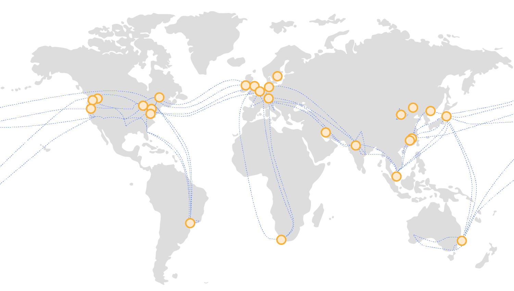
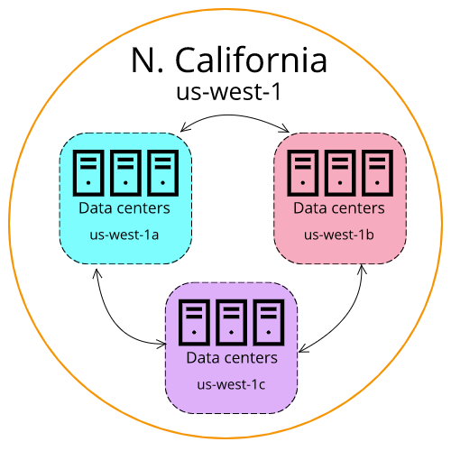

# Infrastruktur Global AWS
Untuk memahami infrastruktur global AWS, yuk kita mulai dengan menguraikan kebutuhan dasar untuk memulai bisnis di masa sekarang ini. Apa saja? Tentu kita membutuhkan:

  - Aplikasi yang harus berjalan.
  - Konten yang perlu disimpan.
  - Data yang perlu dianalisis.

Intinya, kita memiliki sesuatu yang harus berjalan dan beroperasi di suatu tempat. Sebelum adanya teknologi Cloud, perusahaan harus menjalankan aplikasi mereka di on-premise karena mereka tak punya pilihan lain. Namun setelah AWS hadir, mereka dapat menjalankannya di data center lain tanpa harus memilikinya.

Tetapi pembahasan kita di modul ini akan jauh lebih dari itu. Kita harus memahami masalah yang `fundamental terkait data center`.

Kejadian tak terduga seperti terputusnya koneksi ke data center dapat terjadi kapan pun. Ada banyak faktor yang dapat memengaruhi problem seperti ini, salah satunya adalah `bencana`.

Jika Anda menjalankan on-premise(lokal), apa yang akan Anda lakukan saat bencana melanda data center tersebut? Mungkin solusinya adalah membangun data center kedua. Tapi ini bukan solusi yang terbaik.

Harga gedung atau bangunan untuk membangun data center akan `terlalu mahal` bahkan bisa jadi menghentikan bisnis Anda. Belum lagi biaya untuk perangkat keras, karyawan, listrik, pemanas dan pendingin, serta keamanan.

Oleh sebab itu, sebagian besar perusahaan pada akhirnya hanya menyimpan data cadangan mereka di suatu tempat dan berharap bencana tidak akan pernah datang. Kita semua tahu, harapan bukanlah rencana bisnis yang baik.

Tapi, tenang! AWS dapat membantu Anda mengatasi persoalan tersebut. Solusinya adalah dengan membangun data center dalam kelompok besar yang disebut dengan `AWS Regions` (Wilayah/Region AWS).

Mari kita bahas bagaimana AWS Regions didesain.

# AWS Regions

Diambil dari Jaringan Infrastruktur Global AWS.

AWS telah membangun Region di seluruh dunia agar permintaan traffic bisnis `dapat dilayani` oleh `Region terdekat`. Beberapa contoh lokasi Region adalah kota Paris, Tokyo, Sao Paulo, Dublin, Ohio, dll.

Di dalam Region, AWS memiliki beberapa data center yang berisi semua sumber daya yang dibutuhkan seperti komputasi, penyimpanan, jaringan, dll.

Setiap Region tersebut dapat terkoneksi ke Region lain melalui `high speed fiber network` (jaringan fiber berkecepatan tinggi) yang dikontrol oleh AWS--kita membutuhkannya untuk operasi yang benar-benar global dari satu lokasi ke lokasi lainnya di seluruh dunia.

Ketahuilah! AWS memungkinkan Anda untuk dapat memilih Region mana yang ingin dijalankan. Selain itu, setiap Region juga terisolasi dari Region lainnya. Ini berarti tidak akan ada data yang masuk atau keluar dari Region tersebut kecuali Anda secara eksplisit mengizinkan data itu untuk berpindah.

Misalnya begini. Anda memiliki suatu `persyaratan compliance` (kepatuhan) dari pemerintah yang menyatakan bahwa informasi keuangan Anda yang berada di kota Frankfurt tidak dapat meninggalkan negara Jerman.

Di sinilah bagaimana AWS benar-benar beroperasi secara `out of the box alias unik`. Di AWS:
  - Setiap data yang disimpan di Region Frankfurt tidak pernah meninggalkan Region Frankfurt.
  - Setiap data di Region London tidak pernah meninggalkan Region London.
  - Setiap data yang berada di Sydney tidak pernah meninggalkan Region Sydney.

Intinya, semua data yang disimpan di dalam Region, tak akan pernah meninggalkan Region tersebut, kecuali Anda secara `eksplisit--dengan kredensial` dan izin yang `tepat--meminta` data tersebut untuk diekspor.

`Regional data sovereignty atau kedaulatan data regional` adalah bagian dari desain penting AWS Regions, di mana data mengikuti hukum dan undang-undang lokal negara tempat Region berada.

Nah, setelah kita tahu bahwa data dan aplikasi akan tinggal dan berjalan di suatu Region, Anda harus memilih Region mana yang tepat dan sesuai dengan kebutuhan. Ada 4 faktor bisnis yang menentukan pemilihan suatu Region.

1. Compliance (Kepatuhan)
   Sebelum faktor lainnya, Anda harus terlebih dahulu melihat compliance requirement (persyaratan kepatuhan) Anda. Titik. Opsi lainnya menjadi tidak penting saat Anda memiliki persyaratan kepatuhan.

   Misalnya, jika Anda memiliki persyaratan bahwa data Anda harus tinggal di perbatasan negara Inggris, maka pilihlah Region London. Atau jika Anda harus masuk ke dalam perbatasan negara Cina, maka Anda bisa memilih salah satu Region Cina.

   Namun, sebagian besar perusahaan tidak diatur oleh regulasi yang ketat semacam itu. Jadi, jika Anda tidak memiliki kontrol kepatuhan atau regulasi yang mewajibkan penentuan Region, maka Anda dapat mempertimbangkan faktor lain.

2. Proximity (Kedekatan)
   Memilih region yang paling dekat dengan basis pelanggan akan membantu Anda untuk mengirimkan konten lebih cepat kepada mereka.

   Katakanlah suatu perusahaan berlokasi di Washington, DC, namun kebanyakan pelanggannya tinggal di negara Singapura. Nah, untuk kasus ini, solusi yang tepat adalah dengan menjalankan infrastruktur di Region Northern Virginia agar dekat dengan lokasi perusahaan dan menerapkan aplikasi dari Region Singapura.

   Dengan begitu, latensi (waktu yang diperlukan untuk mengirim dan menerima data) bisa semakin kecil dan pengiriman konten ke pelanggan menjadi lebih cepat.

3. Feature Availability (Ketersediaan Fitur)
   Adakalanya, Region terdekat mungkin tidak memiliki semua fitur AWS yang Anda inginkan. Namun, AWS terus berinovasi untuk pelanggan. Setiap tahun, AWS merilis ribuan fitur dan produk baru secara spesifik untuk menjawab permintaan dan kebutuhan pelanggan.

   Tapi, terkadang layanan baru tersebut membutuhkan banyak perangkat keras fisik baru yang harus AWS bangun agar dapat beroperasi. Dan terkadang, itu berarti AWS harus membangun layanan di satu Region pada satu waktu.

   Misal Anda ingin membangun sebuah aplikasi yang menggunakan Amazon Braket--platform komputasi kuantum baru AWS. Faktanya, layanan ini belum tersedia di seluruh AWS Regions sehingga Anda harus menjalankannya di Region yang menyediakannya.

   Kalau begitu, dapatkah kita mengharapkan fitur tersebut tersedia di semua Region? Ya, itu ekspektasi yang bagus. Tapi, jika Anda ingin menggunakannya hari ini juga, maka Anda harus mempertimbangkan untuk memilih Region lain yang memiliki fitur tersebut.

4. Pricing (Harga)
   Meskipun spesifikasi perangkat keras pada suatu Region setara dengan Region lain, namun beberapa lokasi bisa lebih mahal pengoperasiannya.

   Misal negara Brasil, struktur pajak di sana memiliki tatanan sedemikian rupa sehingga biaya AWS bisa jauh lebih mahal untuk mengoperasikan layanan yang sama persis dibandingkan dengan negara lain. Pengoperasian beban kerja yang sama persis di kota Sao Paulo mungkin bisa 50% lebih mahal daripada di kota Oregon di negara Amerika Serikat.

   Harga dapat ditentukan oleh banyak faktor dan AWS akan transparan mengenai hal tersebut.

   Ingat! Setiap Region memiliki harga yang berbeda-beda. Jadi, jika bujet adalah perhatian utama Anda, mungkin akan lebih baik untuk mengoperasikan lingkungan AWS Anda di negara lain meskipun basis pelanggan Anda tinggal di Brasil. Sekali lagi, ini berlaku jika anggaran adalah motivasi utama Anda.

Jadi, itulah 4 faktor utama untuk memilih suatu Region: Compliance, Proximity, Feature availability, dan Pricing. Selanjutnya, kita akan menelaah bagian yang lebih kompleks di dalam Region.

# Availability Zone

Seperti yang telah kita singgung di materi sebelumnya, menjalankan aplikasi di satu bangunan data center saja bukanlah solusi yang baik karena gedung tersebut bisa mengalami kegagalan untuk sejumlah alasan yang tak dapat dihindari.

Itulah mengapa `AWS Regions` tidak hanya terdiri dari satu lokasi saja. AWS memiliki banyak data center di seluruh dunia dan `setiap Region` terdiri dari beberapa `data center`.

AWS memberi nama satu atau sekelompok data center tersebut dengan sebutan `Availability Zone (AZ)`. Setiap `Availability Zone` adalah satu atau beberapa data center terpisah dengan daya, jaringan, dan konektivitasnya sendiri-sendiri.

Saat meluncurkan Amazon EC2 instance, sebenarnya Anda menjalankan mesin virtual pada perangkat keras fisik yang diinstal di Availability Zone.

Ketahuilah! Setiap AWS Regions terdiri dari beberapa Availability Zone yang terisolasi dan secara fisik terpisah di dalam Region geografis. AWS tidak membangun Availability Zone bersebelahan satu sama lain. Kenapa?

Karena, jika insiden dengan skala besar terjadi--misal bencana alam--Anda dapat kehilangan konektivitas ke semua sumber daya yang ada di dalam Availability Zone tersebut.

Sekarang begini, saat Anda meluncurkan 1 EC2 instance, itu berarti instance tersebut hanya berjalan di 1 gedung atau 1 Availability Zone saja. Nah, persoalannya, jika terjadi bencana berskala besar, maka aplikasi tersebut tentunya tak lagi dapat melayani bisnis Anda.

Solusi terbaik untuk masalah ini adalah dengan menjalankan beberapa EC2 instance--seperti yang kita pelajari dari contoh scaling sebelumnya. Tetapi, jangan menjalankannya di gedung yang sama.

AWS memberikan jarak Availability Zone sejauh puluhan mil untuk satu sama lainnya namun tetap mempertahankan `single-digit millisecond latency (latensi milidetik satu digit)`.

Sebagai praktik terbaik, AWS selalu menyarankan untuk menjalankan setidaknya `2 Availability Zone` dalam `satu Region`. Itu artinya, Anda perlu menerapkan infrastruktur Anda di 2 AZ yang berbeda.

Dengan demikian, sekarang jika bencana melanda, aplikasi Anda akan tetap beroperasi dengan baik karena momen tersebut hanya melumpuhkan sebagian dari kapasitas Anda, tidak semua. Dan Anda dapat dengan cepat menambah kapasitas di Availability Zone yang tersisa sehingga memungkinkan bisnis Anda terus beroperasi tanpa interupsi.

Tapi Region bukan sekadar tempat untuk mengelola EC2, banyak layanan AWS yang berjalan di level Region. Itu artinya, layanan tersebut sudah beroperasi secara sinkron di beberapa AZ tanpa upaya tambahan.

Ambil contoh layanan Elastic Load Balancing (ELB) yang telah kita bicarakan sebelumnya. Ia adalah regional construct (konstruksi regional) yang berjalan di semua Availability Zone. Ia dapat pula berkomunikasi dengan EC2 instance yang beroperasi di AZ tertentu.

Layanan regional menurut definisi sudah highly available (sangat tersedia) tanpa biaya tambahan. Jadi, saat merencanakan infrastruktur dengan high availability (ketersediaan tinggi), Anda bisa menggunakan layanan apa pun yang terdaftar sebagai regional scoped service (layanan dengan cakupan regional).

Oke, itulah tadi seputar infrastruktur global AWS. Sekarang, mari kita masuk ke pembahasan materi berikutnya.