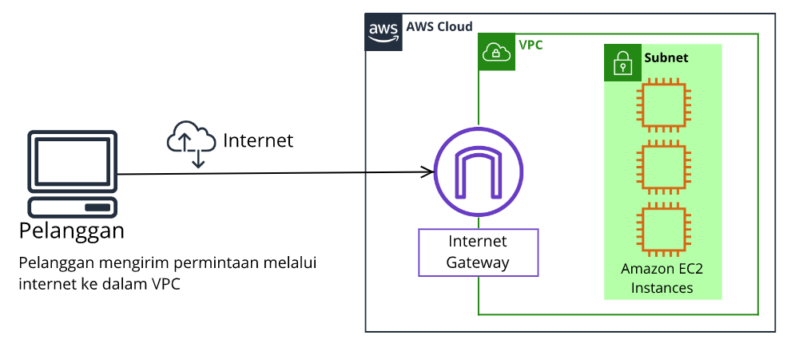
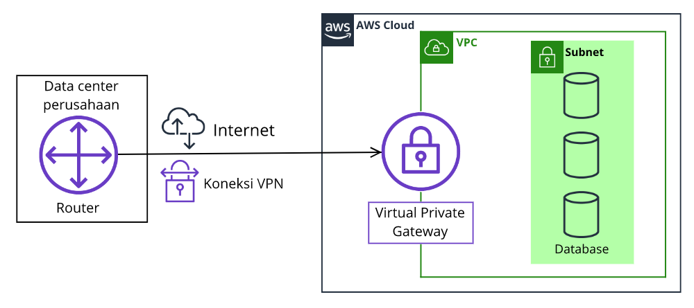
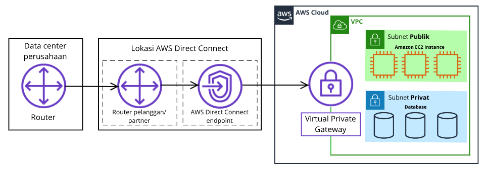

# Konektivitas ke AWS
Ada jutaan pelanggan yang menggunakan layanan AWS. Lalu, bayangkan terdapat pula jutaan sumber daya yang telah dibuat oleh pelanggan tersebut, seperti Amazon EC2 instance. Tanpa adanya batasan di sekitar semua sumber daya itu, traffic jaringan akan mengalir di antaranya tanpa restriksi.

Layanan jaringan yang dapat Anda gunakan untuk menetapkan batasan di sekitar sumber daya AWS adalah `Amazon Virtual Private Cloud (Amazon VPC)`.

# Amazon Virtual Private Cloud (Amazon VPC)
Selamat datang di `Amazon Virtual Private Cloud (Amazon VPC)`. Anggaplah ia sebagai benteng kukuh di mana tak akan ada yang dapat masuk atau keluar tanpa izin secara eksplisit.

`Amazon VPC` pada dasarnya adalah jaringan pribadi Anda di AWS. VPC memungkinkan Anda untuk membuat bagian terisolasi dari AWS Cloud dan meluncurkan sumber daya seperti EC2 instance dan ELB di dalamnya.

Anda tak bisa menaruh sumber daya ke VPC begitu saja, melainkan harus mengelolanya di dalam subnet yang berbeda. Subnet adalah bagian dari VPC yang dapat mengelompokkan sumber daya. Subnet bersama dengan aturan jaringan--akan kita bahas nanti--dapat mengontrol apakah sumber daya tersedia untuk publik atau privat.

Anda bisa saja memiliki sumber daya yang `internet-facing` (terhubung ke internet) sehingga dapat dijangkau oleh umum, seperti website publik.

Namun, dalam skenario lain, Anda mungkin ingin memiliki sumber daya yang hanya Anda saja yang dapat menjangkaunya. Ini mungkin pas untuk layanan internal, seperti aplikasi HRD atau database.

# Internet Gateway
Berkaca dari materi sebelumnya. Mari kita telaah tentang sumber daya yang `internet-facing` atau `public-facing` (berhubungan dengan internet/publik).

Untuk mengizinkan traffic dari internet publik mengalir masuk dan keluar dari VPC, Anda harus melampirkan apa yang disebut dengan `Internet Gateway (IGW)`. Di bawah ini adalah contoh arsitektur yang menggunakan Internet Gateway.

Jika Anda tak kunjung paham apa fungsi dari Internet Gateway, bayangkanlah ia seperti pintu depan yang terbuka untuk publik. Di kedai kopi, pintu depan berguna supaya orang-orang dapat keluar masuk dengan leluasa. Jika tak ada, bagaimana pelanggan ingin memesan kopi?

Pintu depan ini adalah perumpamaan yang ideal untuk Internet Gateway. Tanpanya, tidak ada yang dapat menjangkau sumber daya di dalam VPC Anda.

Selanjutnya, timbul pertanyaan seperti ini, “Bagaimana jika kita memiliki sumber daya pribadi di VPC dan tidak ingin sembarang orang bisa menjangkaunya?” Mari kita lihat di materi berikutnya!

# Virtual Private Gateway
Anda bisa memasang gateway privat yang hanya mengizinkan masuk suatu permintaan jika ia berasal dari jaringan yang disetujui, bukan internet publik. Gateway privat ini disebut juga dengan `virtual private gateway`. Ia memudahkan Anda untuk membuat koneksi `VPN (virtual private network)` terenkripsi antara jaringan privat--seperti data center `on-premise` atau jaringan perusahaan internal--ke VPC Anda.

Jadi, dapat disederhanakan bahwa `virtual private gateway` adalah komponen yang memungkinkan traffic internet yang terlindungi masuk ke dalam VPC. Silakan amati contoh arsitektur berikut:

Bingung? Nah, untuk mempermudah penjelasan bagaimana virtual private gateway bekerja, mari kita cari tahu dengan mengaitkannya ke skenario kedai kopi. Anda bisa mengibaratkan internet itu sebagai jalan raya antara rumah Anda dan kedai kopi.

Katakanlah Anda bepergian melalui jalan tersebut dengan seorang pengawal untuk melindungi Anda. Tentu, sebenarnya Anda masih menggunakan jalan yang sama dengan pelanggan lain, bedanya, Anda memiliki lapisan perlindungan ekstra.

Nah, pengawal tersebut bisa Anda anggap sebagai koneksi VPN yang mengenkripsi (atau melindungi) traffic internet dari semua permintaan lain di sekitarnya.

Oh, tidak! Sayangnya, sekarang timbul masalah baru terhadap kasus di atas, meskipun Anda memiliki perlindungan yang ekstra. Apa itu? Anda masih menggunakan jalanan yang sama dengan pelanggan lain. Walhasil, sudah barang tentu ia akan rentan terhadap kemacetan atau perlambatan lalu lintas.

Hal yang sama pun berlaku untuk koneksi VPN. Memang betul koneksi VPN bersifat pribadi dan dienkripsi, tetapi faktanya ia masih menggunakan koneksi internet reguler dengan bandwidth (jumlah maksimum data yang dapat dikirim) yang terbagi kepada banyak pengguna internet lainnya.

Lalu, bagaimana jika kita ingin memiliki koneksi pribadi yang mengarah langsung ke VPC?

# AWS Direct Connect
Untuk memulai, bayangkanlah sebuah apartemen dengan lorong pribadi yang langsung terhubung ke kedai kopi. Hanya penghuni apartemen saja yang dapat melewati lorong ini.

Lorong ini menyediakan jenis koneksi khusus/terdedikasi di mana penghuni apartemen dapat masuk ke kedai kopi tanpa perlu menggunakan jalan raya bersama para pelanggan lain.

Intinya, jika Anda menginginkan `koneksi privat, koneksi terdedikasi, jumlah latensi yang rendah, dan tingkat keamanan yang tinggi`, maka Anda bisa mewujudkannya di AWS dengan menggunakan `AWS Direct Connect`.

`AWS Direct Connect` memungkinkan Anda untuk membuat koneksi fiber yang privat nan terdedikasi sepenuhnya antara data center Anda dan VPC. Untuk membangun koneksi tersebut, Anda perlu berpartner dengan mitra `Direct Connect` yang tersedia di wilayah Anda.

Dengan demikian, layanan ini dapat membantu Anda memenuhi kebutuhan regulasi dan kepatuhan yang tinggi serta menghindari potensi masalah pada bandwidth.

+++++++++++++++++++++++++++++++++++++++++++++++++++++++++++++++++++++++++++++++++++++++++++++++++++++++++
Catatan: Satu VPC mungkin memiliki beberapa tipe gateway yang terpasang untuk berbagai jenis sumber daya di VPC yang sama namun dengan subnet yang berbeda.
+++++++++++++++++++++++++++++++++++++++++++++++++++++++++++++++++++++++++++++++++++++++++++++++++++++++++