# Subnet dan Network Access Control List
Pada materi pengantar sebenarnya kita telah mengupas sedikit tentang peran dari subnet. Bahkan kita juga telah mengilustrasikannya di kedai kopi. Tapi rasanya masih belum dalam ya. Begitu juga dengan `network access control list`, sepertinya kita belum menyinggungnya sama sekali. Tak apa. Di pembahasan kali ini, kita akan belajar lebih lanjut.

Subnet dan network access control list adalah dua hal yang penting untuk dipahami saat Anda belajar jaringan AWS. Jadi, tak perlu menunggu waktu lama. Mari kita lanjutkan ke materi berikutnya!

# Subnet
`Subnet` adalah sebuah bagian dari VPC di mana Anda dapat mengelompokkan sumber daya berdasarkan keamanan atau kebutuhan operasional. Subnet bisa menjadi publik maupun privat.
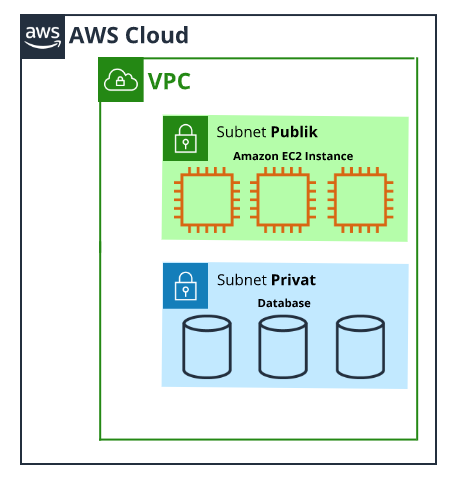

`Subnet publik` biasanya berisi sumber daya yang perlu diakses oleh publik, seperti website toko online. Sedangkan `subnet privat` memuat sumber daya yang seharusnya hanya dapat diakses melalui jaringan privat, seperti database yang berisi informasi pribadi pelanggan dan riwayat pesanan.

Di VPC subnet dapat berkomunikasi satu sama lain. Misalnya, Anda dapat memiliki aplikasi pada Amazon EC2 instance di `subnet publik` yang berkomunikasi dengan database di `subnet pribadi`.

# Network Access Control List (Network ACL)
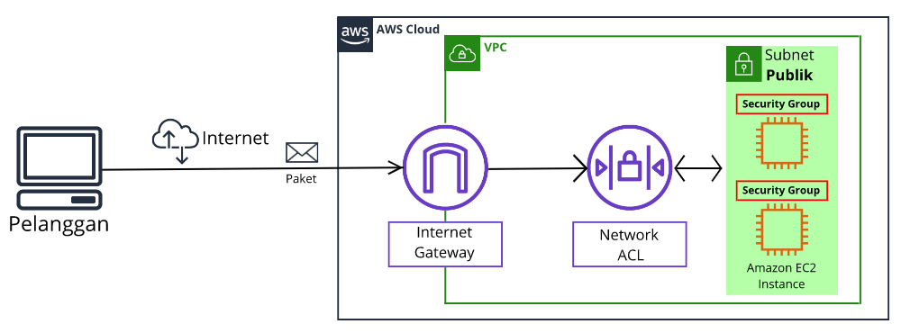

Sebelumnya, kita telah belajar seputar `Internet Gateway (IGW)` yang dapat mengizinkan traffic masuk atau keluar dari VPC. Tetapi, layanan ini hanya meliputi satu bagian saja dari keamanan jaringan--yang harus Anda fokuskan sebagai bagian dari strategi IT.

Ketahuilah, AWS memiliki berbagai layanan yang dapat mencakup setiap lapisan keamanan:

  - Network hardening (Penguatan jaringan).
  - Keamanan aplikasi.
  - Identitas pengguna.
  - Autentikasi dan otorisasi.
  - Pencegahan distributed denial-of-service (DDoS).
  - Integritas data.
  - Enkripsi.
  - dan masih banyak lainnya.

Tenang, Anda tak harus memahami semuanya. Di kelas ini kita hanya akan membahas beberapa bagian saja.

Sekarang mari kita berbincang mengenai beberapa aspek dari `network hardening (penguatan jaringan)` dengan melihat praktiknya di dalam VPC.

Satu-satunya alasan teknis untuk menggunakan subnet di VPC adalah untuk `mengontrol akses ke gateway`. Subnet publik memiliki akses ke Internet Gateway, sementara Subnet privat tidak. Tapi walaupun begitu, tahukah Anda? Subnet juga bisa mengontrol perizinan traffic, loh.

Bagaimana caranya? Simak paparan berikut.

Ketika pelanggan meminta data dari aplikasi yang berjalan di AWS Cloud, maka permintaan ini dikirim sebagai paket. `Paket` adalah sebuah unit data yang dikirim melalui internet atau jaringan.
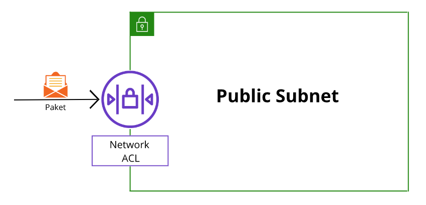

Paket masuk ke VPC melalui Internet Gateway. Sebelum paket dapat masuk atau keluar dari subnet, ia akan diperiksa terkait perizinannya. Pemeriksaan ini dilakukan untuk melihat apakah paket memiliki izin untuk masuk ke subnet berdasarkan siapa pengirimnya dan bagaimana ia mencoba berkomunikasi dengan sumber daya yang berada di subnet.

Komponen VPC yang memeriksa izin paket untuk subnet adalah `network access control list` alias `network ACL`. `Network ACL` adalah firewall virtual yang mengontrol traffic masuk dan keluar di tingkat subnet. Tentu ini berbeda dengan Internet Gateway yang cakupannya di tingkat VPC.

Jika paket memiliki potensi yang dapat membahayakan sumber daya di dalam subnet--seperti upaya untuk menguasai sistem melalui permintaan administratif--maka ia akan diblokir sebelum dapat menyentuh target.

Jika masih sukar memahaminya, Anda bisa menganggap network ACL sebagai petugas pengawas paspor. Misalnya begini.

Mari kita keluar dari kedai kopi dan bayangkan Anda sedang berada di bandara. Di sana ada banyak turis yang mencoba masuk ke negara lain. Anda dapat menganggap para turis itu sebagai paket dan petugas pengawas paspor sebagai network ACL.

Petugas pengawas paspor memeriksa kredensial setiap turis yang masuk ke suatu negara. Jika nama turis tertera di dalam daftar yang disetujui, maka ia diizinkan untuk masuk. Sebaliknya, jika namanya tak terdaftar atau bahkan secara eksplisit tercatat di dalam daftar turis yang diblokir, maka tentu ia dilarang masuk.

Selain memeriksa traffic yang masuk, network ACL pun akan mengecek setiap traffic yang keluar dari subnet. Ini serupa pula dengan petugas pengawas paspor. Hanya karena Anda diizinkan masuk, bukan berarti petugas akan membiarkan Anda keluar dengan leluasa.

Setiap akun AWS menyertakan network ACL secara default (bawaan). Saat mengonfigurasi VPC, Anda dapat menggunakan default network ACL (mengizinkan semua traffic masuk dan keluar) atau custom network ACL (menolak semua traffic masuk dan keluar hingga Anda secara eksplisit mengizinkannya).

Selain itu, network ACL memiliki aturan penolakan secara eksplisit. Aturan ini berguna untuk memastikan jika sebuah paket tidak cocok dengan salah satu aturan lain di daftar, paket tersebut akan ditolak.

Mungkin terdengar seperti keamanan yang hebat ya? Tapi nyatanya, network ACL tidak bisa menjawab semua masalah terkait kontrol jaringan. Sebab, ia hanya dapat mengevaluasi paket jika melintasi batas subnet--baik masuk atau keluar namun tidak tahu-menahu apakah paket tersebut dapat mencapai EC2 instance tertentu atau tidak.

# Security Group
Boleh jadi Anda memiliki beberapa EC2 instance di subnet yang sama. Namun pada praktiknya, mungkin tiap-tiapnya akan memiliki aturan yang berbeda tentang.
  - siapa yang dapat mengiriminya pesan; atau
  - port mana yang diizinkan untuk menerima pesan.
Jadi, Anda juga memerlukan keamanan jaringan pada tingkat instance. Nah, untuk menjawabnya, AWS memperkenalkan security group.

`Security group` adalah firewall virtual yang mengontrol traffic masuk dan keluar untuk Amazon EC2 instance. Terlihat berbeda ya dengan network ACL yang cakupannya di tingkat subnet.
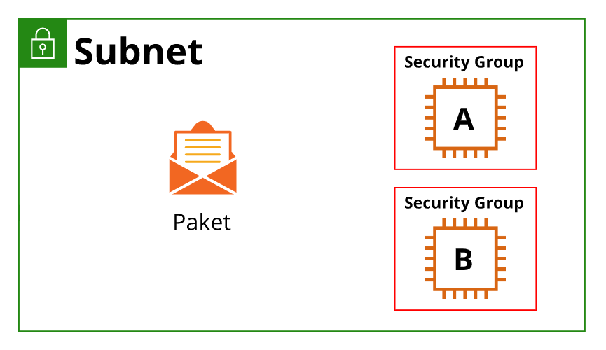
Saat EC2 instance diluncurkan, ia secara otomatis dilengkapi dengan security group. Jika Anda memiliki beberapa Amazon EC2 instance di dalam subnet yang sama, Anda dapat mengaitkannya dengan security group yang sama maupun berbeda untuk setiap instance.

Ingat! secara default (bawaan), security group menolak semua traffic masuk namun mengizinkan semua lalu lintas yang keluar dari instance.

Dengan security group default, semua port dan alamat IP yang mengirimkan paket akan diblokir. Tentu ini sangat aman, tapi mungkin membuat instance tidak berguna. Maka dari itu, tentu Anda bisa mengonfigurasinya dengan menambah aturan sendiri yang mengizinkan atau menolak traffic sesuai kebutuhan.

Misalnya, dalam kasus website, Anda bisa mengatur security group untuk menerima traffic berbasis web (HTTPS) dan tidak untuk jenis lalu lintas lain (sistem operasi atau permintaan administrasi).

Jika sebelumnya kita mengibaratkan network ACL sebagai petugas pengawas paspor, nah, anggaplah security group itu seperti penjaga pintu di gedung apartemen Anda. Dalam hal ini, gedung tersebut adalah EC2 instance.

Penjaga pintu akan memeriksa setiap orang yang ingin memasuki gedung untuk memastikan apakah mereka memiliki izin atau tidak. Namun, bagi setiap orang yang akan keluar dari gedung tersebut tak akan diperiksa olehnya.

Serupa dengan itu, security group mengizinkan traffic tertentu untuk masuk dan--secara default--membolehkan semua lalu lintas keluar.

Mungkin dahi Anda akan mulai berkerut, “Tunggu sebentar. Kita baru saja belajar dua mesin berbeda namun melakukan pekerjaan yang sama, yaitu membiarkan paket dari alamat yang kita izinkan untuk masuk dan menolak paket dari alamat yang tidak kita izinkan. Lalu, apa bedanya?”

Oke, Oke. Tenang! Mari kita tilik perbedaannya.

Perbedaan utama antara `security group` dan `network ACL` adalah:
  - Security group bersifat `stateful`, yang berarti ia memiliki semacam memori untuk mengingat siapa yang diizinkan masuk atau keluar.
  - Network ACL bersifat `stateless`, artinya ia tidak mengingat apa pun. Layanan ini akan memeriksa setiap paket yang melintasi perbatasannya terlepas dari keadaan apa pun.

Oke, sekarang kita akan mengilustrasikan suatu perjalanan bolak-balik sebuah paket saat berpindah dari satu instance ke instance lain di subnet yang berbeda. Pahami metafora ini dengan baik ya.
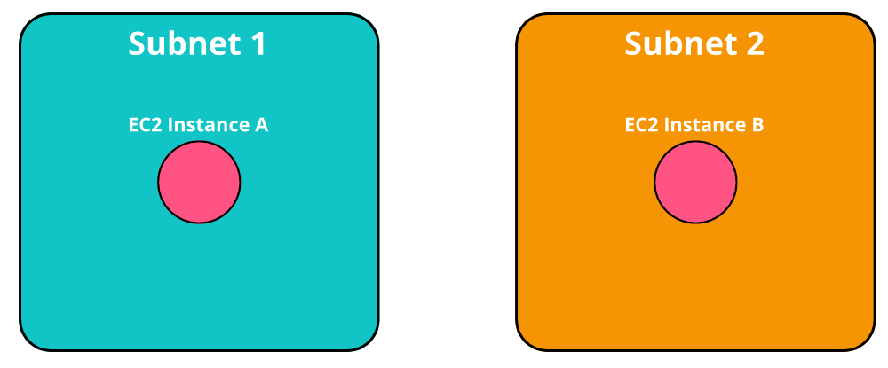
Untuk mengawali, ketahuilah bahwa layanan manajemen traffic ini tak peduli dengan isi dari paket itu sendiri. Ia hanya memeriksa apakah pengirimnya tertera di dalam daftar yang disetujui atau tidak.

Baiklah. Mari kita mulai ilustrasinya. Katakanlah Anda ingin mengirim paket dari instance A ke instance B di subnet yang berbeda di VPC yang sama.
   1. Paket dikirim dari instance A. Hal pertama yang akan terjadi adalah paket tersebut akan bertemu dengan batas security group dari instance A. Ingat! Secara default, security group akan mengizinkan semua traffic keluar. Jadi, paket bisa melanjutkan perjalanannya dan sukses melewati security group dari instance A.
   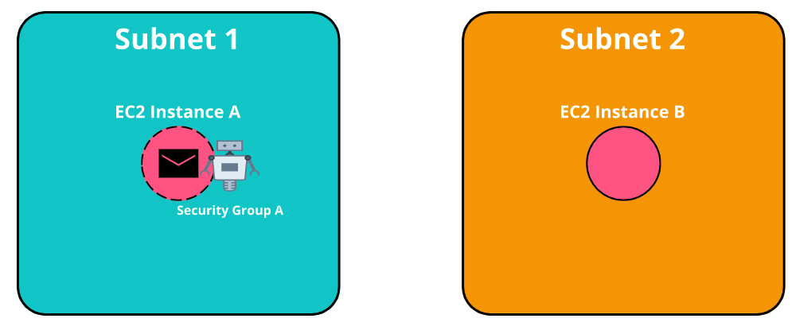

   2. Selanjutnya, paket berhadapan dengan perbatasan subnet 1. Di sana ada petugas pengawas paspor, yakni network ACL. Network ACL tetap akan memeriksa paket walaupun security group telah mengizinkannya karena ia memiliki daftarnya sendiri atas siapa yang bisa dan tidak bisa lewat. Jika diperbolehkan, paket dapat melanjutkan perjalanannya.
   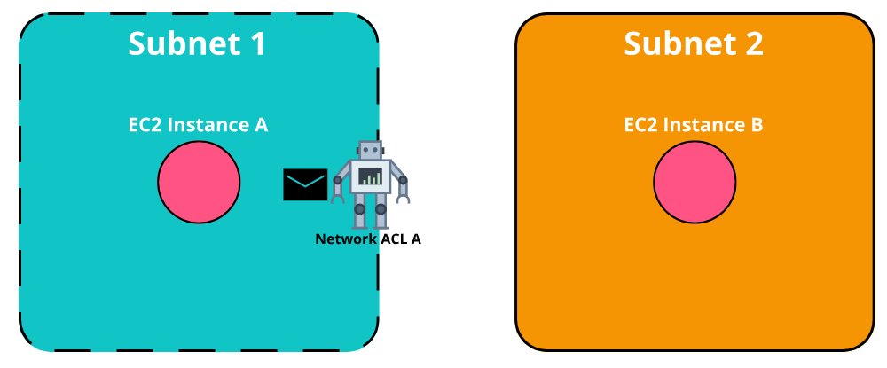

   3. Oke, sekarang paket telah keluar dari subnet asal dan menuju ke subnet target di mana instance B berada. Untuk memasuki subnet 2, paket kembali berhadapan dengan petugas pengawas paspor, yaitu Network ACL.
  
   Hanya karena paket diizinkan keluar dari wilayah asalnya, bukan berarti ia dapat bebas masuk ke wilayah atau subnet target. Masing-masing subnet memiliki petugas pengawas paspornya sendiri. Walhasil, paket harus mendapatkan izin dari keduanya, jika tidak maka paket bisa ditolak di perbatasan.
  
   Nah, ternyata paket Anda tertera di dalam daftar yang disetujui untuk masuk ke subnet 2. Ayo, hampir sampai.
   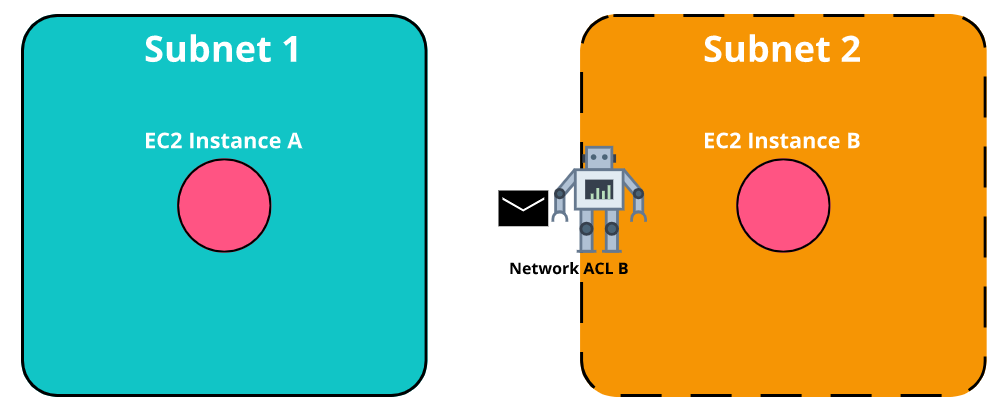

   4. Sekarang paket semakin dekat dengan instance target, yakni instance B. Setiap EC2 instance memiliki security group-nya sendiri. Jika paket ingin masuk ke instance B, maka penjaga pintu alias security group perlu melakukan pemeriksaan terlebih dahulu untuk memastikan apakah paket diizinkan masuk atau tidak.
   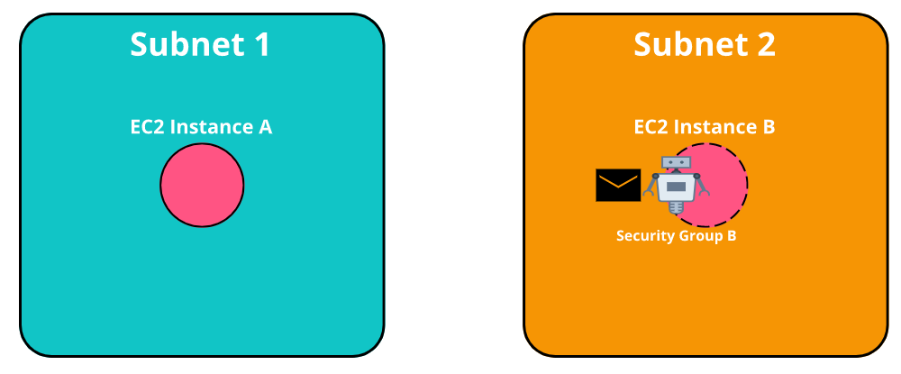

   5. Apabila terdaftar, maka paket Anda pun dapat masuk dan akhirnya sampai ke instance target.
   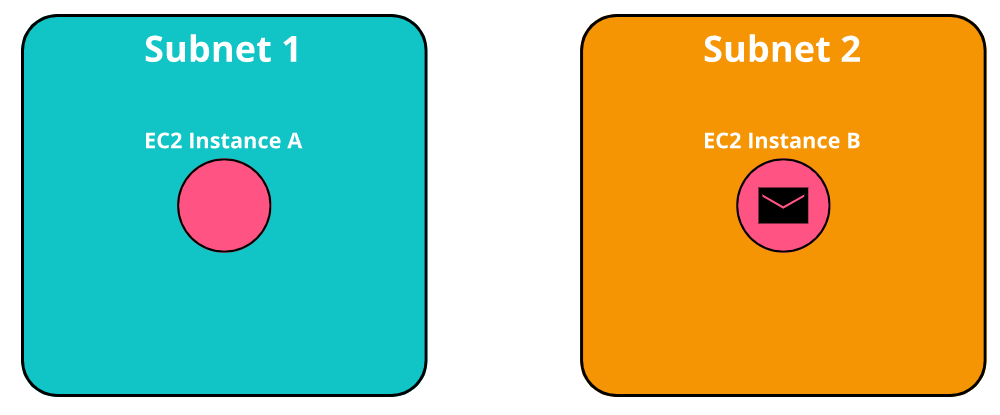

Wah cukup meletihkan ya. Setelah paket sampai ke tujuan, ia akan melakukan apa yang harus dilakukan. Nah, setelah proses transaksi selesai, sekarang saatnya pulang. Kita akan melihat bagaimana return traffic pattern alias pola lalu lintas kembali terjadi.

Ini adalah bagian yang paling menarik karena di sinilah sifat stateful versus stateless dari mesin yang berbeda berperan. Pasalnya, paket masih harus dievaluasi pada setiap pos pemeriksaan. Agar tak penasaran, silakan simak uraian perjalanan pulang dari paket berikut:
   1. Seperti yang telah kita pelajari, security group secara default mengizinkan semua lalu lintas keluar. Jadi, ia tak perlu lagi memeriksa apakah paket diizinkan keluar atau tidak. Tanpa kendala paket pun berhasil meninggalkan instance B dan menuju perbatasan subnet 2.
   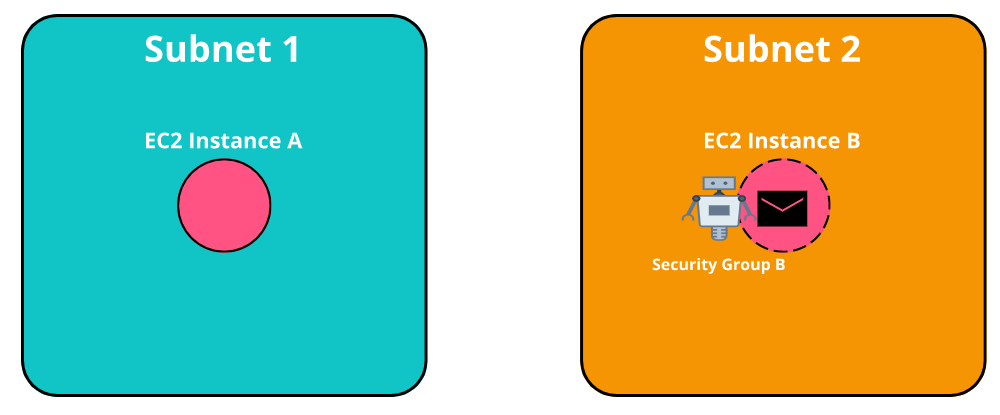

   2. Nah, di perbatasan subnet berdirilah seorang petugas pengawas paspor. Tentu Anda sudah tak asing ya, dialah network ACL yang stateless alias tidak dapat mengingat status. Ia tidak peduli bahwasanya paket Anda telah melewatinya. Ini karena mungkin saja paket Anda tercantum di dalam daftar tidak-bisa-keluar.

   Setiap jalan masuk maupun keluar tetap diperiksa sesuai dengan daftar yang ada. Alamat pengembalian paket harus tercatat di dalam daftar yang disetujui agar berhasil melintasi perbatasan. Tenang, paket Anda diperbolehkan keluar.
   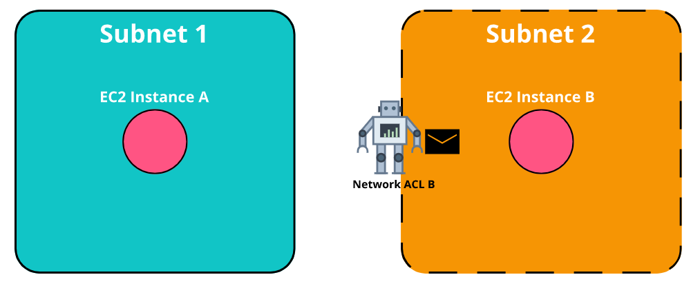

   3. Oke, setelah keluar dari perbatasan subnet 2, paket pun tiba di perbatasan subnet asal, yakni subnet 1. Akan tetapi, paket harus berhadapan lagi dengan network ACL. Karena network ACL bersifat stateless, maka ia akan selalu memeriksa daftarnya. Untungnya, paket Anda diberikan izin untuk masuk ke subnet asal.
   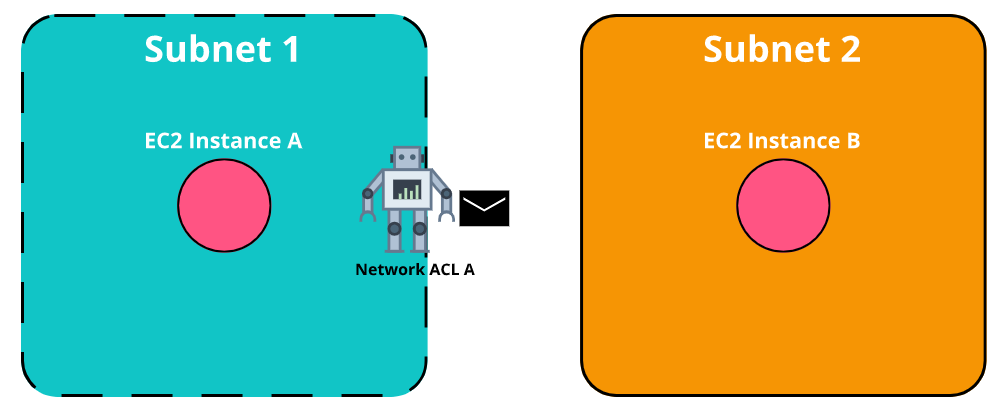

   4. Satu langkah lagi untuk kembali ke rumah. Tapi, security group--sang penjaga pintu--masih bertanggung jawab dan berdiri di sana. Nah, perbedaan utamanya terlihat di sini. Karena security group bersifat stateful, ia dapat mengenali sumber paket. Jadi, paket Anda tak akan diperiksa lagi saat hendak memasuki instance A.
   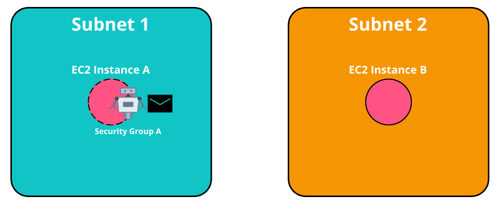

   5. Welcome home!
   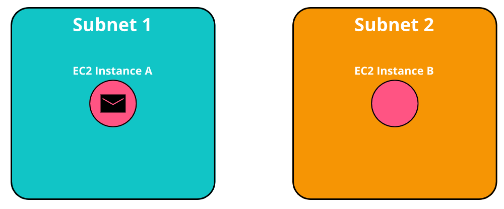

Huh! Mungkin tampak sedikit melelahkan ya hanya untuk mendapatkan paket dari satu instance ke instance lainnya dan kembali lagi. Jangan khawatirkan semua proses panjangnya. Faktanya, operasi pertukaran tersebut terjadi secara instan sebagai bagian dari cara kerja AWS Networking.

Manfaatkanlah network ACL dan security group ini guna mencapai keamanan jaringan yang komprehensif. Mengapa? Karena keamanan yang mendalam merupakan hal yang sangat penting untuk sebuah arsitektur modern.
