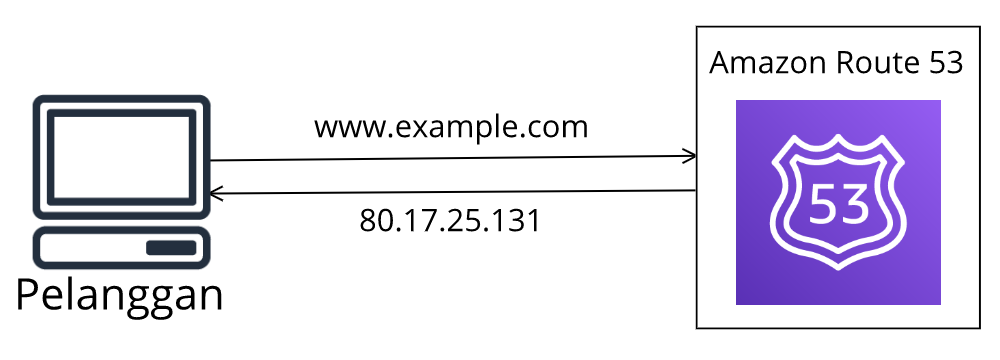
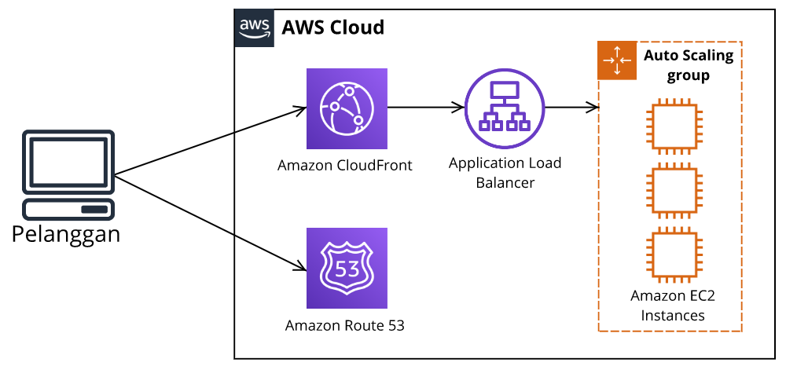

# Jaringan Global
Sebelumnya kita telah banyak belajar mengenai bagaimana Anda berinteraksi dengan infrastruktur AWS. Sekarang pertanyaannya adalah bagaimana pelanggan Anda berinteraksi dengan infrastruktur AWS tersebut?

Tak perlu tergesa-gesa! Di modul ini akan dijelaskan tentangnya. Kita mulai dari DNS terlebih dahulu. Apa itu? Yuk kita lihat di materi berikutnya!

# Domain Name System (DNS)
Untuk mengawali, yuk kita buat suatu cerita. Misalnya, Anda memiliki website yang berjalan di AWS Cloud. Silakan jawab, bagaimana pelanggan Anda dapat mengaksesnya? Mudah saja. tentu kita semua sudah tahu. Caranya adalah dengan memasukkan nama website Anda di browser, tekan Enter, dan boom! Website pun termuat.

Proses tersebut tentu saja tidak sekonyong-konyong terjadi begitu saja. Ada peran `domain name system (DNS)` di sana. Di AWS tersedia layanan DNS yang dapat Anda gunakan, yakni Amazon Route 53--akan dijelaskan nanti.

Tapi, tunggu! Sebelum melangkah lebih jauh, apa sih yang dimaksud dengan DNS? Begini, anggaplah DNS itu sebagai buku telepon bagi internet. DNS dapat menerjemahkan sebuah nama domain ke dalam alamat IP (Internet Protocol) yang dapat dibaca komputer.

Mari kita ambil contoh bagaimana DNS bekerja. Katakanlah Anda ingin membuka halaman www.example.com.

  1. Masukkan nama domain tersebut ke browser Anda.
  2. Lalu, permintaan tersebut akan dikirimkan ke Amazon Route 53 guna memperoleh alamat IP yang sesuai dengan website tersebut.
  3. Route 53 merespons dengan memberikan alamat IP. Misalkan 80.17.25.131.
  4. Kemudian, komputer atau browser Anda pun akan dirutekan ke alamat tadi.
  5. Tada! Website pun termuat.

Tidak sulit kan untuk memahami DNS dan cara kerjanya? Nah, seperti yang telah dijanjikan di awal, sekarang mari kita tilik layanan Amazon Route 53 yang tercantum pada materi berikutnya.

# Amazon Route 53
`Amazon Route 53` adalah layanan `domain name system (DNS)` atau `sistem nama domain di AWS yang highly available (sangat tersedia)` dan `scalable (dapat diskalakan)`. Layanan ini dapat memberikan Anda cara yang andal untuk merutekan pelanggan ke aplikasi internet yang berjalan di AWS.

Amazon Route 53 bertugas untuk menghubungkan permintaan pelanggan ke infrastruktur yang berjalan di AWS (seperti Amazon EC2 instance dan load balancers). Bahkan, ia bisa pula mengarahkan pelanggan ke infrastruktur yang berada di luar AWS.

Jika kita melangkah lebih jauh, Amazon Route 53 itu dapat pula mengarahkan traffic ke endpoints (titik akhir) yang berbeda menggunakan beberapa routing policies (kebijakan perutean) yang berbeda, seperti:

  - Latency-based routing (Perutean berbasis latensi)
  - Geolocation DNS
  - Geoproximity routing
  - Weighted round robin

Kita tidak akan memaparkan semuanya di sini. Tapi, mari ambil contoh dari salah satunya, yaitu Geolocation DNS. Dengan opsi tersebut, kita mengarahkan traffic berdasarkan lokasi pelanggan. Contohnya, lalu lintas yang datang dari Indonesia akan dialihkan ke Region Singapura atau jika berasal dari Jepang akan dialihkan ke Region Tokyo.

Selain mengarahkan traffic, Route 53 dapat digunakan untuk mendaftarkan nama domain baru atau menggunakan nama domain yang Anda miliki. Sehingga, ini memudahkan Anda untuk mengelola semua nama domain dalam satu lokasi.

# Amazon CloudFront
Berkaca dari kasus website yang telah kita bicarakan dari awal, ada layanan yang bisa mempercepat pengiriman aset website, yaitu `Amazon CloudFront`--telah kita bahas di modul sebelumnya yah.

`Amazon CloudFront` adalah `layanan yang dapat membantu Anda untuk mengirimkan konten (data, aplikasi, maupun API) ke pelanggan di seluruh dunia dengan aman dan latensi rendah`. Konten yang dimaksud ini bisa berbagai hal, seperti data, video, aplikasi, dan API.

Jika Anda ingat, kita telah belajar tentang Edge locations sebelumnya. Edge locations menyajikan konten sedekat mungkin dengan pelanggan, salah satu bagiannya adalah `content delivery network (CDN)` atau jaringan pengiriman konten. Sebagai pengingat, CDN adalah jaringan yang membantu Anda untuk memberikan konten kepada pelanggan berdasarkan lokasi geografis mereka.

CloudFront sangat terintegrasi dengan layanan lainnya seperti `AWS Web Application Firewall (WAF)`, `AWS Certificate Manager`, Amazon Route 53, Amazon S3, dan lainnya.

Anda dapat memulai menggunakan Amazon CloudFront hanya dalam hitungan menit menggunakan layanan AWS yang sudah Anda kenal: API, AWS Management Console, Command Line Interface (CLI), dan SDK.

# Studi Kasus: Bagaimana Amazon Route 53 dan Amazon CloudFront Mengirimkan Konten
Di modul sebelumnya kita telah belajar tentang Amazon Route 53 dan Amazon CloudFront. Kali ini kita akan menelaah bagaimana kedua layanan tersebut berkolaborasi untuk mengirimkan konten kepada pelanggan.

Misalnya, Anda memiliki aplikasi yang berjalan di beberapa Amazon EC2 instance. Instance ini berada di dalam Auto Scaling group (grup Auto Scaling) yang dilampirkan ke Application Load Balancer. Perhatikan gambar berikut:

Dengan arsitektur di atas, sekarang proses memuat website pun bisa semakin lebih cepat. Mari kita uraikan arsitektur tersebut:

  1. Pelanggan memasukkan alamat website di browser mereka.
  2. Permintaan tersebut akan dikirimkan ke Amazon Route 53 untuk diidentifikasi alamat IP-nya.
  3. Informasi tersebut kemudian dikirim kembali ke pelanggan.
  4. Selanjutnya, permintaan dari pelanggan tersebut ditransfer ke Edge locations terdekat melalui Amazon CloudFront.
  5. Setelah itu, Amazon CloudFront yang terhubung ke Application Load Balancer akan mengirimkannya ke Amazon EC2 instance.
  6. Dan akhirnya, website pun termuat.
  
Selamat! Sekarang Anda sudah mengerti bagaimana proses dibalik pemuatan suatu website yang menggunakan penggabungan layanan Amazon CloudFront dan Amazon Route 53.
