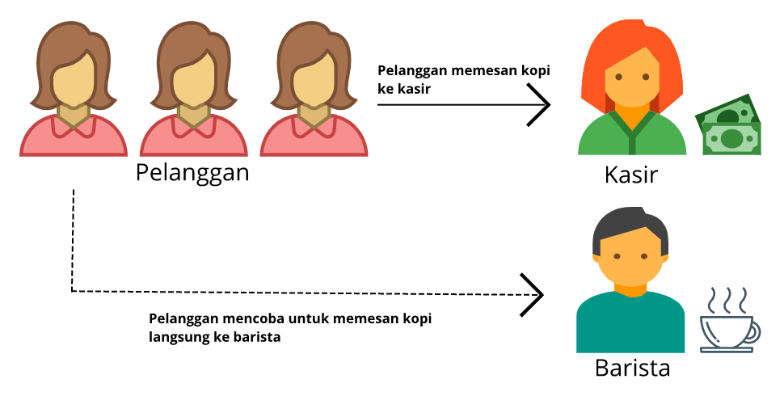
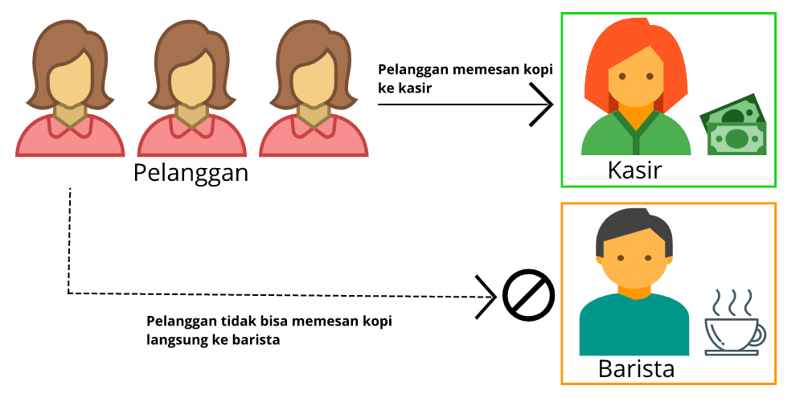

# Tujuan Pembelajaran
Dengan mempelajari modul ini, Anda akan mampu:

  - Menjelaskan konsep dasar jaringan.
  - Membedakan antara sumber daya jaringan publik dan pribadi.
  - Menerangkan virtual private gateway menggunakan skenario kehidupan nyata.
  - Mendeskripsikan virtual private network (VPN) menggunakan cerita sehari-hari.
  - Memaparkan manfaat dari AWS Direct Connect.
  - Merangkum manfaat penerapan secara hybrid.
  - Menjabarkan lapisan keamanan yang digunakan dalam strategi IT.
  - Menguraikan layanan yang digunakan untuk berinteraksi dengan jaringan global AWS.

Oke, mari kita mulai perjalanan di modul ini dari mengenal jaringan di AWS terlebih dahulu. Silakan singkap materi berikutnya!

# Pengenalan ke Jaringan
Pikirkan kembali skenario kedai kopi atau lingkungan AWS kita. Proses pemesanan pada kedai kopi adalah pelanggan menyampaikan ordernya kepada kasir yang lantas meneruskannya ke barista. Proses ini seharusnya sudah berjalan lancar tanpa kendala ya.

Meskipun demikian, bagaimana jika ada beberapa pelanggan tak sabar yang coba mengabaikan kasir dan ingin memberikan pesanannya langsung ke barista? Para pelanggan penerobos antrean ini tentu akan merusak alur kedai kopi.

Yah, tak mungkin kita biarkan pelanggan terus berinteraksi dengan barista. Alih-alih menerima pesanan, sang barista harus fokus membuat kopi saja. Jadi, apa yang harus kita perbuat?

Di AWS Anda bisa menggunakan `Amazon Virtual Private Cloud (Amazon VPC)` untuk menuntaskan dilema ini. VPC memungkinkan Anda untuk menyediakan bagian yang terisolasi secara logis dari AWS Cloud di mana Anda dapat meluncurkan sumber daya AWS di jaringan virtual sesuai kebutuhan.

Sumber daya tersebut dapat menjadi `public-facing` yang berarti memiliki akses ke internet ataupun private alias tanpa akses internet. Jenis kedua biasanya dipakai untuk layanan backend seperti database atau server aplikasi.

Nah, `pengelompokan sumber daya menjadi publik dan privat ini` disebut dengan `subnet` yang juga merupakan rentang alamat IP di VPC Anda.

Sekarang mari kembali ke kedai kopi dan mengimplementasikan apa yang telah kita pelajari di atas. Anda dapat menempatkan kasir dan barista di area kerja yang terpisah.

Karena kasir bertanggung jawab untuk menerima pesanan pelanggan, maka kita tempatkan ia di `subnet publik`. Sehingga, kasir dapat berkomunikasi langsung dengan pelanggan atau internet--jika kasusnya adalah `instance`.

Berbeda kasusnya buat barista. Karena kita ingin ia fokus untuk membuat kopi dan tidak berinteraksi dengan pelanggan secara langsung, maka kita tempatkan ia di `subnet privat`. Dengan begitu, barista tetap dapat menerima pesanan dari kasir tetapi tidak langsung dari pelanggan.

Semoga modul pengantar ini dapat membuka gerbang pemahaman dasar kita menuju materi yang lebih detail di modul mendatang. Mari kita masuki gerbang tersebut sekarang! Are you ready?
