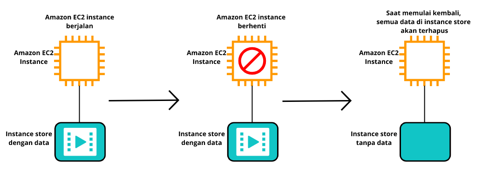
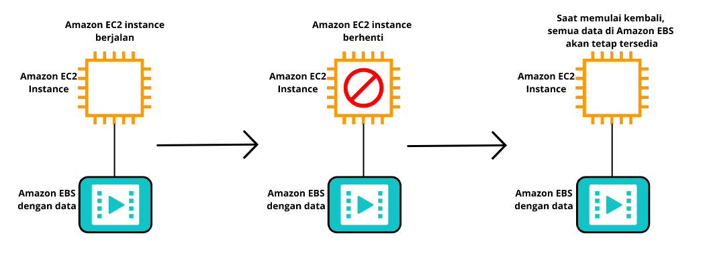
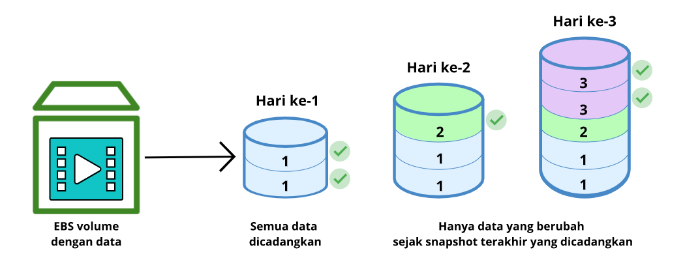

# Instance Store dan Amazon Elastic Block Store (Amazon EBS)
Saat Anda menjalankan aplikasi di AWS, tentunya aplikasi tersebut memerlukan akses ke CPU, memori, jaringan, dan penyimpanan. Nah, untungnya, EC2 instance dapat memberikan akses ke semua komponennya. Untuk saat ini, mari kita fokus pada penyimpanan.

Ketika aplikasi berjalan di EC2 instance, mereka kerap kali membutuhkan akses ke block-level storage (penyimpanan tingkat blok).

Jika Anda kurang kenal dengan istilah block-level storage, maka anggaplah ia sebagai tempat menyimpan file. `File` adalah `serangkaian byte (bita) yang disimpan di dalam blok pada disk`.

Pada saat file pada disk tersebut diperbarui, ia tak akan menimpa seluruh rangkaian blok, melainkan memperbarui bagian yang berubah saja. Dengan sistem seperti ini, penyimpanan untuk aplikasi (database, perangkat lunak perusahaan, atau sistem file) jadi lebih efisien.

Hmm. Mungkin penjelasan di atas sangat teknis ya. Oke, mari kita sederhanakan. Apakah sekarang Anda sedang menggunakan laptop atau komputer pribadi?

Nah! Itu berarti Anda sedang mengakses block-level storage alias penyimpanan tingkat blok. Block-level storage dalam kasus ini adalah hard drive (cakram keras) di komputer Anda.

EC2 instance juga memiliki hard drive dengan beberapa tipe yang berbeda.

# Instance Store
Instance store (tempat penyimpanan instance) adalah penyimpanan block-level storage, sementara untuk Amazon EC2 instance. Saat Anda meluncurkan EC2 instance--tergantung tipe EC2 instance yang Anda pilih--biasanya sudah tersedia penyimpanan lokal alias instance store volume di dalamnya.

Volume ini secara fisik terpasang ke host (mesin fisik), yaitu tempat di mana EC2 instance Anda berjalan. Anda dapat melakukan proses write (menulis) data padanya seperti hard drive pada umumnya.

Namun masalahnya, jika Anda menghentikan atau mengakhiri EC2 instance tersebut, maka semua data di sana akan terhapus. Ini terjadi karena ketika Anda memulai instance dari status stop alias berhenti kemungkinan EC2 instance akan berjalan di host lain, yang mana instance store volume tersebut tidak berada di sana.

Ingat! EC2 instance adalah mesin virtual. Oleh karena itu, host yang mendasarinya dapat berubah pada saat instance berhenti dan memulai.

Karena sifatnya yang sementara inilah biasanya instance store volume digunakan untuk penyimpanan data yang sering berubah, seperti cache, temporary file (file sementara), data yang dapat dibuat ulang dengan mudah, dan konten sementara lainnya. Tapi, ingat! Jangan simpan data penting Anda ke dalam instance store volume.

Lantas, bagaimana solusinya jika kita ingin menyimpan data secara persisten dan berada di luar siklus hidup EC2 instance? Atau dengan kata lain, bagaimana kita ingin menyimpan data yang takkan terhapus walau EC2 instance berhenti? Nah, jangan khawatir, di sinilah Anda perlu mengenal layanan Amazon Elastic Block Store (Amazon EBS).

# Amazon Elastic Block Store (Amazon EBS)
`Amazon Elastic Block Store (Amazon EBS)` adalah `layanan yang menyediakan block-level storage (penyimpanan tingkat blok) yang dapat Anda gunakan bersama dengan Amazon EC2 instance`.

Amazon EBS memungkinkan Anda untuk membuat hard drive virtual (EBS volume) yang kemudian bisa di-attach (dipasang) ke EC2 instance. EBS volume ini merupakan penyimpanan yang terpisah dari instance store volume. Ia pun tak terikat langsung ke host yang menjalankan EC2 instance Anda.

Lalu, bagaimana cara membuat EBS volume? Sebenarnya, mudah saja. Anda hanya perlu menentukan konfigurasinya (seperti ukuran dan tipe) sesuai dengan kebutuhan. Jika sudah, Anda bisa meluncurkannya dan memasangkannya ke Amazon EC2 instance.

Sekarang, jika Anda menghentikan lalu memulai EC2 instance, data yang Anda simpan di EBS volume akan tetap ada.

Karena EBS volume digunakan untuk kebutuhan data yang persisten, maka penting untuk Anda melakukan backup (pencadangan) data. Anda dapat menjalankan incremental backup (pencadangan secara inkremental) dari EBS volume dengan membuat Amazon EBS snapshot.

Amazon EBS snapshot disimpan secara bertahap/inkremental. Itu berarti pada saat pertama kali proses pencadangan dilakukan, ia akan menyalin semua data yang ada di EBS volume. Namun, untuk pencadangan berikutnya, ia hanya menyimpan blok data yang berubah dari snapshot terakhir.

Tentu, incremental backup ini sesungguhnya berbeda ya dengan full backup (pencadangan penuh). Full backup itu akan menyalin semua data yang ada di dalam volume setiap pencadangan dilakukan, sementara incremental backup hanya mencadangkan data yang berubah (delta) dari pencadangan sebelumnya.

Lakukanlah snapshot untuk EBS volume secara teratur. Dengan begitu, jika sebuah drive corrupted atau rusak, maka Anda tidak akan kehilangan data, melainkan Anda dapat memulihkannya dari snapshot.
