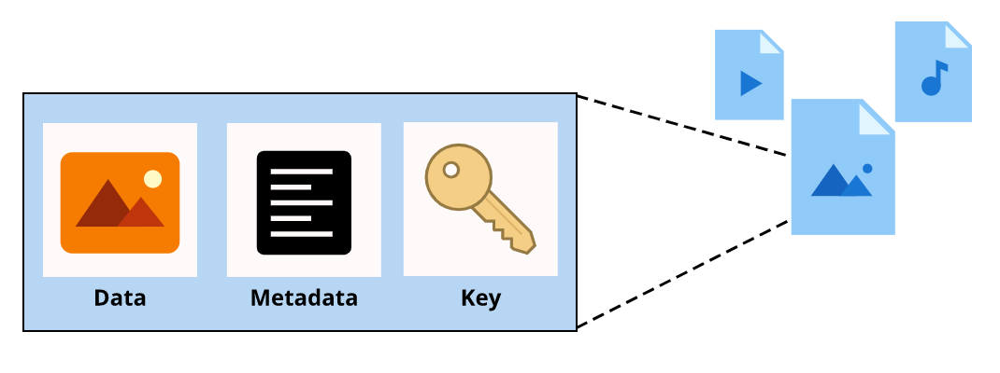
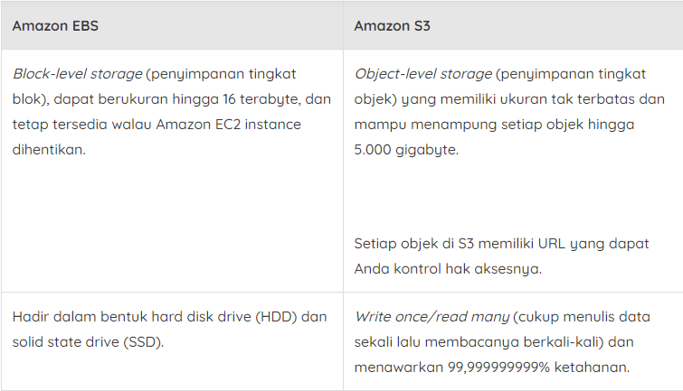
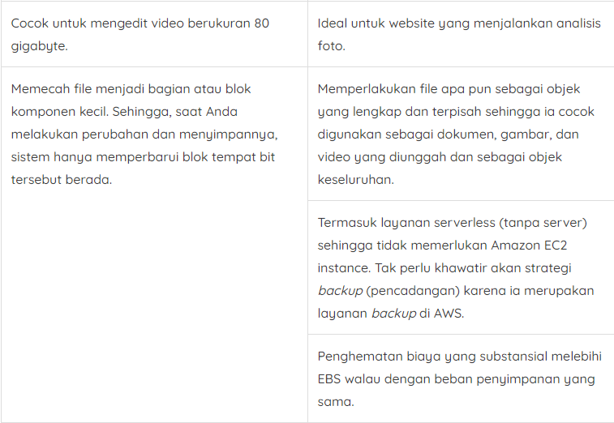

# Amazon Simple Storage Service (Amazon S3)
Sekarang kita masuk ke materi yang berkenaan tentang Amazon Simple Storage Service (Amazon S3). Dari namanya, mungkin Anda sudah menduga bahwa ini adalah layanan penyimpanan yang sederhana.

Tahukah Anda? Sebagian besar bisnis memiliki data yang perlu disimpan di suatu tempat. Misalnya untuk kedai kopi kita, ini bisa berupa struk, gambar, spreadsheet Excel, video pelatihan karyawan, bahkan file teks.

Nah, Anda dapat menyimpan file-file tersebut di Amazon S3 karena ia merupakan layanan yang dapat menyimpan dan mengambil data dalam jumlah tak terbatas pada skala apa pun.

Dengan Amazon S3, data disimpan sebagai objek. Objek tersebut tidak akan ditaruh di direktori file, melainkan data Anda akan disimpan di dalam bucket. Sederhananya begini. Anggaplah file yang ada di hard drive Anda sebagai objek dan direktori file adalah bucket.

Amazon S3 juga merupakan object-level storage (penyimpanan tingkat objek). Setiap objek terdiri dari data, metadata, dan kunci.

Mari kita lihat lebih lanjut. Data yang dimaksud itu bisa bermacam-macam, seperti gambar, video, dokumen teks, atau jenis file lainnya. Lalu, metadata adalah informasi yang berisi tentang apa itu data, cara penggunaannya, ukuran objeknya, dan sebagainya. Nah, key (kunci) pada suatu objek adalah identifier/pengenal yang unik.

Ukuran maksimum dari setiap objek yang dapat Anda unggah adalah 5 terabyte. S3 juga memiliki fitur versioning dengan membuat object version (versi objek). Maksudnya, Anda akan tetap dapat memiliki versi sebelumnya dari objek tersebut walaupun secara tidak sengaja menimpa objek dengan isi yang berbeda.

Selain itu, Anda juga dapat membuat beberapa bucket lalu menentukan permission (izin) untuk membatasi siapa yang dapat melihat atau mengakses objek di dalamnya.

Hal lain yang perlu diingat adalah ketika Anda mengubah file di block-level storage (penyimpanan tingkat blok), hanya bagian yang diubah saja yang akan diperbarui. Sebaliknya, saat Anda mengubah file di object-level storage (penyimpanan tingkat objek), maka keseluruhan objek yang akan diperbarui.

Oke, sekarang mari kita membahas storage class atau kelas penyimpanan yang ada pada Amazon S3. Maksudnya, ia menawarkan mekanisme untuk kasus penggunaan penyimpanan yang berbeda-beda. Misalnya untuk data yang sering diakses atau bahkan data audit yang perlu disimpan selama beberapa tahun. Mari kita uraikan.
  ## S3 Standard
  S3 Standard hadir dengan daya tahan 11 sembilan. Artinya, objek yang disimpan akan memiliki 99,999999999% probabilitas tetap utuh setelah jangka waktu satu tahun. Waw, Itu cukup tinggi, bukan?

  Selain itu, data disimpan setidaknya di tiga data center. Sehingga, ini membuatnya dapat menawarkan high availability (ketersediaan tinggi) bagi objek. S3 Standard menjadi pilihan yang ideal untuk berbagai kasus penggunaan, seperti website, distribusi konten, dan analitik data.

  Anda juga dapat menggunakan Amazon S3 untuk meng-hostingwebsite statis, yaitu jenis website yang paling dasar dan berisi halaman web dengan konten statis. Caranya cukup mudah, Anda hanya perlu:
    - Unggah semua file HTML, aset web statis, dan sebagainya ke dalam bucket.
    - Centang opsi untuk meng-hosting website statis.
    - Lalu buka website tersebut dengan memasukkan URL bucket dan ta-da! Website instan.

  Cara yang cukup mengagumkan ya untuk memulai blog tentang kedai kopi kita.

  ## S3 Standard-Infrequent Access (S3 Standard-IA)
  Kelas penyimpanan jenis ini digunakan untuk data yang jarang diakses tetapi membutuhkan proses cepat saat dibutuhkan. Artinya, opsi ini adalah tempat yang ideal untuk menyimpan backup (cadangan), disaster recovery file (file pemulihan bencana), atau objek apa pun yang memerlukan penyimpanan jangka panjang.

  ## S3 One Zone-Infrequent Access (S3 One Zone-IA)
  Berbeda dengan S3 Standard dan S3 Standard-IA yang menyimpan data minimal di tiga Availability Zone, kelas penyimpanan S3 One Zone-IA menyimpan data hanya di satu Availability Zone.

  Nah, ini menjadikannya kelas penyimpanan yang perlu Anda pertimbangkan jika memiliki kondisi seperti berikut:
    - Ingin menghemat biaya penyimpanan.
    - Data dapat diproduksi ulang dengan mudah jika terjadi kegagalan di Availability Zone.

  ## S3 Intelligent-Tiering
  Pada kelas penyimpanan S3 Intelligent-Tiering, Amazon S3 memantau pola akses objek. Jika Anda tidak pernah mengakses objek selama 30 hari berturut-turut, Amazon S3 akan memindahkannya secara otomatis ke S3 Standard-IA.

  Atau sebaliknya, jika Anda mengakses kembali objek di S3 Standard-IA, Amazon S3 memindahkannya secara otomatis ke S3 Standard.

  ## S3 Glacier
  Opsi kelas penyimpanan ini ideal untuk data audit. Katakanlah Anda perlu menyimpan data selama beberapa tahun untuk tujuan audit. Sehingga, tidak memerlukan proses akses yang langsung pada saat itu juga. Maka dari itu, Anda dapat menggunakan Amazon S3 Glacier untuk mengarsipkan data tersebut.

  Perlu diingat bahwa untuk mengakses objek yang disimpan di S3 Glacier, Anda memerlukan waktu beberapa menit hingga beberapa jam.

  Lalu bagaimana cara menggunakan Glacier? Mudah saja, Anda hanya perlu memindahkan data ke sana atau dengan membuat vault (brankas) lalu mengisinya dengan arsip.

  Jika Anda memiliki compliance requirement (persyaratan kepatuhan) tentang penyimpanan data untuk periode waktu tertentu, Anda dapat menerapkan S3 Glacier vault lock policy untuk mengunci vault Anda.

  Kontrol yang dapat Anda tentukan pada vault lock policy adalah write once/read many (WORM) alias cukup menulis data sekali lalu membacanya berkali-kali. Selain itu, Anda juga dapat mengunci kebijakan dari pengeditan di masa mendatang sehingga setelah terkunci, kebijakan tersebut tidak dapat lagi diubah.

  Anda juga memiliki tiga opsi untuk pengambilan data yang berkisar dari hitungan menit hingga jam. Bahkan, Anda memiliki pilihan untuk mengunggah langsung ke kelas Glacier atau menggunakan S3 Lifecycle policies.

  S3 Lifecycle policies adalah kebijakan yang bisa Anda buat untuk memindahkan data secara otomatis antar storage class (kelas penyimpanan).

  Misalnya, Anda perlu menyimpan objek dalam S3 Standard selama 90 hari. Lalu, Anda ingin memindahkannya ke S3-IA selama 30 hari ke depan. Kemudian setelah total 120 hari, Anda ingin memindahkannya ke S3 Glacier.

  Nah, kebutuhan semacam itu dapat Anda capai dengan S3 Lifecycle policies yang juga merupakan contoh lain dari layanan AWS terkelola.

  ## S3 Glacier Deep Archive
  Opsi ini merupakan kelas penyimpanan objek yang memiliki biaya terendah dan ideal untuk pengarsipan.

  Saat Anda ingin memilih antara menggunakan Amazon S3 Glacier atau Amazon S3 Glacier Deep Archive, coba pertimbangkan seberapa cepat Anda perlu mengakses objek yang diarsipkan.

  Di S3 Glacier waktu pengaksesan suatu objek berlangsung beberapa menit hingga jam saja, sementara dengan S3 Glacier Deep Archive Anda memerlukan waktu 12 hingga 48 jam.
  Oke, sampai tahap ini, Anda sudah belajar tentang Amazon EBS dan juga Amazon S3. Mungkin sekarang Anda akan mengerutkan dahi, “Kapan kita harus menggunakan Amazon EBS dan Amazon S3?”

  Baiklah, mari kita bandingkan dua layanan tersebut secara lebih mendalam.
  
  
Kesimpulannya, jika Anda memiliki objek atau file yang lengkap dan hanya membutuhkan sesekali perubahan, maka pilihlah Amazon S3. Namun, jika Anda membutuhkan proses read (baca) data yang kompleks, maka tentu saja Anda perlu memilih Amazon EBS.

Jadi, memilih penyimpanan yang tepat itu tergantung pada kebutuhan beban kerja Anda. Setiap layanan sebenarnya merupakan solusi yang tepat untuk kebutuhan tertentu. Pahamilah apa yang Anda butuhkan, maka Anda akan tahu layanan mana yang ideal.
