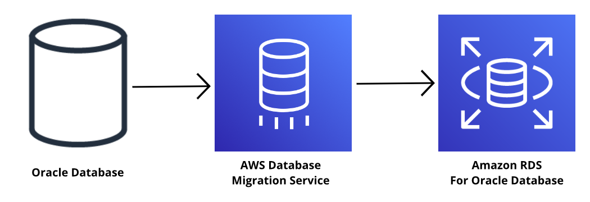

# AWS Database Migration Service
Wah, tak terasa ya kita telah banyak membahas berbagai opsi database di AWS. Nah, sekarang mungkin Anda akan mengerutkan dahi, “Bagaimana kalau kita sudah punya database di on-premise atau mungkin di platform lain? Apa itu berarti kita harus memulai dari awal?”

Oh, tak perlu khawatir akan itu! AWS punya cara yang ajaib.

Mari berkenalan dengan AWS Database Migration Service (AWS DMS). Ia dapat memigrasikan database yang Anda miliki--baik relasional, nonrelasional (NoSQL), atau tipe penyimpanan data lain--ke AWS dengan mudah dan aman.

Pada dasarnya, proses migrasi itu membutuhkan sumber dan target database. Nah, dengan AWS DMS:

  - Database sumber tetap beroperasi penuh selama proses migrasi.
  - Downtime (waktu henti) diminimalkan untuk aplikasi yang bergantung pada database tersebut.
  - Database sumber dan target tidak harus bertipe sama.

Oke. Meski tak harus bertipe sama, mari mulai pembahasan kita dari proses migrasi database yang bertipe sama (homogen) terlebih dahulu, atau dikenal sebagai homogenous database migration. Proses semacam ini dapat memigrasikan database dari:

  - MySQL ke Amazon RDS for MySQL.
  - Microsoft SQL Server ke Amazon RDS for SQL Server.
  - Bahkan, Oracle ke Amazon RDS for Oracle.

Karena sumber database dan target memiliki struktur skema, tipe data, dan kode database yang sama, hasilnya proses migrasi akan berlangsung mudah.

Nah, contoh dari sumber database ini dapat berupa database yang berjalan di on-premise, Amazon EC2 instance, ataupun Amazon RDS. Sementara untuk database target, ia bisa saja database yang berada di Amazon EC2 maupun Amazon RDS.

Cara kerja migrasi homogen ini pun cukup sederhana. Anda hanya perlu membuat tugas migrasi, mengoneksikannya ke database sumber dan target, lalu mulai prosesnya dengan mengeklik tombol. Sisanya, akan ditangani oleh AWS DMS. Keren, bukan?

Sekarang, mari kita beralih ke jenis kedua, yakni migrasi database heterogen alias heterogeneous database migration. Berbeda dengan jenis pertama, migrasi heterogen ini terjadi saat database sumber dan target memiliki tipe yang berbeda. Ia juga merupakan proses dua langkah.

Maksudnya, karena struktur skema, tipe data, dan kode database asal berbeda dengan database target, maka kita perlu mengubahnya terlebih dahulu menggunakan AWS Schema Conversion Tool. Setelah itu, barulah kita gunakan AWS DMS untuk memigrasikannya.

Nah, selain dari yang dijelaskan di atas, AWS DMS juga dapat digunakan untuk:

  ## Migrasi ke database pengembangan dan pengujian
     Contoh penggunaannya adalah ketika Anda ingin melakukan pengujian aplikasi pada database produksi tanpa memengaruhi pengguna. Nah, dengan AWS DMS, Anda dapat memigrasikan salinan dari database produksi tersebut ke lingkungan pengembangan (development) atau pengujian (testing).

  ## Konsolidasi database
     Dengan AWS Database Migration Service, Anda dapat menggabungkan beberapa database menjadi satu database pusat.

  ## Replikasi database yang kontinu
     AWS DMS memungkinkan Anda untuk melakukan replikasi data yang berkelanjutan. Ini berguna untuk disaster recovery (pemulihan bencana) atau pemisahan geografis.
     
Oke, itulah dia materi tentang AWS Database Migration Service. Perjalanan kita belum berakhir ya, masih ada materi menarik lain di modul berikutnya. Ganbatte!