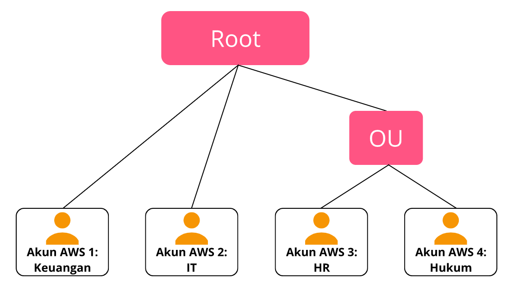

# AWS Organizations
Saat Anda terjun pertama kali ke AWS Cloud, kemungkinan besar Anda akan memulai dengan satu akun AWS, kebanyakan orang pun akan seperti itu. Tetapi, seiring dengan pertumbuhan bisnis atau perjalanan cloud, Anda perlu memisahkan tugas dengan akun yang berbeda.

Misalnya begini. Katakanlah Anda memiliki beberapa tim yang menjalankan bisnis kedai kopi. Anda ingin

  - tim developer dapat memiliki akses ke sumber daya pengembangan;
  - tim akuntansi bisa mengakses informasi penagihan; atau bahkan
  - memisahkan tim bisnis agar mereka dapat bereksperimen dengan layanan AWS tanpa mempengaruhi satu sama lain.

Semakin banyak tugas yang dilakukan setiap tim, maka lama-kelamaan akun AWS Anda akan makin kusut karena tak terkelola dengan baik.

Dengan kondisi tersebut, Anda perlu mengenal layanan yang satu ini, yaitu AWS Organizations. Sederhananya, ia adalah lokasi sentral yang dapat mengelola beberapa akun AWS. Dengannya, Anda dapat mengelola biaya, kontrol akses, compliance (kepatuhan), keamanan, dan berbagi sumber daya dengan seluruh akun-akun AWS.

Saat Anda membuat organisasi, AWS Organizations secara otomatis membuat root (wadah induk yang terdiri dari OU--nanti kita bahas--dan akun AWS di organisasi Anda).

Lalu, apa saja fitur-fitur yang ditawarkan oleh AWS Organizations? Oke, mari kita uraikan.

   1. `Manajemen terpusat`
      
      AWS Organizations dapat menjadi alat manajemen terpusat dari semua akun AWS Anda. Misal jika Anda memiliki beberapa akun (A, B, C, D, E), maka Anda dapat menggabungkannya menjadi sebuah organisasi sehingga memungkinkan akun terkelola secara terpusat.

   2. `Consolidated billing (Tagihan terkonsolidasi)`
      
      Anda dapat menggunakan akun utama dari organisasi untuk menggabungkan dan mengatur pembayaran biaya penggunaan semua akun anggota. Bahkan, keuntungan lain dari consolidated billing adalah diskon massal. Kita akan mempelajari secara detail tentang consolidated billing ini di modul yang akan datang.

   3. `Pengelompokan hierarki akun`
      
      Anda dapat mengimplementasikan fitur ini untuk memenuhi kebutuhan keamanan, compliance, atau anggaran. Kelompokkan akun ke dalam `organizational unit (OU)` untuk mempermudah pengelolaan akun-akun yang memiliki tujuan serupa atau kepentingan persyaratan keamanan.

      Saat Anda menerapkan policy (kebijakan) ke OU, semua akun otomatis mewarisi permission yang ada di policy tersebut. Fitur ini juga memudahkan Anda untuk mengisolasi beban kerja atau aplikasi yang memiliki persyaratan keamanan tertentu.

      Misalnya, jika Anda memiliki akun yang hanya dikhususkan untuk mengakses layanan AWS tertentu, maka Anda dapat memasukkannya ke dalam suatu OU. Kemudian lampirkan policy yang mengatur akses ke layanan AWS tersebut.

   4. `Kontrol atas layanan AWS dan tindakan API`
      
      Dengan AWS Organizations, Anda bisa mengontrol layanan AWS dan layanan API yang dapat diakses oleh setiap akun administrator dari akun utama organisasi.

      Anda juga dapat menggunakan `service control policies (SCP)` untuk menentukan permission alias izin maksimum untuk akun anggota di organisasi. Maksudnya, Anda bisa membatasi layanan AWS, sumber daya, dan layanan API individual yang mana dapat diakses oleh user dan role di setiap akun anggota.

# Studi Kasus: AWS Organizations
Katakanlah Anda memiliki bisnis dengan akun AWS terpisah untuk setiap departemen: Keuangan, IT, HR (Human Resource/Sumber Daya Manusia), dan Hukum. Anda memutuskan untuk menggabungkan akun ini ke dalam satu organisasi sehingga dapat dikelola dari satu tempat.

Tentu, kebutuhan semacam ini dapat diwujudkan dengan AWS Organizations. Dalam mendesain organisasi, Anda mempertimbangkan kebutuhan bisnis, keamanan, dan peraturan dari setiap departemen. Informasi ini Anda gunakan untuk memutuskan departemen mana yang akan dikelompokkan ke dalam sebuah OU.

Karena departemen Keuangan dan IT memiliki persyaratan yang tidak tumpang tindih dengan departemen lain, Anda memutuskan untuk memasukkannya ke dalam organisasi untuk berbagai keuntungan seperti consolidated billing dan tidak menempatkannya ke dalam OU mana pun.

Nah selanjutnya, karena departemen HR dan Hukum perlu mengakses layanan dan sumber daya AWS yang sama, Anda pun menempatkannya ke dalam satu OU.

Dengan menempatkan akun departemen HR dan Hukum ke dalam OU yang sama, Anda dapat melampirkan policy yang berlaku untuk keduanya. Selain itu, Anda juga dapat lebih mudah memberikan akses ke layanan dan sumber daya yang dibutuhkan.

Walaupun telah menempatkan akun-akun tersebut ke dalam satu OU, Anda tetap dapat memberikan akses untuk user, group, dan role melalui AWS IAM.