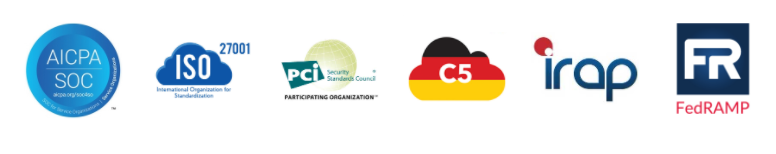

# Compliance (Kepatuhan)
Untuk mengawali modul, mari kita ungkap suatu fakta menarik. Tahukah Anda? Di setiap industri ada standar tertentu yang perlu ditegakkan. Anda akan diaudit atau diperiksa untuk memastikan bahwa standar tersebut telah dipenuhi.

Misalnya di kedai kopi. Suatu saat akan ada inspektur kesehatan yang datang untuk memeriksa apakah semuanya sesuai dengan regulasi dan sanitasi. Selain itu, akan ada petugas pajak yang datang mengaudit untuk memastikan bahwa Anda telah menjalankan administrasi dengan benar dan mematuhi hukum. Agar bisa lulus audit dan pemeriksaan compliance, Anda perlu mengandalkan dokumentasi, catatan, dan inspeksi.

Nah, begitu juga saat menggunakan AWS. Anda harus memenuhi standar dan regulasi tertentu sesuai jenis aplikasi yang dijalankan. Misal:

  - Anda harus mematuhi GDPR (General Data Protection Regulation) saat menjalankan software yang menangani data konsumen di Uni Eropa; atau
  - Anda perlu merancang arsitektur yang dapat memenuhi persyaratan compliance HIPAA (Health Insurance Portability and Accountability Act) ketika menjalankan aplikasi perawatan kesehatan di Amerika Serikat.

Maka dari itu, tentu Anda memerlukan suatu layanan yang dapat mengumpulkan dokumen, menyimpan catatan, dan memeriksa lingkungan AWS, dengan tujuan untuk memastikan regulasi compliance yang Anda jalankan telah terpenuhi dengan baik.

Ketahuilah, AWS telah membangun infrastruktur dan jaringan data center sesuai dengan standar praktik terbaik industri untuk keamanan. Nah, Anda--sebagai pelanggan AWS--seharusnya ikut juga mewarisi semua praktik terbaik tersebut baik dari segi kebijakan, arsitektur, dan juga proses operasional di atas AWS platform.

AWS telah memenuhi daftar panjang dari program compliance--dapat Anda temukan secara online di halaman AWS Compliance Programs. Ini berarti, sebagian dari aspek compliance Anda telah terpenuhi. Dengan begitu, Anda pun dapat fokus untuk memenuhi kebutuhan compliance di sisi arsitektur yang Anda bangun.

Oke, hal berikutnya yang perlu Anda ketahui terkait compliance di lingkungan AWS adalah Region. Region yang Anda pilih dapat juga membantu memenuhi regulasi compliance. Ibaratnya, jika Anda hanya dapat menyimpan data secara legal di negara tertentu, maka pilihlah Region yang sesuai dengan tujuan agar bisnis operasional Anda tunduk kepada aturan yang berlaku di negara tertentu.

Catat! Anda memiliki kontrol penuh atas keseluruhan data yang tersimpan di AWS. Anda bisa menggunakan beberapa mekanisme enkripsi tambahan untuk menjaga agar data tetap aman. Selain itu, jika Anda memiliki standar khusus terkait penyimpanan data, maka Anda dapat membuat mekanisme sendiri di AWS atau menggunakan fitur yang tersedia pada layanan AWS.

# AWS Artifact
Berbicara tentang compliance, tahukah Anda? AWS menyediakan whitepaper (panduan resmi AWS) dan dokumen yang dapat Anda gunakan untuk keperluan laporan compliance.

Bahkan, AWS dapat memberikan dokumentasi yang membuktikan dirinya mengikuti praktik terbaik untuk keamanan dan compliance. Wow, menarik ‘kan? 

Nah, `layanan yang dapat Anda gunakan untuk mengakses dokumentasi` tersebut adalah `AWS Artifact`. Dengannya, Anda bisa mendapatkan `akses on-demand` ke laporan keamanan dan `compliance AWS serta online agreements` (perjanjian online) tertentu.

Berikut adalah beberapa laporan dan regulasi compliance yang dapat Anda temukan dalam AWS Artifact.

Diambil dari AWS Artifact.

AWS Artifact terdiri dari 2 bagian utama, yaitu `AWS Artifact Agreements` dan `AWS Artifact Reports`. Mari kita telaah:

  - `AWS Artifact Agreements`

    Jika Anda perlu menandatangani perjanjian dengan AWS terkait penggunaan jenis informasi tertentu di seluruh layanan, Anda dapat melakukannya melalui AWS Artifact Agreements.

    Di AWS Artifact Agreements, Anda dapat meninjau, menerima, dan mengelola perjanjian, baik untuk akun individu maupun semua akun di AWS Organizations.

    AWS menyediakan berbagai jenis perjanjian untuk memenuhi kebutuhan pelanggan yang patuh pada peraturan tertentu, seperti `Health Insurance Portability and Accountability Act (HIPAA)`.

  - `AWS Artifact Reports`

    Ketika Anda hendak membuat aplikasi dan membutuhkan informasi tentang tanggung jawab untuk mematuhi standar regulasi tertentu, Anda dapat mengakses AWS Artifact Reports.

    AWS Artifact Reports menyediakan laporan compliance dari auditor pihak ketiga. Auditor ini telah menguji dan memverifikasi bahwa AWS mematuhi berbagai standar dan regulasi keamanan global, regional, dan industri.

# Customer Compliance Center
Customer Compliance Center menyediakan informasi yang dapat membantu Anda untuk mempelajari lebih lanjut tentang compliance.

Di sana, Anda dapat membaca beberapa contoh kasus yang berhubungan dengan compliance dari para pelanggan AWS untuk memberikan gambaran bagaimana perusahaan dalam `regulated industry (industri teregulasi)` menyelesaikan berbagai tantangan compliance, governance/tata kelola, dan audit.

Anda juga dapat mengakses whitepaper dan dokumentasi tentang:

  - Jawaban untuk pertanyaan mengenai compliance.
  - Tinjauan mengenai AWS Risk and Compliance.
  - Checklist audit keamanan.
  - Dan masih banyak lainnya.