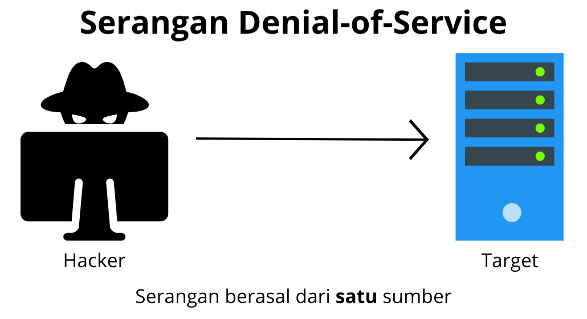
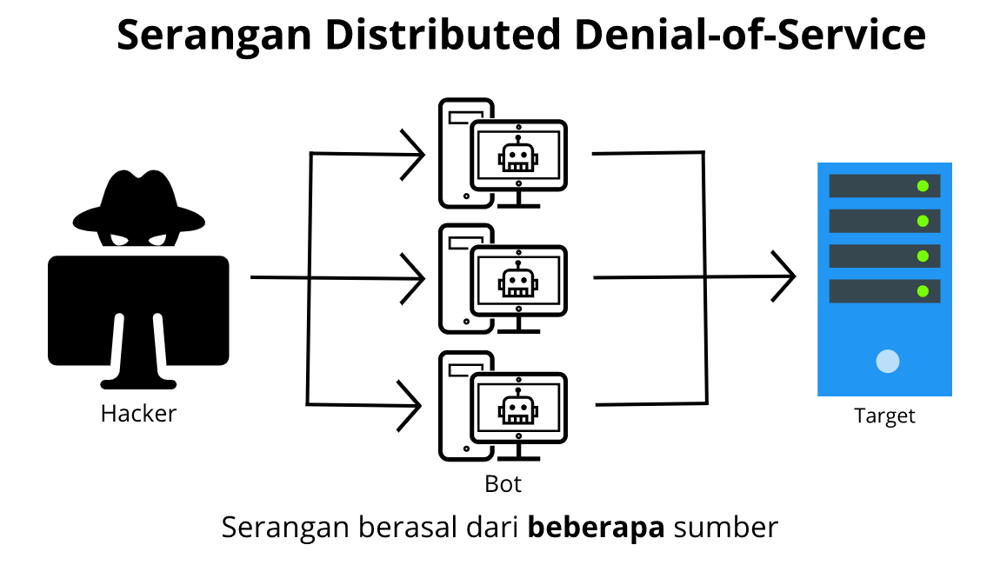
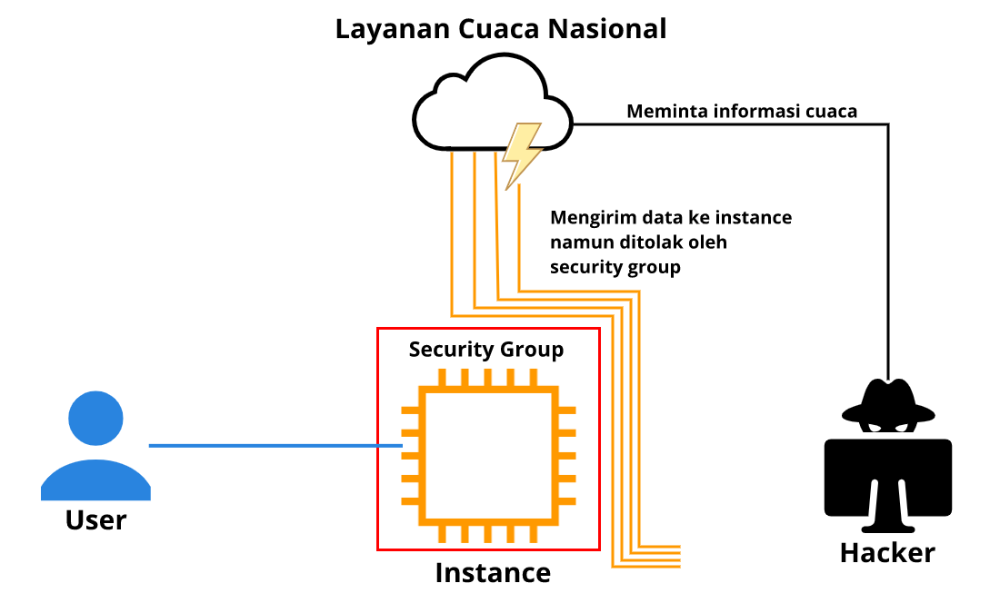
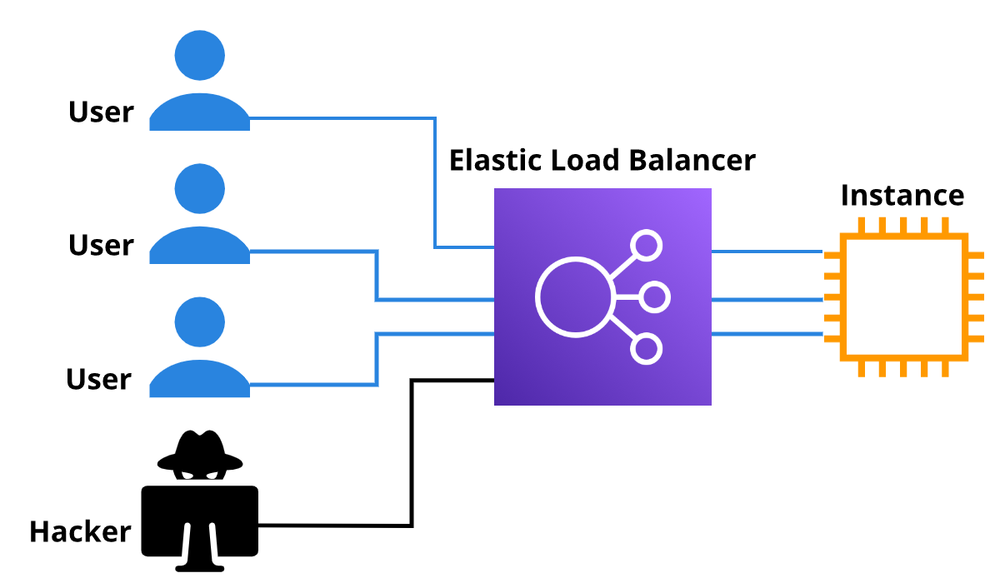

# Serangan Denial-of-Service
Oke, sekarang kita masuk ke modul yang serius, benar-benar serius, yakni seputar serangan yang dapat melumpuhkan infrastruktur Anda.

Tapi, untuk mempermudah penjelasan, mari kita kaitkan dengan skenario kedai kopi. Katakanlah kedai kopi Anda memiliki layanan pemesanan melalui telepon. Cara kerjanya, seorang kasir akan menulis pesanan dan memberikannya kepada barista. Setelah minuman tersaji, pelanggan bisa mengambilnya di kedai kopi.

Namun, anggaplah ada orang iseng yang menelepon beberapa kali untuk memesan kopi tetapi ia tak pernah mengambil minumannya. Karena terus-menerus menelepon, ia membuat kasir tak bisa menerima panggilan dari pelanggan lain.

Lalu, bagaimana cara mengatasi masalah ini? Solusi sederhananya adalah dengan memblokir nomor telepon tersebut. Nah, tindakan orang iseng tersebut mirip dengan serangan denial-of-service.

Serangan `denial-of-service (DoS)` adalah `upaya yang dilakukan secara sengaja untuk membuat website atau aplikasi menjadi tidak bekerja dengan optimal bagi pengguna`.

Salah satu contohnya adalah ketika penyerang membanjiri aplikasi Anda dengan traffic jaringan yang masif sehingga membuatnya kewalahan dan tak lagi dapat merespons permintaan pengguna.

# Serangan Distributed Denial-of-Service
`Distributed denial-of-service alias DDoS` adalah `salah satu serangan yang dapat menimpa infrastruktur atau aplikasi Anda`. Serangan ini telah membuat banyak bisnis hancur.

Banyak tim keamanan di luar sana yang telah membangun rencananya yang kompleks untuk mencegah serangan ini. Tapi, apa sebenarnya DDoS itu? Bagaimana kita bisa bertahan melawannya?

Huh! Ini akan menjadi pembahasan yang panjang, bahkan bisa memakan waktu yang cukup lama untuk benar-benar memahami semuanya. Tapi tenang! Anda tak perlu tahu semuanya.

Pada modul kali ini, kita hanya akan membahas dasar-dasar bagaimana serangan DDoS terjadi dan bagaimana AWS dapat secara otomatis mempertahankan infrastruktur Anda darinya. Oke, mari kita mulai.

Guna mempermudah, seperti biasa, kita analogikan dengan kedai kopi dan menggunakan kasus yang sama seperti sebelumnya, yaitu orang iseng yang menelepon berulang kali.

Yup! Kita memang telah memblokir nomor tersebut. Tapi ternyata, orang ini meminta bantuan teman-temannya. Mereka terus-menerus menghubungi kedai kopi dengan nomor telepon yang berbeda. Tentu ini akan membuat pelanggan lain semakin kesulitan untuk menelepon kedai kopi Anda.

Nah, itulah konsep dari serangan `DDoS`. Berbeda dengan DoS yang hanya berasal dari satu  sumber, serangan DDoS ini menggunakan beberapa sumber untuk melakukan serangan. Tujuannya `untuk membuat aplikasi Anda kewalahan dan tak dapat beroperasi lagi`.

Serangan ini bisa bisa berasal dari sekelompok orang atau bahkan individu. Cara kerjanya, penyerang menggunakan beberapa komputer yang terinfeksi (juga dikenal sebagai "bot") untuk mengirimkan traffic yang masif ke situs aplikasi Anda.

Oke, pembahasan terkait mekanisme DDoS ini akan sangat panjang. Maka dari itu, mari kita beralih dan menguraikan beberapa tipe dari serangan DDoS.

  - `UDP flood`

    Seseorang dapat menggunakan jenis serangan ini untuk melakukan DDoS dengan mudah, salah satunya adalah memanfaatkan layanan cuaca nasional.

    Saat Anda mengirim permintaan informasi ke layanan cuaca nasional, ia akan mengirimkan telemetri cuaca, prakiraan, pembaruan, dan lain-lain dengan jumlah yang masif.

    Nah, di sini masalahnya. Penyerang akan melakukan permintaan seputar informasi cuaca, tapi ia mencantumkan alamat penerima yang palsu, yakni alamat infrastruktur Anda.

    Dengan demikian, layanan cuaca akan membanjiri server Anda dengan data berukuran megabyte yang dapat membuat sistem Anda kewalahan dalam memprosesnya. Hingga akhirnya, server Anda akan berhenti.

  - `HTTP level attack`

    HTTP level attack merupakan serangan yang jauh lebih canggih. Penyerang akan terlihat seperti pelanggan normal yang mengakses aplikasi Anda dan melakukan permintaan umum, seperti pencarian produk yang rumit.

    Bedanya, penyerang melakukannya secara berulang kali dan terus-menerus sehingga server akan selalu memprosesnya. Ini mengakibatkan pelanggan yang sah menjadi tidak bisa mengakses aplikasi Anda.

  - `Slowloris attack`

    Serangan ini bahkan jauh lebih mengerikan. Agar lebih mudah memahaminya, mari kita umpamakan.

    Katakanlah ada seorang pelanggan yang memesan minuman di kedai kopi Anda. Pelanggan tersebut membutuhkan waktu hingga tujuh menit lamanya. Tentu ini akan membuat para pelanggan lain yang mengantre di belakangnya menjadi tak bisa memesan kopi. Nah, serangan Slowloris serupa dengan itu.

    Penyerang berpura-pura memiliki koneksi yang sangat lambat. Ini menyebabkan server Anda terus menunggu pelanggan a.k.a penyerang tersebut menyelesaikan permintaannya dan membuat pelanggan lain tak terlayani. Beberapa penyerang Slowloris bahkan dapat menghabiskan seluruh kapasitas server Anda hanya dengan sedikit usaha.

Oke. Sekarang saatnya kita hentikan serangan-serangan ini dengan solusi yang tepat. Sebetulnya, Anda sudah tahu caranya. Apa maksudnya?

Begini. Semua hal yang telah kita pelajari di kelas ini tak hanya berbicara tentang membangun arsitektur yang baik, melainkan juga membantu Anda menyelesaikan hampir semua jenis serangan DDoS, bahkan tanpa biaya tambahan. Mari kita kupas satu per satu.

Mulai dari serangan pertama, yakni UDP flood. Solusi untuk mencegah serangan ini adalah dengan menggunakan security group. Ia hanya dapat mengizinkan traffic permintaan yang tepat.

Tahukah Anda? Data laporan cuaca menggunakan protokol yang benar-benar berbeda dari pelanggan Anda. Artinya, security group bisa menolak permintaan tersebut jika memang tak ada di dalam daftar yang diizinkan.

Lalu, bagaimana untuk menghalau serangan `Slowloris`? Solusinya sederhana, Anda pun sudah mempelajarinya, yakni menggunakan `Elastic Load Balancer (ELB)` yang dapat mengarahkan traffic lalu lintas untuk Amazon EC2 instance.

Jadi, walaupun penyerang memiliki koneksi yang sangat lambat, pelanggan Anda yang sah tak perlu menunggunya hingga selesai, mereka tetap bisa mengakses server.

Serangan ini juga tak akan mengenai instance Anda karena sebelum diteruskan ke server, ELB akan menangani setiap permintaan hingga selesai terlebih dahulu, tak peduli ia memiliki koneksi yang cepat atau bahkan lambat sekali pun.

Ingat! ELB itu sangat kuat dan kapasitasnya dapat diskalakan. Ia juga berjalan di tingkat Region. Artinya, untuk bisa membanjiri ELB, Anda harus membanjiri keseluruhan AWS Regions. Bukannya mustahil, tetapi secara teoritis akan terlalu mahal bagi siapa pun yang melakukannya.

Nah, bagaimana untuk mengadang serangan yang paling tajam dan paling canggih di luar yang telah dijelaskan? Tenang, tenang! AWS juga menawarkan layanan pertahanan khusus yang disebut dengan `AWS Shield`.

# AWS Shield
`AWS Shield` adalah layanan yang dapat melindungi aplikasi Anda dari serangan DDoS. Layanan ini memberikan dua tingkat perlindungan: Standard dan Advanced. Mari kita kupas keduanya.

  - `AWS Shield Standard`

    AWS Shield Standard secara otomatis melindungi sumber daya AWS Anda dari jenis serangan DDoS yang paling umum tanpa biaya.

    Dengan menggunakan berbagai teknik analisis, AWS Shield Standard dapat mendeteksi dan memitigasi traffic berbahaya secara real time saat memasuki aplikasi Anda.

  - `AWS Shield Advanced`

    AWS Shield Advanced adalah layanan berbayar yang menyediakan kemampuan untuk mendiagnostik, mendeteksi, dan memitigasi serangan DDoS yang canggih.

    AWS Shield Advanced terintegrasi dengan layanan lain seperti Amazon CloudFront, Amazon Route 53, dan Elastic Load Balancing.

    Selain itu, Anda juga dapat mengintegrasikan AWS Shield dengan AWS WAF. `AWS WAF` merupakan `web application firewall` untuk melindungi aplikasi web atau API Anda dari eksploitasi web umum yang dapat memengaruhi ketersediaan, mengganggu keamanan, atau memakai sumber daya secara berlebihan.