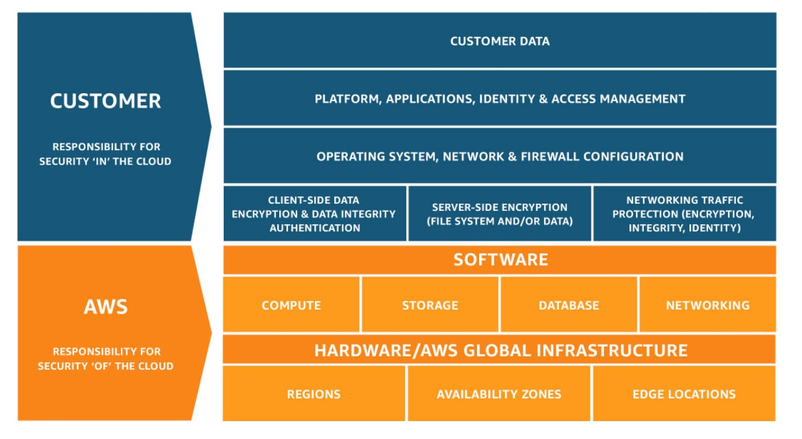

# Tujuan Pembelajaran
Dalam modul ini, Anda akan mempelajari bagaimana cara:

  - Menjelaskan manfaat shared responsibility model.
  - Menerangkan multi-factor authentication (MFA).
  - Mengerti pengaturan keamanan dengan AWS Identity and Access Management (IAM).
  - Memaparkan manfaat utama AWS Organizations.
  - Menjabarkan kebijakan keamanan di tingkat dasar.
  - Merangkum aspek compliance di lingkungan AWS.
  - Menguraikan layanan keamanan tambahan di AWS.

Oke, sepertinya Anda sudah penasaran ya. Mari kita menyibak ke materi selanjutnya!

# Pengenalan ke Keamanan
Di modul ini kita akan menyelami materi AWS semakin dalam. Kita akan belajar tentang pembagian kontrol terhadap lingkungan AWS platform, melalui konsep shared responsibility model alias model tanggung jawab bersama. Silakan amati gambar di bawah ini.

Diambil dari `Model Tanggung Jawab Bersama AWS`.

Ada dua hal utama yang harus Anda perhatikan di shared responsibility model ini, yaitu:

  - AWS mengontrol security of the cloud (keamanan dari cloud).
  - Pelanggan mengontrol security in the cloud (keamanan di cloud).
  
AWS bertanggung jawab untuk mengontrol data center, keamanan setiap layanan, dan lain sebagainya--dapat Anda lihat di gambar tersebut.

Lalu, bagian pelanggan adalah mengamankan beban kerja yang mereka jalankan di cloud. Ini merupakan bagian tanggung jawab yang AWS bagikan dengan pelanggan guna memastikan keamanan di cloud. 

Kita akan membahas materi ini sekaligus menguak berbagai layanan, mekanisme, dan fitur keamanan lain di AWS secara lebih detail di modul berikutnya. Jadi, sudah siapkah Anda? Stay tuned!