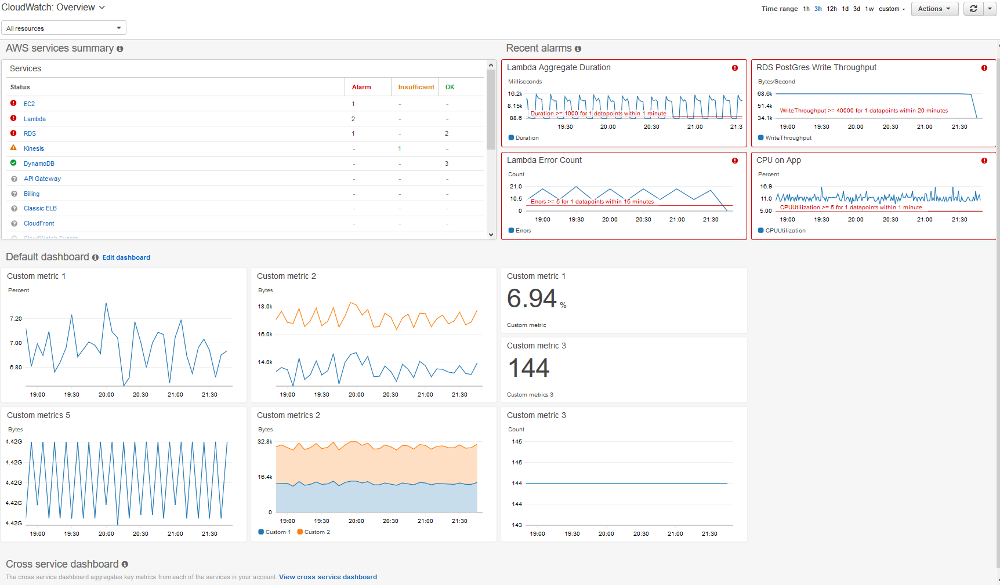

# Amazon CloudWatch
Mari kita awali modul ini dengan mengingat kembali skenario kedai kopi yang telah beroperasi cukup lama. Tapi, tahukah Anda? Ada satu masalah baru yang muncul di sana.

Karena kita terus-menerus menjalankan mesin kopi; menggunakan mug; membuka dan menutup lemari es, tentu akan lebih baik jika muncul suatu pemberitahuan.

Notifikasi tersebut sebaiknya datang pada saat ada sesuatu yang memerlukan tindakan tertentu, seperti mesin kopi yang harus dibersihkan atau diperbaiki.

Intinya, Anda sebagai pemilik kedai kopi memerlukan visibilitas terhadap status dari sistem, seperti:

  - Apakah semuanya berjalan dengan baik?
  - Apakah pelanggan Anda semakin senang atau malah sebaliknya?
  - Apakah Anda sering mengirimkan minuman yang salah kepada pelanggan?

Selain beberapa pertanyaan di atas, masih banyak lagi pertanyaan lainnya yang dapat menunjukkan keberhasilan operasional Anda.

Ide yang sama pun berlaku untuk sistem yang dibangun di AWS. Anda perlu satu cara yang dapat memantau kesehatan dan pengoperasian aplikasi. Tak perlu repot-repot untuk membangun platform pemantauan sendiri karena AWS telah menyediakannya untuk Anda.

Sambutlah, `Amazon CloudWatch`. Ia dapat `memantau infrastruktur dan aplikasi` yang Anda jalankan di AWS secara real time. Layanan ini bekerja dengan cara melacak dan memantau metrik. `Metrik` adalah `variabel yang terikat dengan sumber daya Anda`, seperti penggunaan CPU dari EC2 instance.

Oke, ini akan menarik. Sesuai dengan persoalan kita di awal, Anda ingin memiliki suatu sistem yang dapat memberi tahu jika mesin kopi perlu dibersihkan, misalnya setiap kali selesai membuat 100 espreso.

Nah, hal ini bisa terlaksana dengan hadirnya Amazon CloudWatch alarm. Anda dapat membuat suatu metrik khusus dan menetapkan ambang batasnya adalah 100. Pada saat jumlah espreso yang dibuat telah mencapai angka tersebut, ia akan memperingatkan Anda untuk membersihkan mesin. Sederhana, bukan?

Oh, tidak hanya itu! Bahkan CloudWatch alarm dapat terintegrasi dengan layanan Amazon SNS. Jadi, Anda dapat mengirimkan SMS ke pegawai di kedai kopi supaya mereka membersihkan mesinnya.

Dengan Amazon CloudWatch, Anda dapat membuat alarm sendiri untuk metrik dari semua jenis sumber daya di AWS. Nah, bagaimana jika kita ingin menggabungkan semua metrik tersebut dalam satu panel?

Diambil dari `Amazon CloudWatch: Getting Started with Amazon CloudWatch`.
Tentu kita bisa menggunakan fitur CloudWatch dashboard. Ia adalah panel yang mencantumkan metrik hampir secara real time. Dengannya, Anda dapat memantau penggunaan CPU dari Amazon EC2 instance, jumlah total permintaan yang dibuat ke Amazon S3 bucket, dan masih banyak lainnya. Sehingga, Anda dapat memonitornya secara proaktif.

Dashboard ini akan me-refresh secara otomatis setiap kali terbuka sehingga akan selalu menunjukkan tampilan terkini dari sumber daya Anda.

Sekarang mungkin Anda akan bertanya-tanya, “Apa keuntungan menggunakan Amazon CloudWatch ini?” Yuk mari kita jabarkan.

  - `Akses ke semua metrik dari satu lokasi`
    Anda dapat mengumpulkan metrik dan log dari semua sumber daya yang berjalan di AWS bahkan server yang berada di on-premise.

  - `Visibilitas ke seluruh aplikasi, infrastruktur, dan layanan`
    Dengan visibilitas ke seluruh sistem, Anda dapat mengorelasikan bahkan memvisualisasikan metrik dan log untuk menunjukkan sekaligus menyelesaikan masalah dengan cepat.

  - `Mengurangi waktu MTTR dan meningkatkan TCO`
    MTTR (mean time to resolution) adalah rata-rata waktu untuk menyelesaikan suatu masalah, sementara TCO (total cost of ownership) adalah biaya kepemilikan.

    Implementasi di kedai kopinya adalah, jika MTTR untuk jam pembersihan mesin lebih pendek, maka Anda dapat menghemat TCO. Dengan kata lain, Anda tak perlu repot-repot menghabiskan waktu untuk membuat sistem analitik sendiri. AWS telah menyediakan Amazon CloudWatch sehingga Anda dapat fokus pada peningkatan nilai bisnis.

  - `Mengoptimalkan aplikasi dan sumber daya operasional`
    Anda dapat menggabungkan metrik dari seluruh EC2 instance untuk memperoleh wawasan akan operasional dan penggunaannya.
    
Itu dia materi kita tentang Amazon CloudWatch. Berikutnya, kita punya materi yang tak akan kalah seru. Jadi, tunggu apalagi? Mari kita masuk ke materi selanjutnya!