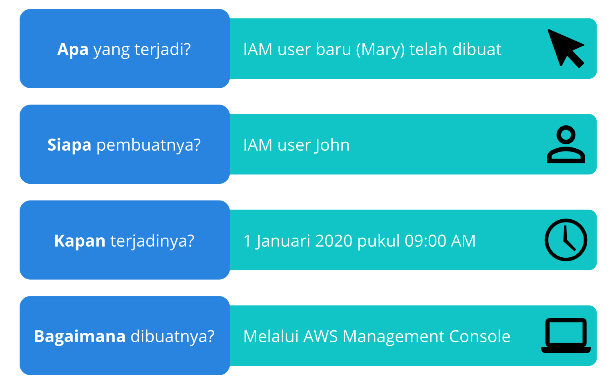

# AWS CloudTrail
Masih ingatkah Anda dengan contoh kasus kedai kopi kita sebelumnya? Tentu kita semua tahu bahwa di sana terdapat sebuah mesin kasir.

Tapi tahukah Anda? Mesin kasir adalah salah satu perangkat audit mandiri pertama di dunia. Walaupun demikian, Anda tetap harus memiliki prinsip: percaya tapi verifikasi.

Maksudnya begini. Pegawai kasir yang bekerja di kedai kopi tentunya adalah seseorang yang telah Anda percayai. Namun, mungkin Anda perlu memastikan bahwa uang tunai di laci kas telah sesuai dengan penjualan yang terjadi sebenarnya. Bagaimana caranya?

Anda bisa mewujudkan hal itu dengan `memeriksa mesin kasir tersebut karena ia dapat mencatat dan menyusun menjadi tabel semua transaksi yang terjadi`. Inilah yang disebut dengan `mengaudit transaksi`. Kemampuan semacam itu di bidang IT merupakan elemen yang penting dalam sebagian besar struktur `compliance (kepatuhan)`.

Coba kita bandingkan antara data center on-premise dengan AWS. Di on-premise, jika seseorang membuat suatu perubahan konfigurasi pada server, kita tak bisa mengetahui siapa pelakunya karena memang tidak ada yang dapat mencatat aksi modifikasi tersebut. Lantas, bagaimana dengan AWS? Eits, tentu masalah tersebut tak akan terjadi karena semuanya terprogram. 

Perkenalkan, `AWS CloudTrail`. Ia adalah `layanan audit API yang komprehensif`. Dengan CloudTrail, Anda dapat melihat riwayat lengkap dari aktivitas pengguna dan panggilan API untuk aplikasi maupun sumber daya Anda.

Cara kerjanya sederhana, setiap permintaan yang dikirimkan ke AWS, seperti meluncurkan EC2 instance; menambahkan baris ke tabel DynamoDB; atau mengubah izin pengguna, semuanya akan tercatat di mesin CloudTrail.

Anda bisa menganggap AWS CloudTrail sebagai log tindakan atau “jejak” yang ditinggalkan seseorang. Mesin akan mencatat dengan tepat tentang identitas pemanggil API, waktu panggilan, alamat IP pemanggil, dan masih banyak lainnya. Dari perspektif audit, ini adalah hal yang luar biasa.

Mari kita buat perumpamaannya. Bayangkan Anda sedang berurusan dengan auditor. Ia ingin memeriksa dan memastikan bahwa tidak ada siapa pun dari internet yang dapat mengakses database Anda. Ini mudah, Anda telah membangun security group yang mengunci lalu lintas eksternal.

Tetapi, sang auditor pun bertanya, “Administrator masih memiliki permission (izin) untuk mengubah pengaturan tersebut, bukan?”

Nah, bagaimana membuktikan kepada auditor bahwa pengaturan security group Anda itu tidak pernah berubah?”

Jawabannya sudah jelas, AWS CloudTrail. Anda dapat menyimpan log tersebut tanpa batas waktu ke dalam S3 bucket yang aman. Bahkan, Anda dapat menyimpannya dengan menggunakan metode anti-gangguan seperti Vault Lock--telah kita pelajari di modul penyimpanan dan database.

Selain itu, Anda juga dapat mengaktifkan CloudTrail Insights. Ini adalah fitur opsional yang memungkinkan CloudTrail secara otomatis mendeteksi aktivitas API yang mencurigakan di akun AWS Anda.

Misalnya, baru-baru ini jumlah Amazon EC2 instance yang diluncurkan oleh akun Anda lebih banyak dari biasanya. Nah, Anda dapat meninjau detail kejadian tersebut secara lengkap dengan CloudTrail Insights guna menentukan tindakan apa yang perlu diambil selanjutnya.

# Studi Kasus: AWS CloudTrail Event
Selamat datang kembali di modul yang mungkin sudah Anda rindukan ya pastinya, yakni Studi Kasus.

Oke. Di studi kasus kali ini kita akan menelaah tentang layanan AWS CloudTrail, tentunya dengan skenario kedai kopi.

Katakanlah Anda--sebagai pemilik kedai kopi--sedang menjelajahi bagian AWS Identity and Access Management (AWS IAM) dari AWS Management Console.

Anda menemukan adanya pembuatan IAM user baru bernama Mary. Namun, Anda tidak tahu siapa pembuatnya, kapan terjadinya, atau metode apa yang digunakan. Tahukah Anda cara untuk menyelesaikan permasalah di atas? Yup! Anda perlu menuju ke halaman AWS CloudTrail.

Di sana Anda bisa membuka CloudTrail Event History dan menerapkan filter agar hanya menampilkan peristiwa untuk tindakan API "CreateUser" di IAM.

Katakanlah Anda telah menemukan suatu catatan kejadian berupa panggilan API yang mengindikasikan pembuatan IAM user bernama Mary. Catatan ini memberikan detail yang begitu lengkap tentang apa yang terjadi. Tahukah Anda apa isi catatan tersebut?

Pada 1 Januari 2020 pukul 09.00 pagi, IAM user bernama John membuat pengguna baru (Mary) melalui AWS Management Console. Wah, menarik ‘kan?

Nah, dengan ini Anda sudah berhasil menyelesaikan studi kasus di atas menggunakan AWS CloudTrail. Selamat! Anda telah menjadi Sherlock Holmes yang baru.
