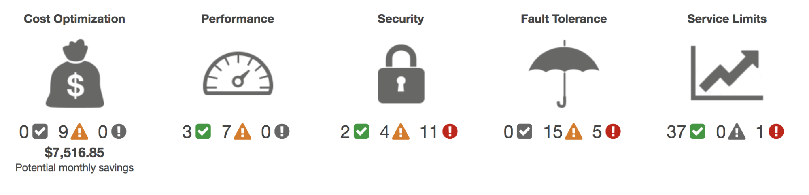

# AWS Trusted Advisor
Saat menjalankan kedai kopi, mungkin Anda memerlukan seorang penasihat yang datang menganalisis sistem dan berkata, “Hei, proses ini harus disederhanakan.”

Atau, “Saya punya beberapa tips bagus tentang cara menghemat uang untuk bisnis Anda.”

Atau bahkan, “Tahu, nggak? Saya bisa masuk ke area mesin kasir Anda dan membuka laci kasnya tanpa ada yang memperhatikan. Itu tidak baik!”

Poinnya, akan sangat sempurna jika Anda kenal seseorang yang mengerti praktik terbaik di industri, paham apa yang harus dianalisis, dan memberi tahu apa yang perlu dilakukan. Jika poin-poin di atas diterapkan, maka sistem dapat berjalan lebih efisien, lebih aman, dan lebih hemat.

Lalu, bagaimana cara untuk menerapkannya? AWS memiliki penasihat otomatis yang disebut dengan `AWS Trusted Advisor`. Ia adalah `layanan web yang memeriksa lingkungan AWS` Anda dan `memberikan rekomendasi secara real time sesuai dengan praktik terbaik AWS`.

Jika Anda penasaran, berikut adalah tampilan dari AWS Trusted Advisor dashboard:

Diambil dari `AWS Trusted Advisor`.

Ada 3 kategori yang terdapat pada dashboard tersebut, di antaranya:

  - Centang hijau: menunjukkan jumlah item yang terdeteksi tanpa masalah.
  - Segitiga oranye: mewakili jumlah saran yang mungkin perlu Anda investigasi.
  - Lingkaran merah: mengindikasikan jumlah rekomendasi yang perlu Anda tindak lanjuti.

Dapat Anda lihat pada gambar tersebut, AWS Trusted Advisor mengevaluasi sumber daya Anda berdasarkan 5 pilar, di antaranya:

  - Cost optimization (pengoptimalan biaya)
  - Performance (kinerja)
  - Security (keamanan)
  - Fault tolerance (toleransi terhadap kesalahan)
  - Service limits (batas layanan)

AWS Trusted Advisor juga menyertakan daftar rekomendasi tindakan dan materi pendukung di setiap pemeriksaan pilarnya agar Anda dapat mempelajari lebih lanjut tentang praktik terbaik AWS.

Setelah mengetahui apa itu `AWS Trusted Advisor`, sekarang mari kita uraikan contoh-contoh masalah yang dapat terdeteksi di setiap pilar dari layanan ini.

  ## Cost optimization
    Di pilar ini, contoh masalah yang bisa muncul adalah:
    - RDS instances yang tidak dipakai.
    - Beberapa EC2 instance yang jarang digunakan.
    - EBS volume yang tidak dimanfaatkan.

    Anda dapat melakukan scaling down--telah kita bahas di modul komputasi di cloud--terhadap instance yang jarang dipakai untuk menghemat biaya. Atau, Anda dapat menghapus sumber daya yang memang tidak digunakan sama sekali.

  ## Performance
    Salah satu contoh masalah yang muncul di pilar ini adalah pengiriman konten untuk Amazon CloudFront yang tidak teroptimasi.

  ## Security
    Beberapa contoh masalah yang muncul pada pilar security atau keamanan adalah:
    - IAM password policy atau kebijakan kata sandi IAM yang lemah untuk user.
    - MFA (multi-factor authentication) tidak diaktifkan untuk root user.
    - Security group yang mengizinkan akses publik ke EC2 instance.
    Semua hal ini membahayakan sumber daya di akun Anda dan harus ditangani secepat mungkin.

  ## Fault tolerance
    Berikut adalah beberapa contoh masalah yang dapat muncul:
    - EBS volume yang tidak memiliki snapshot. Ingat, snapshot adalah backup (cadangan). Tanpa backup, Anda akan kehilangan data di dalamnya jika volume EBS mengalami kegagalan.
    - Amazon EC2 yang tidak terdistribusi ke seluruh Availability Zone (AZ). Ini akan buruk jika salah satu AZ mengalami masalah, aplikasi Anda mungkin akan mengalami gangguan.

  ## Service limits
    Pilar ini akan memberi peringatan saat Anda mendekati atau mencapai batas layanan AWS. Contoh, limit dari kepemilikan VPC per Region adalah 5. Nah, jika telah mencapai batas tersebut, maka AWS Trusted Advisor akan segera memberi tahu Anda.

Oke. Jadi, AWS Trusted Advisor dapat memandu Anda ke arah yang lebih baik dalam hal 5 pilar yang telah kita bahas. Gunakan layanan ini dan mulailah mengambil tindakan. Semangat!