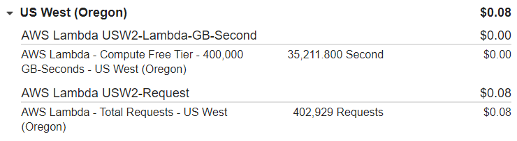
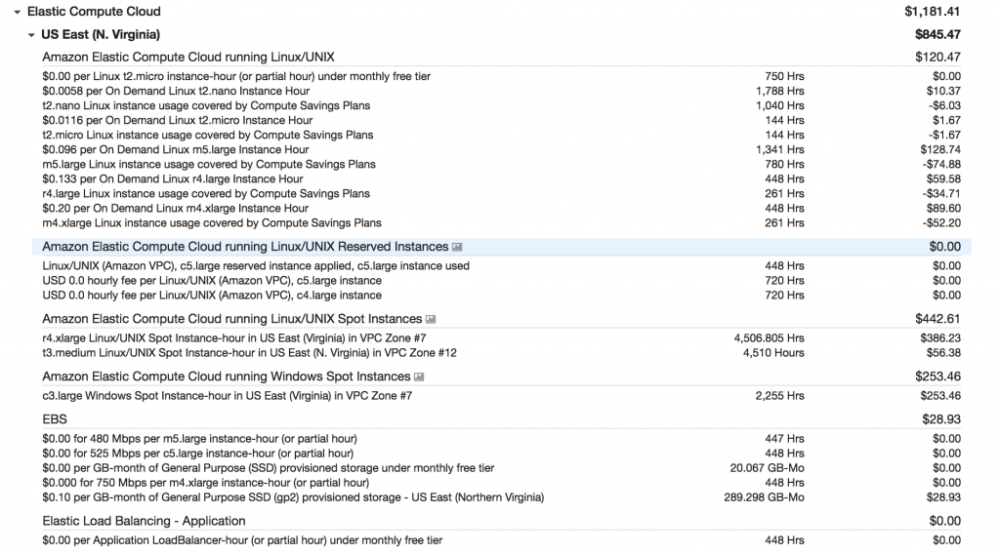
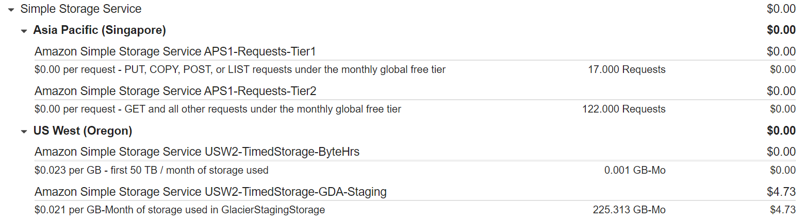

# Konsep Harga AWS
# Bagaimana Cara Kerja Harga AWS?
Dengan menggunakan AWS, Anda cukup membayar untuk setiap layanan dan tak perlu mendaftar dengan kontrak jangka panjang atau lisensi yang rumit. Sama halnya dengan membayar kebutuhan sehari-hari seperti air dan listrik, di AWS Anda hanya membayar layanan sesuai pemakaian. Setelah penggunaan berhenti atau tidak dilanjutkan, tak ada biaya tambahan atau biaya penghentian.

Ada beberapa keuntungan ketika Anda menggunakan AWS dalam hal biaya, mari kita uraikan.

  - `Pay for what you use` (Bayar sesuai yang Anda gunakan)
  Saat menjalankan beban kerja di AWS, Anda tidak perlu repot-repot mengeluarkan banyak biaya, seperti membeli server atau menyewa gedung. Pengeluaran ini dapat Anda ganti dengan variabel lain yang lebih rendah, misal menggunakan beberapa layanan yang tepat sesuai kebutuhan.

  Untuk setiap layanan, Anda cukup membayar sesuai dengan jumlah sumber daya yang Anda gunakan, tanpa memerlukan komitmen jangka panjang.

  - `Pay less when you reserve` (Berhemat saat Anda memesan di awal)
  Beberapa layanan menawarkan opsi reservasi yang memberikan diskon signifikan daripada harga instance dengan opsi penagihan On-Demand.

  Jika Anda memiliki kebutuhan beban kerja yang harus senantiasa berjalan, maka gunakanlah Amazon EC2 dengan opsi penagihan Savings Plans. Dengan Savings Plans, Anda dapat menghemat hingga 72% dibandingkan dengan kapasitas instance On-Demand.

  Anda tidak lupa ‘kan dengan opsi penagihan di atas? Kita telah membahasnya pada Modul Komputasi di Cloud ya.

  - `Pay less with volume-based discounts when you use more` (Bayar lebih murah dengan diskon berbasis volume saat Anda menggunakan lebih sering)
  Beberapa layanan menawarkan harga yang berjenjang. Sehingga, biaya per unit akan semakin rendah jika Anda semakin sering menggunakannya.

  Salah satu jenis layanan yang dapat membantu Anda untuk menjaga pengeluaran tetap rendah adalah layanan penyimpanan AWS, misalnya Amazon S3. Semakin banyak ruang penyimpanan yang Anda gunakan, maka akan semakin sedikit pula harga per GB-nya.

# AWS Pricing Calculator
AWS Pricing Calculator memungkinkan Anda untuk menjelajahi layanan AWS dan membuat estimasi biaya untuk kasus penggunaan di AWS. Layanan ini berguna baik untuk yang belum pernah menggunakan AWS maupun yang ingin mengatur ulang atau memperluas penggunaan AWS.

AWS Pricing Calculator memiliki banyak manfaat, di antaranya Anda dapat:

  - Memodelkan arsitektur yang diinginkan sebelum membangunnya.
  - Menelusuri setiap harga sekaligus membuat perhitungan.
  - Menemukan tipe instance yang tersedia beserta persyaratan kontrak yang dapat memenuhi kebutuhan Anda.

Menarik, bukan? Dengan begitu, Anda dapat membuat keputusan tentang sumber daya apa saja yang akan Anda gunakan di AWS. Bahkan, Anda juga dapat membuat perencanaan biaya yang kelak Anda bayarkan.

Mari kita ambil contoh penggunaannya. Katakanlah Anda tertarik menggunakan Amazon EC2. Namun, Anda belum yakin AWS Regions atau tipe instance mana yang paling hemat biaya untuk kasus penggunaan Anda. Nah, dengan AWS Pricing Calculator, Anda dapat memasukkan detail seperti jenis sistem operasi, kebutuhan memori, dan input/output (I/O) yang Anda butuhkan.

Lebih menariknya lagi, AWS Pricing Calculator ini tidak menaruh biaya sama sekali alias gratis untuk Anda gunakan. Selamat mengestimasi!

# Contoh Harga AWS
Di materi ini kita akan membahas lebih detail tentang harga di AWS. Terdapat tiga karakteristik mendasar yang Anda bayar: komputasi, penyimpanan, dan transfer data. Karakteristik tersebut beragam tergantung pada produk AWS yang Anda gunakan, namun ketiga hal ini memiliki pengaruh terbesar pada biaya.

Sekarang mari kita uraikan penetapan harga untuk beberapa produk AWS yang umum digunakan, seperti AWS Lambda, Amazon EC2, dan Amazon S3.

## AWS Lambda
Saat menggunakan AWS Lambda, Anda dikenai biaya berdasarkan jumlah request (permintaan) untuk fungsi Anda dan waktu yang diperlukan untuk menjalankannya.

Layanan ini memungkinkan Anda untuk melakukan 1 juta request dan 3,2 juta detik waktu komputasi secara gratis setiap bulan.

Anda juga dapat menghemat biaya AWS Lambda dengan mendaftar Compute Savings Plan. Compute Savings Plan menawarkan biaya komputasi yang lebih rendah dengan berkomitmen pada jumlah penggunaan yang konsisten selama jangka waktu 1 atau 3 tahun. Ini adalah contoh mekanisme harga pay less when you reserve.

Sekarang mari kita lihat contoh tagihan untuk AWS Lambda. Perhatikan gambar berikut:

Tagihan di AWS Lambda akan dikelompokkan menurut AWS Regions. Untuk contoh di atas, penggunaan AWS Lambda terjadi di Region US West (Oregon). Bisa Anda lihat, daftar tagihan untuk jumlah request dan total durasi dibuat terpisah.

## Amazon EC2
Dengan Amazon EC2, Anda hanya membayar waktu komputasi sesuai yang digunakan. Bahkan, Anda juga dapat mengurangi biayanya secara signifikan dengan menggunakan Spot Instances--telah kita bahas pada Modul Komputasi di Cloud--untuk beberapa beban kerja.

Misalnya, Anda menjalankan pekerjaan batch processing yang tak masalah dengan interupsi. Nah, Spot Instances dapat memberi Anda penghematan biaya hingga 90% sekaligus tetap memenuhi kebutuhan atas ketersediaan beban kerja Anda.

Selain Spot Instances, Anda juga dapat melakukan penghematan tambahan untuk Amazon EC2 dengan Savings Plans dan Reserved Instances. Mari kita lihat contoh tagihan untuk Amazon EC2 berikut:

Diambil dari `Back to Basics: Getting Started with AWS Billing Console`.

Pada gambar di atas contoh tagihan mencakup

  - tipe instance yang telah digunakan;
  - jumlah ruang penyimpanan Amazon EBS yang telah digunakan; dan
  - durasi penggunaan Elastic Load Balancing.

## Amazon S3
Saat Anda menggunakan Amazon S3 pertimbangkanlah komponen biaya berikut:

  - Penyimpanan
    Ingat! Di Amazon S3, Anda hanya membayar untuk penyimpanan yang digunakan. Tarif yang dikenakan akan dihitung berdasarkan ukuran, storage class (kelas penyimpanan), dan durasi penyimpanan setiap objek.

  - Permintaan dan pengambilan data
    Anda akan dikenakan biaya untuk jumlah permintaan yang dibuat untuk objek dan Amazon S3 bucket.

    Misalnya, Anda menyimpan file foto di Amazon S3 bucket dan menggunakannya untuk website statis. Nah, setiap kali pengunjung membuka website, itu akan dihitung sebagai permintaan yang harus Anda bayar.

  - Transfer data
    Di Amazon S3, Anda membayar untuk semua bandwidth yang masuk dan keluar dari Amazon S3, kecuali untuk:
     - Data yang ditransfer masuk dari internet.
     - Data yang ditransfer keluar ke Amazon EC2 instance di AWS Regions yang sama dengan S3 bucket (termasuk ke akun yang berbeda di Region yang sama).
     - Data yang ditransfer keluar ke Amazon CloudFront.
     - Data yang ditransfer antara S3 bucket yang berbeda atau dari Amazon S3 ke layanan lain dalam AWS Regions yang sama.

  - Manajemen dan replikasi
    Anda akan dikenakan tarif atas fitur manajemen penyimpanan yang telah Anda aktifkan di Amazon S3 bucket. Fitur-fitur ini termasuk Amazon S3 Inventory, S3 Storage Class Analysis, dan S3 Object Tagging.

Nah, sekarang coba perhatikan gambar berikut:

Gambar di atas adalah contoh tagihan penggunaan Amazon S3 di dua Region: Asia Pacific (Singapore) dan US West (Oregon). Untuk setiap Region, rincian biaya didasarkan pada faktor-faktor berikut:

  - Jumlah permintaan untuk menambah atau menyalin objek ke dalam bucket.
  - Jumlah permintaan untuk mengambil/mengunduh objek dari bucket.
  - Jumlah ruang penyimpanan yang digunakan.
  