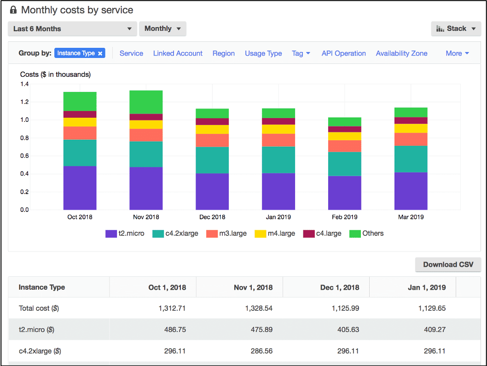

# AWS Cost Explorer
Seperti yang telah kita pelajari, AWS memiliki model biaya yang variabel dan Anda hanya membayar sesuai pemakaian. Setiap akhir bulan, tagihan tak akan terus-menerus sama, melainkan berubah-ubah sesuai dengan sumber daya yang Anda gunakan. Oleh karena itu, Anda perlu menelusuri tagihan dan pengeluaran di AWS.

AWS memiliki layanan yang disebut dengan AWS Cost Explorer. Ia adalah layanan berbasis konsol yang dapat meninjau dan menganalisis secara visual pengeluaran Anda di AWS.

AWS Cost Explorer dapat menunjukkan layanan mana yang memiliki pengeluaran terbesar. Bahkan, ia akan memberikan 12 bulan data historis sehingga Anda bisa melacak pengeluaran dari waktu ke waktu.

Pengeluaran Anda dapat divisualisasikan dan dikelompokkan berdasarkan beberapa atribut: layanan, AWS Regions, tipe instance, tag, dll. Di antara atribut tersebut, tag adalah salah satu pengelompokan yang cukup penting untuk Anda terapkan.

Tag pada dasarnya adalah pasangan key-value (kunci-nilai). Dengan tag, Anda dapat memberi label pada beberapa sumber daya (misal EC2 instance) dengan nama tertentu. Lalu visualisasikan semua biaya yang terkait dengan tag tersebut.

Supaya lebih mudah, amati gambar berikut:

Diambil dari `E-learning AWS Cloud Practitioner Essentials`.

Gambar di atas adalah contoh dari AWS Cost Explorer dashboard yang menampilkan biaya bulanan untuk Amazon EC2 instance selama periode 6 bulan. Baris untuk setiap bulan menunjukkan pengeluaran dari berbagai tipe Amazon EC2 instance (seperti t2.micro atau m3.large).

Dengan menganalisis pengeluaran AWS dari waktu ke waktu, Anda dapat membuat keputusan yang tepat untuk biaya di masa mendatang. Selamat bereksplorasi!