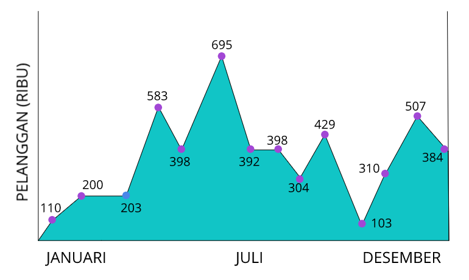
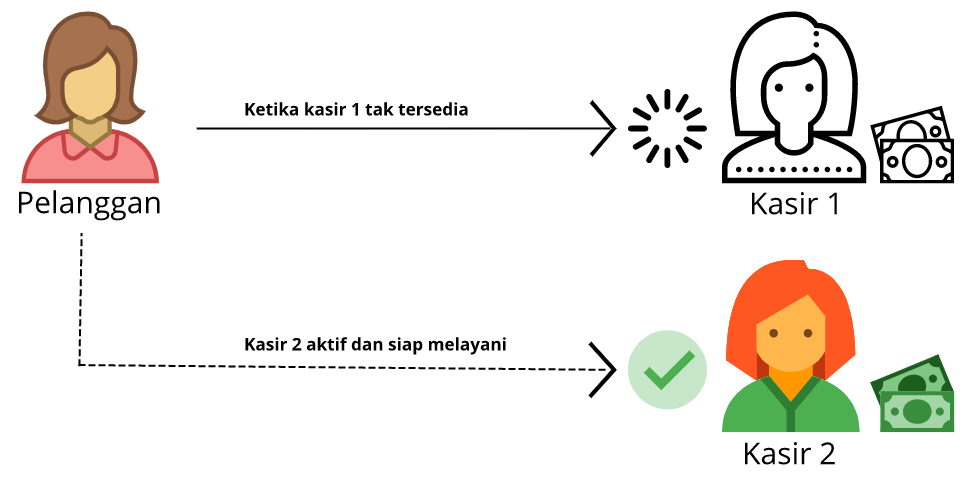
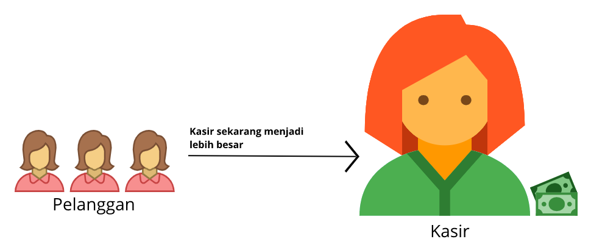

# Penyesuaian Kapasitas Amazon EC2
Sampai sini, kita sudah memiliki pemahaman tentang dasar-dasar Amazon EC2 dan bagaimana itu dapat membantu kita dalam menangani kebutuhan komputasi apa pun, seperti membuat kopi di skenario kedai kopi kita. Minuman kopi mewakili apa pun yang dapat dihasilkan oleh instance Anda.

Di modul ini kita akan berbincang mengenai manfaat utama lainnya dari AWS, yaitu skalabilitas dan elastisitas. Dua hal ini mengacu pada bagaimana kapasitas dapat bertambah dan berkurang sesuai kebutuhan. Itulah yang menjadi dilema jika menggunakan data center on-premise.

Jika Anda memiliki bisnis seperti 99% dari semua bisnis di dunia, maka pastinya beban kerja aplikasi Anda bervariasi dari waktu ke waktu. Ada kalanya Anda mengalami masa-masa sibuk, ada juga di mana aplikasi Anda sepi.

Jika Anda menggunakan data center on-premise, maka akan muncul satu pertanyaan yang selalu mencemaskan, “Berapa tepatnya jumlah perangkat keras yang harus dibeli?”

Kalau Anda membelinya sesuai dengan jumlah penggunaan rata-rata, maka tidak akan terjadi pemborosan biaya. Namun sayangnya, ketika beban kerja melonjak, Anda tak akan memiliki perangkat keras yang cukup untuk melayani pelanggan. Akan banyak keluhan yang datang dari pelanggan karena mereka kesulitan mengakses aplikasi Anda.

Nah, bagaimana jika Anda membeli perangkat keras melebihi beban kerja tertinggi dan berharap semua berjalan dengan lancar? Hmm. Mungkin pelanggan Anda akan senang. Tapi Anda akan memiliki sumber daya yang menganggur hampir sepanjang tahun, tentu ini akan terbuang sia-sia. Anda tak ingin terjebak dengan mereka, bukan?

Jadi, bagaimana menyelesaikan masalah ini di on-premise? Ups. Tidak bisa. Namun jangan khawatir! Itulah kenapa kita belajar mengenai AWS di kelas ini.

Sebenarnya dengan AWS, Anda dapat mengatur beban kerja berdasarkan kondisi yang Anda tentukan agar sesuai dengan permintaan. Nah, sekarang pelanggan Anda akan senang karena mereka selalu bisa mengakses aplikasi Anda. Anda pun akan bahagia karena tak lagi harus berkutat dengan prediksi dan biaya yang besar di awal.

Itulah sedikit gambaran mengenai penyesuaian kapasitas alias scaling--selebihnya kita akan sering menggunakan kata scaling. Lalu, bagaimana cara kerjanya di AWS? Mari kita sangkut pautkan dengan skenario kedai kopi.

Di kedai kopi kita menggunakan decoupled system (sistem yang terpisah). Artinya, setiap pegawai tidak melakukan semua pekerjaan sendiri. Seorang kasir hanya bertugas untuk menerima pesanan. Dan barista bertanggung jawab untuk membuat minuman.

Nah, masalah pertama yang harus kita pecahkan adalah membuat rencana jika suatu saat terjadi bencana. Ada kutipan hebat dari Werner Vogels--VP dan CTO di Amazon--yang mengatakan, "Semuanya gagal setiap saat, jadi rencanakan kegagalan sehingga tidak ada yang gagal."

Dengan kata lain, tanyakan pada diri sendiri apa yang akan terjadi jika kita kehilangan instance kasir di kedai kopi? Mungkin, kita tidak dapat melayani pelanggan hingga instance lain aktif dan lanjut bekerja.

AWS membuatnya sangat sederhana. Dengan menggunakan metode terprogram yang sama seperti instance kasir yang asli, kita dapat membuat kasir kedua. Sehingga, jika salah satu instance tersebut mengalami kegagalan, kita memiliki instance lain yang sudah berada di garis depan dan siap menerima pesanan.

Dengan begitu, pelanggan tak akan pernah kehilangan kasir. Hal yang sama pun bisa Anda lakukan terhadap instance barista jika Anda mau.

Nah, sekarang kita memiliki sistem yang highly available (sangat tersedia) tanpa satu pun titik celah kegagalan. Selama jumlah pelanggan yang ada di antrean selaras dengan kapasitas instance, kita baik-baik saja.

Tapi, kita semua tahu bahwa jumlah pelanggan yang sedang mengantre tak dapat diprediksi, bukan? Jadi, mari kita lihat apa yang akan terjadi ketika kita memiliki banyak pelanggan, yaitu dengan peningkatan kapasitas berdasarkan permintaan.

Mari kita bahas apa yang sudah kita singgung di awal modul, tentang skalabilitas. Skalabilitas berarti kapasitas dari arsitektur Anda dapat merespons terhadap perubahan permintaan dengan melakukan scaling out atau scaling in--keduanya akan kita bahas nanti.

Anda cukup membayar sumber daya yang Anda gunakan dan tak perlu lagi khawatir akan kekurangan kapasitas komputasi untuk memenuhi kebutuhan Anda.

Jika ingin proses scaling terjadi secara otomatis untuk instance EC2, maka layanan AWS yang tepat adalah Amazon EC2 Auto Scaling.

# Amazon EC2 Auto Scaling
Pernahkah Anda mencoba mengakses sebuah website namun halaman tersebut tak dapat memuat info dan malah sering kali menunjukkan eror seperti timeout (kehabisan waktu). Itu artinya, website tersebut terlalu banyak menerima permintaan masuk sehingga tak dapat menanganinya lagi. Maka dari itu, hadirlah solusi Amazon EC2 Auto Scaling.

Amazon EC2 Auto Scaling memudahkan Anda untuk menambah atau menghapus Amazon EC2 instances secara otomatis sesuai kebutuhan. Dengan begitu, Anda dapat membuat aplikasi selalu tersedia.

Dengan menggunakan Amazon EC2 Auto Scaling, Anda dapat menggunakan dua pendekatan: 
 - Dynamic scaling, yaitu merespons terhadap perubahan permintaan.
 - Predictive scaling, yaitu secara otomatis menjadwalkan jumlah Amazon EC2 instances yang tepat berdasarkan prediksi permintaan.

`Catatan: Anda pun dapat menggunakan dynamic scaling dan predictive scaling secara bersamaan agar dapat melakukan scaling arsitektur dengan lebih cepat.

Sekarang, mari kita belajar tentang beberapa cara untuk menangani permintaan yang melonjak. Anda dapat melakukan scaling up/vertical scaling atau scaling out/horizontal scaling.

## Scaling up

Scaling up artinya menambahkan lebih banyak daya pada mesin yang sedang berjalan. Saat pelanggan kedai kopi Anda semakin banyak, instance kasir yang menjadi lebih besar bukanlah solusinya karena kasir tetap tidak dapat menerima pesanan pelanggan dengan lebih cepat. Karena terkadang, kecepatan menerima pesanan itu tergantung pada pelanggan, bukan kasir.

Lantas apa solusinya? Tentu dengan memperbanyak pegawai!

## Scaling Out

Sederhananya, scaling out artinya menambahkan lebih banyak instance agar dapat menangani permintaan.
Coba perhatikan gambar di atas. Kenapa terdapat lebih banyak instance kasir daripada instance barista? Nah, dalam kasus ini, jumlah tugas yang dapat diselesaikan oleh instance barista masih dapat ditangani dengan baik daripada instance kasir.

Salah satu keunggulan dengan decoupling the system (memisahkan sistem) adalah Anda bisa mendapatkan jumlah daya yang tepat untuk setiap bagian dari proses daripada harus menyediakan terlalu banyak instance.

Oke, sepertinya kita baru saja membereskan antrean tersebut. Saat kedai kopi Anda sudah sepi pelanggan, Anda dapat menyuruh para pegawai tambahan tersebut pulang atau menghentikan instance-nya.

`Catatan: Selain scaling up dan scaling out, ada juga istilah scaling down dan scaling in. Dua hal ini adalah kebalikan dari yang telah kita bahas. Scaling down berarti Anda membuat daya komputasi menjadi lebih kecil, sementara scaling in berarti Anda mengurangi jumlah instance.

Kesimpulannya, dengan Amazon EC2 Auto Scaling Anda dapat menambahkan instance sesuai permintaan kemudian menonaktifkannya saat tak memerlukannya lagi. Ini berarti Anda akan selalu memiliki jumlah instance yang tepat setiap saat.

# Auto Scaling Group
Di cloud, komputasi adalah sumber daya yang terprogram sehingga Anda dapat mengambil pendekatan yang lebih fleksibel untuk masalah scaling (penyesuaian kapasitas).

Nah, untuk melakukan scaling, kita perlu mengonfigurasi ukuran dari Auto Scaling group (grup Auto Scaling)--kumpulan Amazon EC2 instance untuk tujuan scaling dan manajemen secara otomatis.

Untuk mengaturnya, Anda perlu menentukan berbagai jenis konfigurasi, seperti minimum capacity (kapasitas minimum), desired capacity (kapasitas yang diinginkan), dan maximum capacity (kapasitas maksimum).

1. Minimum capacity
Minimum capacity alias kapasitas minimum adalah jumlah Amazon EC2 instance yang diluncurkan segera setelah Anda membuat Auto Scaling group. Ambil contoh kita menentukan minimumnya 1. Ini berarti setidaknya harus ada 1 Amazon EC2 instance yang berjalan setiap saat.

2. Desired capacity
Selain itu, Anda dapat mengisi desired capacity dengan 2 Amazon EC2 instance meskipun aplikasi Anda hanya memerlukan minimal 1 instance untuk dijalankan.

``Catatan: Jika Anda tidak menentukan jumlah desired capacity dalam Auto Scaling group, maka otomatis akan diatur menjadi default ke minimum capacity Anda.

3. Maximum capacity
Konfigurasi ketiga yang dapat Anda atur adalah maximum capacity. Misalnya, Anda dapat mengonfigurasi Auto Scaling group untuk menyesuaikan dengan permintaan yang melonjak namun maksimum hanya untuk 4 Amazon EC2 instance.
-------------------------------------------------------------------------------------------------------------------
Karena Amazon EC2 Auto Scaling menggunakan Amazon EC2 instance, Anda hanya membayar sesuai yang Anda gunakan. Tak hanya itu, Anda pun akan memiliki arsitektur yang hemat biaya dan dapat memberikan pengalaman terbaik kepada pelanggan.