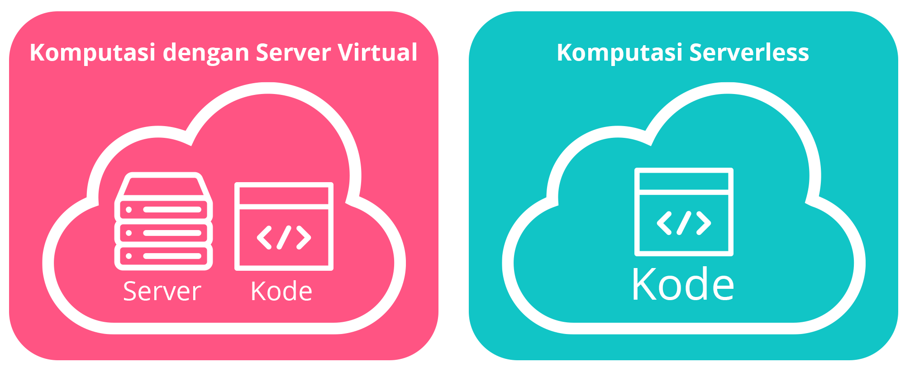
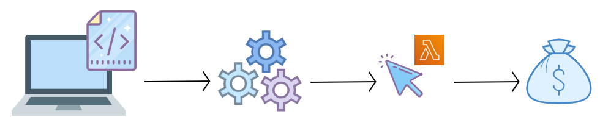
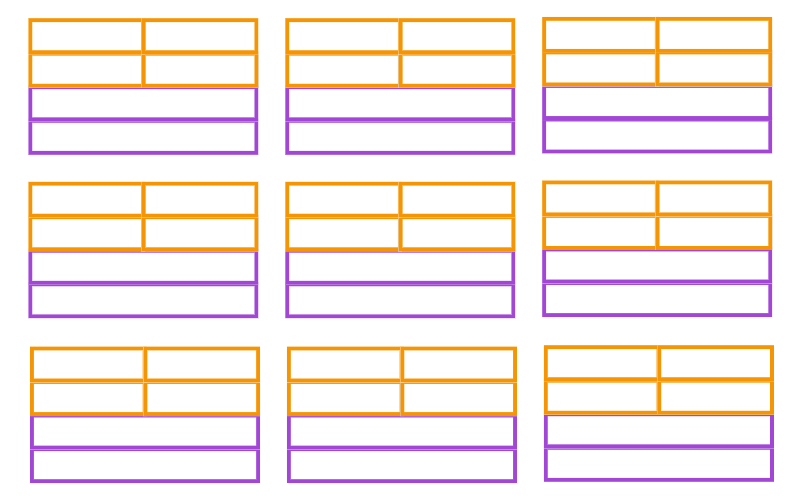

# Layanan Komputasi Tambahan
EC2 instance adalah mesin virtual yang dapat Anda gunakan di AWS. EC2 sangat ideal untuk semua jenis kasus penggunaan seperti menjalankan server web sederhana hingga menjalankan high performance computing clusters (klaster komputasi berkinerja tinggi).
 - EC2 mengharuskan Anda untuk mengatur dan mengelola instance dari waktu ke waktu. Saat Anda menggunakan EC2, Anda bertanggung jawab untuk:
 - Melakukan patching (memperbaiki masalah dengan memperbarui program komputer) saat software package (paket perangkat lunak) yang baru tersedia.
 - Menyiapkan scaling (penyesuaian kapasitas).
 - Merancang aplikasi untuk dijalankan dengan cara yang highly available (sangat tersedia).

Bahkan, jika Anda menggunakan data center on-premise, masih ada banyak hal lain yang harus Anda kelola.

Lalu, bagaimana solusinya? Mari kita melangkah ke materi berikutnya.

# Komputasi Serverless

Anda mungkin akan bertanya-tanya, “Apa ada layanan komputasi lain di AWS yang tak perlu berkutat dengan pengelolaan?”

Di sinilah istilah serverless (tanpa server) hadir. Serverless berarti Anda tidak dapat melihat dan mengakses infrastruktur dasar yang menjalankan aplikasi Anda. Semua pengelolaan lingkungan yang mendasari penyediaan, scaling, high availability (ketersediaan tinggi), dan pemeliharaan sudah ditangani sehingga Anda bisa fokus pada aplikasi yang akan dijalankan.

# AWS Lambda
AWS menawarkan beberapa opsi komputasi serverless, salah satunya adalah AWS Lambda. AWS Lambda adalah layanan yang memungkinkan Anda untuk menjalankan kode tanpa harus membuat atau mengelola server.

AWS Lambda dikelola sepenuhnya, dapat diskalakan secara otomatis, highly available (sangat tersedia), dan semua pemeliharaan dilakukan oleh AWS. Jika Anda memiliki 1 atau bahkan 1000 trigger (pemicu) yang masuk untuk memanggil function (fungsi), Lambda akan melakukan scaling terhadap function tersebut guna memenuhi permintaan.

AWS Lambda dirancang untuk menjalankan kode di bawah 15 menit sehingga layanan ini tak cocok untuk proses yang berjalan lama seperti deep learning misalnya. Layanan Ini lebih ideal untuk pemrosesan cepat seperti web backend, penanganan permintaan, atau pemrosesan laporan pengeluaran yang mana hanya membutuhkan waktu kurang dari 15 menit.

# Cara Kerja AWS Lambda

Mungkin sempat terbayangkan oleh Anda, bagaimana AWS Lambda ini bekerja. Mari kita uraikan yuk.

 1. Unggah kode Anda ke AWS Lambda.
 2. Konfigurasikan kode Anda agar terpicu (trigger) dari sumber kejadian, seperti layanan AWS, aplikasi seluler, atau HTTP endpoint (titik akhir HTTP).
 3. Kode berjalan hanya ketika mendapat trigger.
 4. Cukup bayar sesuai waktu komputasi yang Anda gunakan. Misalnya, Anda mempunyai kode yang dapat mengubah ukuran gambar. Nah, Anda hanya akan membayar waktu komputasi yang digunakan untuk menjalankan fungsi pengubahan ukuran gambar saat ada yang mengunggah sebuah gambar baru.

Jadi begitulah cara kerja AWS Lambda. Mari kita lanjutkan pembahasannya ke materi container.

# Container
Jika Anda belum cukup siap untuk menggunakan serverless atau memerlukan akses ke infrastrukturnya namun tetap menginginkan efisiensi dan portabilitas, Anda bisa mencoba layanan container (kontainer) seperti `Amazon Elastic Container Service` (Amazon ECS) dan `Amazon Elastic Kubernetes Service` (Amazon EKS). Kita akan menjabarkan ini nanti ya.

Keduanya merupakan layanan container orchestration alias orkestrasi kontainer. Container dalam hal ini adalah Docker container. Apa itu?

Docker adalah platform perangkat lunak populer yang menggunakan virtualisasi sistem operasi untuk memudahkan Anda dalam membangun, menguji, dan men-deploy (menerapkan) aplikasi dengan cepat. Sementara container menyediakan cara untuk mengemas kode, konfigurasi, dan dependensi aplikasi Anda ke dalam satu objek.

Container bekerja di atas EC2 instance dan berjalan secara terpisah satu sama lain. Cara kerja container serupa dengan mesin virtual, namun dalam kasus ini, host-nya (server) adalah EC2 instance.

Saat menggunakan Docker container di AWS, Anda memerlukan proses untuk memulai, menyetop, memulai ulang, dan memantau container yang berjalan tidak hanya di 1 EC2 instance, melainkan beberapa yang disebut dengan cluster (klaster).

Proses menggarap tugas-tugas inilah yang disebut dengan container orchestration dan tentu akan sangat sulit jika melakukannya sendiri. Layanan orkestrasi dibuat untuk membantu mengelola container Anda.

# Studi Kasus: Container
Misal developer aplikasi di suatu perusahaan memiliki infrastruktur komputer yang berbeda dengan staf operasi IT. Developer tersebut ingin memastikan bahwa lingkungan aplikasi tetap konsisten terlepas dari deployment-nya (penerapannya) sehingga dia pun menggunakan pendekatan container.

Container membantu developer tersebut mengurangi waktu yang dihabiskan untuk debugging (proses mengidentifikasi dan memperbaiki eror) aplikasi dan mendiagnosis perbedaan dalam lingkungan komputasi.

Saat menjalankan containerized application (aplikasi dalam container), penting untuk mempertimbangkan skalabilitas. Ini tergantung kepada setiap kasus penggunaan, Anda bisa saja:
 - Menggunakan satu host dengan banyak container.
 - Mengelola puluhan host dengan ratusan container.
 - Mengurus mungkin ratusan host dengan ribuan container.

Dalam skala besar, bayangkan berapa lama waktu yang Anda butuhkan untuk memantau penggunaan memori, keamanan, logging (tindakan menyimpan log), dsb.

Untuk itulah hadir layanan container orchestration (orkestrasi container) yang membantu Anda men-deploy (menerapkan), mengelola, dan men-scaling aplikasi dalam container. Selanjutnya, kita akan mempelajari tentang dua layanan yang menyediakan container orchestration: Amazon Elastic Container Service dan Amazon Elastic Kubernetes Service

# Amazon Elastic Container Service (Amazon ECS)
Amazon Elastic Container Service (Amazon ECS) adalah sistem manajemen container berkinerja tinggi yang dapat memungkinkan Anda untuk menjalankan dan melakukan scaling terhadap containerized application (aplikasi dalam container) di AWS.

Amazon ECS mendukung Docker container. AWS mendukung penggunaan open-source Docker Community Edition and subscription-based Docker Enterprise Edition. Dan juga, dengan Amazon ECS, Anda dapat menggunakan panggilan API untuk meluncurkan dan menghentikan aplikasi yang mendukung Docker.

API atau Application Programming Interface adalah perantara perangkat lunak yang memungkinkan dua aplikasi untuk berinteraksi satu sama lain. Kita tak akan membahas detailnya di sini. Jadi, mari lanjut ke materi berikutnya!

# Amazon Elastic Kubernetes Service (Amazon EKS)
Amazon Elastic Kubernetes Service (Amazon EKS) adalah layanan terkelola sepenuhnya yang dapat Anda gunakan untuk menjalankan Kubernetes di AWS.

Kubernetes adalah perangkat lunak open-source (sumber terbuka) yang memungkinkan Anda untuk men-deploy (menerapkan) dan mengelola containerized application (aplikasi dalam container) dalam skala besar.

AWS secara aktif bekerja sama dengan komunitas Kubernetes--yang mengelola Kubernetes. Saat fitur dan fungsionalitas baru dirilis untuk aplikasi Kubernetes, Anda dapat dengan mudah menerapkan pembaruan tersebut ke aplikasi Anda yang dikelola oleh Amazon EKS.

# Amazon Fargate
Baik Amazon ECS dan Amazon EKS, keduanya berjalan di atas EC2. Tetapi jika Anda tak ingin sibuk mengurusi EC2, Anda dapat menggunakan platform komputasi lainnya yang disebut dengan AWS Fargate.

AWS Fargate adalah platform komputasi serverless untuk Amazon ECS dan Amazon EKS. Saat menggunakan layanan ini, Anda tak perlu menyediakan atau mengelola server karena AWS Fargate yang mengelolanya untuk Anda.

Dengan begitu, Anda dapat lebih fokus pada inovasi dan pengembangan aplikasi. Bahkan Anda membayar hanya untuk sumber daya yang diperlukan dalam menjalankan container.

Masih bingung? Mari kita perjelas. Setiap layanan dapat Anda gunakan sesuai dengan kebutuhan.
 - Jika Anda ingin menjalankan aplikasi dan menginginkan akses penuh ke sistem operasinya seperti Linux atau Windows, Anda bisa menggunakan Amazon EC2.
 - Jika Anda ingin menjalankan fungsi yang berjalan singkat, aplikasi berbasis kejadian, dan Anda tak ingin mengelola infrastrukturnya sama sekali, gunakanlah layanan AWS Lambda.
 - Jika Anda ingin menjalankan beban kerja berbasis Docker container di AWS, langkah yang perlu Anda lalui adalah:
  - Anda harus memilih layanan orkestrasinya terlebih dahulu. Anda bisa menggunakan Amazon ECS atau Amazon EKS.
  - Setelah memilih alat orkestrasinya, kemudian Anda perlu menentukan platformnya. Anda dapat menjalankan container pada EC2 instance yang Anda kelola sendiri atau dalam lingkungan serverless seperti AWS Fargate yang dikelola oleh AWS.

Itulah tadi beberapa opsi komputasi di AWS. Silakan lanjutkan ke modul berikutnya, yaitu berupa kesimpulan dari materi-materi yang telah kita pelajari sejauh ini. Semangat!