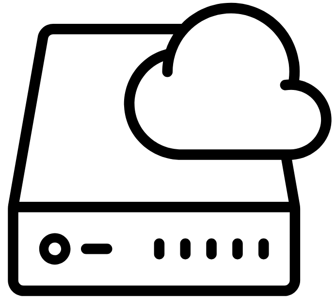

# Tujuan Pembelajaran
Di modul ini, kita akan belajar bagaimana cara:

 - Mendeskripsikan manfaat Amazon EC2 secara dasar.
 - Mengidentifikasi perbedaan dari tipe Amazon EC2 instance.
 - Membedakan berbagai opsi penagihan untuk Amazon EC2.
 - Merangkum manfaat dari Amazon EC2 Auto Scaling.
 - Meringkas manfaat dari Elastic Load Balancing.
 - Memberikan contoh penggunaan Elastic Load Balancing.
 - Menjelaskan perbedaan antara Amazon Simple Notification Service (Amazon SNS) dan Amazon Simple Queue Service (Amazon SQS).
 - Memaparkan opsi komputasi tambahan di AWS.
Penasaran? Yuk kita masuk ke materi selanjutnya!

# Pengenalan ke Amazon Elastic Compute Cloud (Amazon EC2)

Di modul ini kita akan membahas secara mendalam tentang layanan yang disebut `Amazon Elastic Compute Cloud (Amazon EC2)`.

Jika Anda ingat skenario kedai kopi kita, pegawai dan pelanggan adalah metafora untuk model client-server. Client mengirimkan permintaan ke server, server melakukan beberapa pekerjaan, dan kemudian mengirimkan tanggapan. Contoh tersebut sangat pas untuk kedai kopi.

Ide yang sama pun berlaku jika Anda memiliki bisnis lain. Baik itu bisnis perawatan kesehatan, manufaktur, asuransi, ataupun pengiriman konten video. Itu semua menggunakan model client-server untuk menyajikan produk, sumber daya, atau data ke pelanggan.

Maka dari itu, Anda membutuhkan server yang dapat memberikan kapasitas komputasi untuk menjalankan aplikasi dan menyediakan daya komputasi sesuai kebutuhan bisnis Anda. Di AWS server tersebut berbentuk virtual. Dan layanan yang dapat Anda gunakan untuk mendapatkan akses ke server virtual tersebut disebut dengan Amazon EC2.

Dengan menggunakan layanan EC2, Anda memiliki kapasitas komputasi yang fleksibel, hemat biaya, dan cepat dibandingkan dengan menjalankan server sendiri di data center on-premise.

Bayangkan, untuk mengaktifkan dan menjalankan sumber daya di on-premise, Anda memerlukan banyak waktu dan biaya. Coba kita uraikan bagaimana prosesnya.
 1. Pertama, Anda harus melakukan banyak riset untuk mengetahui jenis server apa yang ingin dibeli dan berapa banyak yang diperlukan.
 2. Setelah itu, Anda membelinya dengan biaya di muka yang cukup menguras kantong. Lalu masuklah ke proses yang memakan waktu, yaitu Anda mesti menunggu beberapa minggu atau bahkan berbulan-bulan sampai server tersebut tersedia untuk Anda.
 3. Anggaplah server tersebut sudah tiba di bangunan data center yang Anda miliki atau sewa.
 4. Langkah selanjutnya, Anda perlu memasang, menyusun, dan menghubungkan semuanya.
 5. Kemudian, pastikan server-server tersebut aman dan menyala dengan baik, barulah mereka siap untuk digunakan.

Hanya dengan cara itulah Anda bisa mulai menjalankan aplikasi di server ini. Satu kata: “huft!” Sangat melelahkan. Eh tapi, tunggu! Masih ada bagian terburuknya. Setelah membeli server-server ini, Anda terjebak dengan mereka, entah Anda menggunakannya secara maksimal atau tidak. Nah, tentu ini akan jauh berbeda jika Anda menggunakan AWS.

Amazon EC2 memberikan kapasitas komputasi yang aman dan dapat Anda ubah-ubah ukurannya di cloud. Masih ingat persoalan sulitnya mengaktifkan dan menjalankan sumber daya di on-premise pada materi sebelumnya?

Nah, dengan Amazon EC2, proses tersebut akan jauh lebih mudah. Jangan khawatir! AWS sudah menangani bagian-bagian yang sulit untuk Anda. AWS telah membangun dan mengamankan data center, membeli, menyusun, dan memasang server sehingga siap untuk Anda gunakan.

AWS terus mengoperasikan kapasitas komputasi dalam jumlah besar sehingga Anda dapat menggunakannya kapan pun dan berapa pun sesuai dengan porsi kapasitas yang Anda butuhkan. Anda hanya perlu membuat permintaan untuk EC2 instance sesuai keinginan dan saat itu juga mereka pun tersaji dalam hitungan menit. Di AWS, `server virtual` disebut sebagai `instance`.

Nah, jika telah selesai menggunakannya, Anda dapat menghentikan atau mengakhiri instance tersebut dengan mudah. Anda tidak perlu lagi khawatir akan terjebak dengan server yang tidak digunakan. Anda hanya harus membayar sesuai dengan apa yang Anda gunakan saja (pay for what you use), bukannya saat instance berhenti atau berakhir.

Amazon EC2 berjalan di atas host (mesin fisik) yang dikelola oleh AWS menggunakan teknologi virtualisasi. Saat menjalankan instance, Anda tidak menggunakan keseluruhan mesin host untuk sendiri melainkan Anda akan berbagi mesin host dengan beberapa instance lainnya. Ini dikenal dengan nama virtual machines alias mesin virtual.

Hypervisor-lah yang bertanggung jawab untuk membagi sumber daya fisik yang mendasarinya di antara mesin virtual tersebut. Ini sepenuhnya dikelola oleh AWS. Ide berbagi perangkat keras yang mendasarinya ini disebut multitenancy. Hypervisor juga bertanggung jawab untuk mengisolasi mesin virtual satu sama lain saat mereka berbagi sumber daya dari host. Ini berarti EC2 instance tetap aman meskipun mereka berbagi sumber daya. Satu instance tidak akan mengetahui keberadaan instance lainnya walau mereka ada di host yang sama. Mereka tetap aman dan terpisah satu sama lain.

Amazon EC2 memberikan Anda banyak fleksibilitas dan kontrol. Tak hanya dapat menjalankan server baru atau menghentikannya sesuka hati, Anda juga memiliki kuasa atas konfigurasinya.

Misal pada saat Anda membuat EC2 instance. Anda dapat memilih OS (operating system/sistem operasi) yang Anda inginkan, baik itu Windows atau Linux. Anda juga dapat membuat ribuan instance EC2 sekaligus dengan perpaduan sistem operasi dan konfigurasi sehingga dapat mendukung berbagai aplikasi bisnis Anda.

Selain OS, Anda juga dapat melakukan instalasi perangkat lunak apa yang ingin dijalankan pada instance. Baik itu aplikasi bisnis internal, web sederhana, web yang kompleks, database (basis data), hingga perangkat lunak pihak ketiga seperti paket perangkat lunak perusahaan. Anda memiliki kendali penuh atas apa yang ada di instance tersebut.

Instance EC2 juga dapat diubah-ubah ukurannya. Anda dapat mulai dengan menggunakan small instance (instance dengan tipe small).

Ketika aplikasi yang Anda jalankan mulai membutuhkan kapasitas yang lebih besar, Anda dapat menambahkan lebih banyak memori dan CPU. Itulah yang dinamakan vertical scaling atau mengatur skala instance secara vertikal. Intinya, Anda dapat membuat instance lebih besar atau lebih kecil kapan pun Anda mau.

Bahkan tak hanya itu. Anda juga dapat mengontrol aspek jaringan dari EC2, seperti jenis permintaan apa yang diizinkan atau bagaimana instance dapat diakses (publik atau privat). Di modul berikutnya kita akan membahas lebih lanjut berkenaan jaringan.

Sekali lagi, Amazon EC2 berjalan dengan bantuan teknologi virtualisasi. Mungkin Anda sudah tak asing ya dengan istilah mesin virtual. Yup! Karena ini bukanlah sesuatu yang baru.

Namun AWS membuat proses penyediaan server menjadi lebih mudah dan lebih hemat melalui model Compute as a Service (CaaS) seperti Amazon EC2 ini. Dengan semua keuntungan tersebut, programmer dan bisnis dapat berinovasi lebih cepat.

