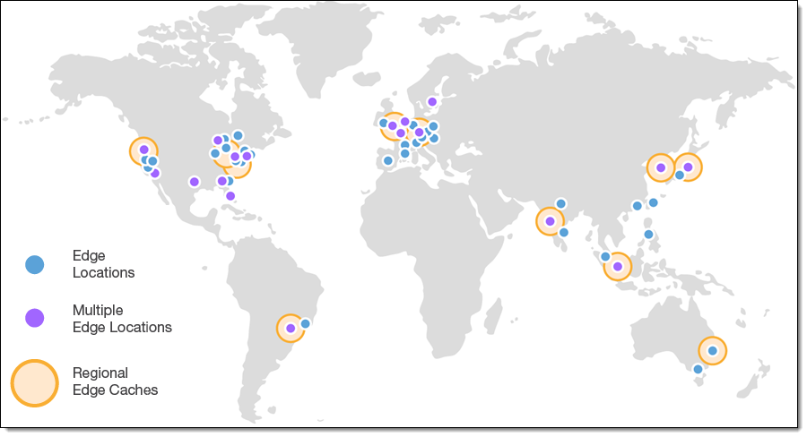

# Edge Locations

Diambil dari AWS News Blog: 98, 99, 100 CloudFront Points of Presence!

Salah satu hal hebat tentang infrastruktur global AWS adalah caranya didesain untuk membantu Anda melayani pelanggan dengan lebih baik. Ingat kembali materi kita sebelumnya yang berkenaan dengan memilih Region. Salah satu kriteria utamanya adalah proximity alias kedekatan dengan pelanggan.

Tapi, masih ada permasalahan lainnya. Coba pikirkan kembali tentang skenario kedai kopi kita. Anggaplah Anda ingin membangun kedai kopi di suatu kota yang memiliki basis pelanggan besar. Namun sayangnya, kota tersebut tidak berada dekat dengan salah satu AWS Regions. Apa yang harus Anda lakukan?

AWS menyediakan solusinya. Daripada harus membangun kedai kopi baru, Anda dapat membangun kedai satelit (kedai kopi kecil di bawah pelayanan pusat distribusi yang sama) untuk melayani pelanggan Anda di kota tersebut.

Mari kita lihat dari perspektif IT. Misalnya Anda memiliki pelanggan di kota Jakarta yang membutuhkan akses ke data aplikasi. Akan tetapi, data tersebut disimpan di Region Tokyo, tentu dengan jarak yang jauh ini akan menyebabkan latensi yang besar.

Lalu bagaimana solusinya? Begini, daripada semua pelanggan yang berada di kota Jakarta itu mengakses data ke Tokyo, akan lebih baik jika Anda cukup menempatkan salinan data secara lokal atau simpan salinannya ke dalam `cache` (penyimpanan data sementara agar dapat diakses lebih cepat) di Singapura.

Nah dengan begitu, saat pelanggan dari kota Jakarta mengakses salah satu data Anda, Amazon `CloudFront--nanti` kita bahas--akan mengambil data dari cache di `Edge locations` lalu mengirimkannya ke pelanggan tersebut. Data tadi terkirim lebih cepat karena berasal dari Edge locations Singapura--yang jaraknya lebih dekat dengan kota Jakarta--bukan dari Tokyo.

Teknik menyimpan salinan data di cache dengan lokasi yang lebih dekat dengan pelanggan di seluruh dunia adalah konsep yang digunakan oleh jaringan pengiriman konten alias `content delivery network` (CDN). Di AWS, CDN disebut dengan `Amazon CloudFront`.

`Amazon CloudFront` adalah `layanan yang dapat membantu Anda untuk mengirimkan data, video, aplikasi, dan API ke pelanggan di seluruh dunia dengan latensi rendah dan kecepatan transfer yang tinggi`. Amazon CloudFront menggunakan Edge locations di seluruh dunia untuk membantu mempercepat komunikasi dengan pengguna--di mana pun mereka berada.

Jadi, `Edge locations` adalah `lokasi` yang digunakan Amazon CloudFront untuk menyimpan salinan cache dengan jarak yang dekat dengan pelanggan sehingga konten dapat terkirim lebih cepat.

Ketahuilah! Edge locations itu terpisah dari AWS Regions. Sehingga, Anda dapat mengirim konten dari dalam Region ke kumpulan Edge locations di seluruh dunia.

AWS Edge locations tak hanya berguna untuk menjalankan CloudFront, melainkan juga layanan domain name system (DNS) atau sistem nama domain yang dikenal sebagai Amazon Route 53. Layanan ini dapat membantu mengarahkan pelanggan ke lokasi web yang tepat dengan latensi rendah yang andal.

Lalu, mungkin Anda akan bergumam, “Bisa nggak ya kalau kita ingin menggunakan layanan AWS langsung di dalam gedung milik sendiri?” Coba tebak.

Tentu bisa. AWS dapat melakukannya untuk Anda.

Perkenalkan, `AWS Outposts`. Dengan layanan ini, pada dasarnya, AWS akan menginstal Region mini yang beroperasi penuh, tepat di dalam data center Anda sendiri. Semua infrastruktur dan layanan tersebut dimiliki serta dioperasikan oleh AWS menggunakan 100% kegunaan AWS namun tetap terisolasi di dalam data center Anda.

`AWS Outposts` bukanlah solusi yang dibutuhkan bagi sebagian besar pelanggan AWS. Tetapi, jika Anda memiliki masalah tertentu yang hanya dapat diselesaikan dengan tetap berada di dalam data center Anda sendiri, AWS Outposts dapat menjadi jalan keluarnya.

Oke, sebenarnya masih banyak yang dapat kita paparkan tentang infrastruktur global AWS. Meskipun demikian, mari kita buat bahasan ini tetap sederhana dan berakhir di sini saja. Jadi, berikut adalah poin kuncinya:
 1. Region adalah wilayah yang terisolasi secara geografis di mana Anda dapat mengakses layanan yang diperlukan untuk menjalankan segala macam kebutuhan.
 2. Region terdiri dari Availability Zone yang memungkinkan Anda untuk menjalankan seluruh bangunan data center yang terpisah secara fisik dengan jarak puluhan mil sambil menjaga aplikasi Anda tetap bersatu secara logis. Availability Zone membantu Anda untuk dapat mencapai high availability (ketersediaan tinggi) dan disaster recovery (pemulihan bencana) tanpa upaya apa pun dari Anda.
 3. AWS Edge locations digunakan untuk menjalankan Amazon CloudFront sehingga dapat memperdekat konten kepada pelanggan Anda di mana pun mereka berada.
