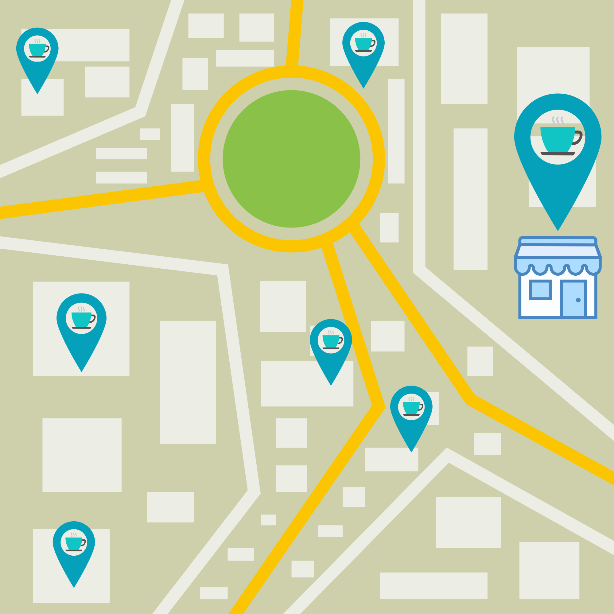

# Tujuan Pembelajaran
Dengan mempelajari modul ini, diharapkan Anda dapat:

  - Merangkum manfaat dari infrastruktur global AWS.
  - Menjelaskan konsep dasar Availability Zone.
  - Menjelaskan manfaat Amazon CloudFront dan Edge locations.
  - Membandingkan berbagai metode yang dapat menyajikan layanan AWS.

Sudah siap? Mari mulai perjalanan kita di modul ini dengan melangkah ke materi berikutnya!

# Pengenalan ke Infrastruktur Global dan Keandalan
Selamat datang! Untuk memulai modul ini, mari kita sedikit berbincang tentang `high availability` (ketersediaan tinggi).

Ceritanya begini. Katakanlah pelanggan Anda ingin menikmati secangkir latte hangat di kedai kopi kita. Namun sayangnya, hari ini tak berjalan seperti biasa. Ada parade perayaan keberhasilan migrasi cloud yang menghalangi jalan menuju ke sana dan akan berbaris tepat di depan kedai kopi tersebut.

Sebenarnya ini bagus karena siapa yang tak suka melihat balon dan bermandi hujan permen? Akan tetapi, hal ini juga dapat berdampak buruk terhadap bisnis kita karena saat parade berlangsung, pelanggan yang tadinya ingin datang ke kedai kopi akan dialihkan jalannya sehingga tidak bisa mampir. Akibatnya, pelanggan akan kecewa dan penjualan pun menurun.

Untungnya, kita telah berpikir jauh ke depan untuk menyiasati gangguan semacam ini. Tahukah Anda? Sebenarnya kedai kopi kita tidak hanya berada di satu tempat saja loh, melainkan terdapat juga di beberapa lokasi lain di seluruh kota.

Dengan demikian, Anda tak perlu khawatir lagi jika ada parade di sejumlah ruas jalan. Bahkan tak hanya untuk parade, halangan lain seperti banjir, bencana, atau apa pun yang bisa mencegah pelanggan ke kedai kopi, telah kita atasi.

Sekarang kedai kopi kita dapat selalu tersedia bagi pelanggan. Mereka tetap bisa mendapatkan secangkir latte dengan mengunjungi kedai kopi kita lainnya yang berada tidak terlalu jauh. Semuanya akan baik-baik saja, bukan? Kita tetap bisa menjalankan bisnis dan pelanggan tetap bisa mendapatkan kopi.

Nah, AWS pun telah melakukan hal yang serupa dengan itu, yaitu dengan menyiapkan infrastruktur global AWS.

Tahukah Anda hikmah cerita di atas? Janganlah kita menempatkan semua sumber daya hanya di satu data center saja. Karena jika terjadi hal yang tidak diinginkan pada data center tersebut--seperti pemadaman listrik atau bencana alam--semua aplikasi akan down (mati) sekaligus. Bahkan, memiliki dua data center pun tetap tidak cukup baik loh.

Solusinya adalah Anda membutuhkan `high availability` (ketersediaan tinggi) dan `fault tolerance` (toleransi terhadap kesalahan). `High availability` adalah kemampuan untuk memastikan bahwa sistem selalu bekerja dan dapat diakses dengan waktu henti yang minimal tanpa memerlukan intervensi manusia. Sedangkan `fault tolerance` berarti sistem masih mampu beroperasi meskipun beberapa komponen mengalami kegagalan.

Faktanya, AWS beroperasi di lokasi yang berbeda-beda di seluruh dunia yang disebut Region. Tapi sabar ya. Kita baru akan membicarakan hal ini secara mendalam di modul mendatang. Jadi, mari kita lanjutkan!
