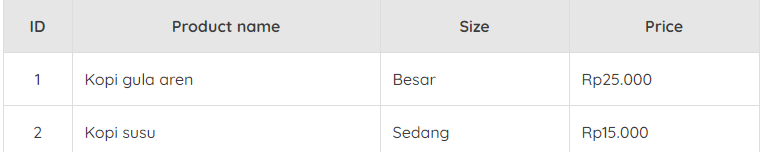

# Amazon Relational Database Service (Amazon RDS)
Sampai sini, kita sudah banyak belajar tentang berbagai sistem penyimpanan di AWS yang dapat membantu Anda untuk menyelesaikan persoalan terkait kartu digital untuk pelanggan setia di kedai kopi, sebagaimana yang telah kita paparkan di awal modul.

Tetapi, ketahuilah! Anda juga perlu menjaga relasi antara berbagai tipe data. Tunggu, apa maksudnya?

Begini. Misalnya, seorang pelanggan di kedai kopi telah memesan minuman yang sama beberapa kali. Nah, melihat hal ini, mungkin Anda sebagai pemilik kedai kopi ingin menawarkan diskon promosi untuk pembelian berikutnya.

Tentu, Anda membutuhkan suatu cara untuk melacak relasi/hubungan semacam ini, bukan?

Solusi terbaik untuk masalah tersebut adalah dengan menggunakan relational database management system (RDBMS) alias sistem manajemen database/basis data relasional. Artinya, data yang kita simpan dapat memiliki relasi dengan bagian data lainnya.

Dalam dunia database, Anda akan sering mendengar kata query atau kueri. Itu adalah sekumpulan instruksi khusus untuk mengekstraksi data.

Nah, database relasional menggunakan structured query language (SQL) alias bahasa kueri terstruktur untuk menyimpan dan membuat kueri data. Pendekatan semacam ini memungkinkan data disimpan dengan cara yang mudah dimengerti, konsisten, dan dapat diskalakan.

Inilah solusi dari persoalan di awal tadi. Dengan database relasional, sekarang Anda dapat menulis kueri SQL untuk mengidentifikasi minuman apa yang sering dibeli oleh masing-masing pelanggan.

Contoh sederhana dari database relasional adalah sistem manajemen inventaris di skenario kedai kopi kita. Setiap record (kumpulan data) di database mencakup data untuk satu item, seperti nama produk, ukuran, harga, dsb.

Berikut adalah contoh sederhana dari tabel database relasional:

Sekarang pertanyaannya adalah, layanan AWS apa yang mendukung database relasional?

Sambutlah, Amazon Relational Database Service (Amazon RDS). Ia adalah layanan yang memungkinkan Anda untuk menjalankan database relasional di AWS Cloud.

Amazon RDS adalah layanan yang terkelola dan mendukung 6 (enam) mesin database, di antaranya:

  - Amazon Aurora
  - PostgreSQL
  - MySQL
  - MariaDB
  - Oracle Database
  - Microsoft SQL Server

Ketahuilah! Jika Anda memiliki data center on-premise yang menjalankan salah satu mesin database di atas, Anda bisa memindahkannya ke cloud dengan mudah. Bagaimana caranya?

AWS memungkinkan Anda untuk melakukan Lift-and-Shift, yaitu proses memigrasikan beban kerja dari on-premise ke AWS dengan sedikit atau bahkan tanpa modifikasi.

Contohnya, Anda bisa memindahkan database on-premise lalu menjalankannya di Amazon EC2. Dengan begitu, Anda mempunyai kendali atas variabel yang sama dengan keadaan di on-premise, seperti OS, memori, CPU, kapasitas penyimpanan, dsb. Ini merupakan entri yang cepat untuk menuju cloud, bukan?

Salah satu cara yang dapat Anda lakukan untuk mewujudkan proses migrasi ini adalah dengan menggunakan layanan Database Migration Service, yang nanti akan kita bahas.

Sekarang, mari kita kembali ke pembahasan mengenai Amazon RDS. Layanan Amazon RDS hadir dengan berbagai fitur, termasuk:

  - Automated patching (memperbaiki masalah dengan memperbarui program).
  - Backup (pencadangan).
  - Redundancy (memiliki lebih dari satu instance untuk berjaga-jaga jika instance utama gagal beroperasi).
  - Failover (instance lain akan mengambil alih saat instance utama mengalami kegagalan).
  - Disaster recovery (memulihkan pascabencana).
  - Encryption at rest (enkripsi data saat disimpan).
  - Encryption in-transit (enkripsi data saat sedang dikirim dan diterima).

Semua hal di atas adalah proses yang biasanya harus Anda kelola sendiri jika menggunakan data center on-premise. Tentu ini menjadikannya pilihan menarik karena Anda tak pusing dengan pemeliharaan dan pengelolaan database. Karena faktanya, semua proses tersebut sangat sulit dan memakan waktu yang lama.

Pertanyaan selanjutnya muncul, “Adakah cara yang bahkan bisa lebih mudah lagi untuk menjalankan beban kerja database di cloud?”

Nah, mari kita sedikit membahas tentang layanan Amazon Aurora. Ia adalah opsi database relasional kelas enterprise/perusahaan yang terkelola oleh AWS. Layanan ini memiliki banyak fitur, seperti:

  - Bisa bekerja secara kompatibel dengan MySQL dan PostgreSQL. Bahkan, dapat 5 kali lebih cepat dari database MySQL standar dan bisa 3 kali lebih cepat dari database PostgreSQL standar.
  - Memberikan performa yang setara dengan database komersial dengan perbandingan biaya 1/10.
  - Mampu memastikan replikasi data di seluruh fasilitas.
  - Menerapkan hingga 15 read replica (replika baca).
  - Mencadangkan secara kontinu ke Amazon S3.
  - Menerapkan point-in-time recovery (Pemulihan data dari periode tertentu).
  
Oke, itulah dia penjelasan tentang database relasional. Masih ada loh materi menarik lainnya yang terkait dengan database, nantikan di modul berikutnya ya.