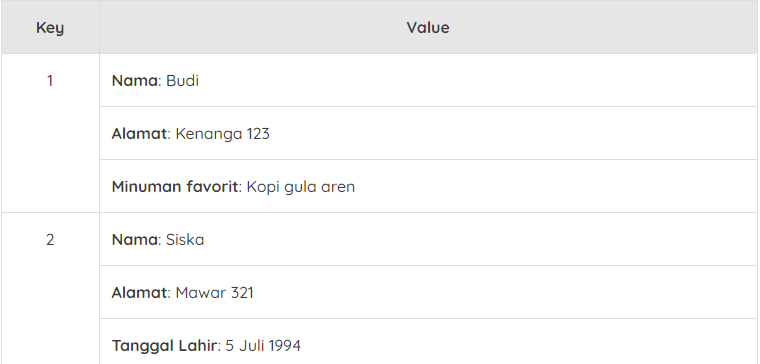
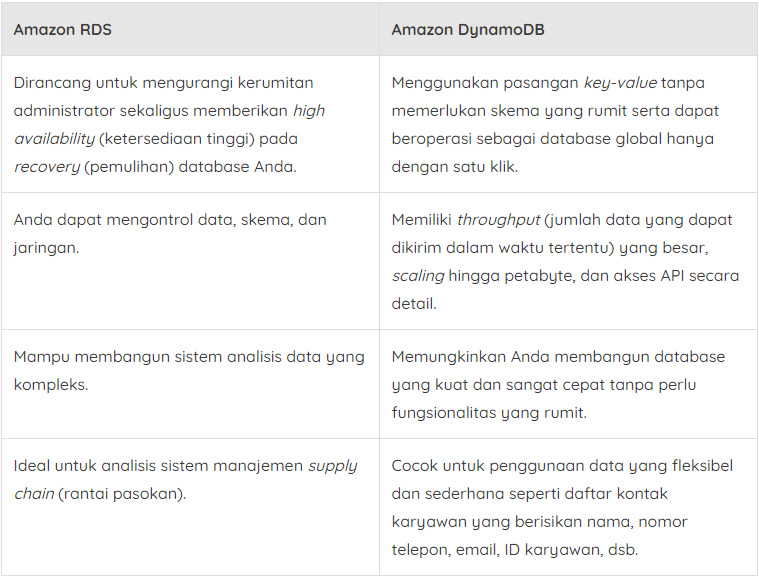

# Amazon DynamoDB
Sebelumnya, kita telah belajar tentang database relasional. Database relasional--misalnya MySQL standar--mengharuskan Anda untuk menentukan skema dengan baik. Ia bisa jadi terdiri dari satu atau banyak tabel yang saling berhubungan. Barulah Anda bisa menggunakan SQL untuk membuat kueri data.

Jenis ini sering dipakai untuk banyak kasus penggunaan dan telah menjadi tipe database standar secara historis. Bagaimanapun, jenis database SQL yang kaku ini dapat memiliki masalah scaling dan kinerja saat berada di bawah tekanan.

Skema yang tetap (fixed schema) juga membuatnya tidak dapat memiliki variasi jenis data di dalam tabel. Jadi, database relasional bukanlah solusi terbaik untuk kumpulan data yang fleksibel dan membutuhkan akses kilat.

Selain itu, pada praktiknya, banyak juga yang menjalankan database SQL bukan untuk penggunaan relasional yang kompleks, melainkan hanya untuk tabel pencarian.

Nah, di sinilah Amazon DynamoDB hadir. Ia merupakan `database nonrelasional (NoSQL) dan menggunakan jenis pendekatan pasangan key-value (kunci-nilai)`.

Dengan Amazon DynamoDB, Anda dapat membuat tabel, yakni tempat menyimpan dan membuat kueri data. Data diatur menjadi item/key dan item memiliki atribut/value.

Anda dapat menambah dan menghapus atribut dari item di dalam tabel kapan pun. Setiap item tidak harus memiliki atribut yang sama. Sehingga, ini akan sangat baik untuk kumpulan data yang memiliki beberapa variasi antara satu item dengan item lainnya.

Karena kueri pada database nonrelasional itu cenderung lebih sederhana, ini membuat Anda bisa fokus pada kumpulan item dari satu tabel, bukan kueri dari rentang beberapa tabel.

Berikut adalah contoh sederhana dari tabel database nonrelasional.

Mudah, bukan? Seperti yang telah kita pelajari sebelumnya, setiap item pada tabel tidak harus memiliki atribut yang sama.

Oke, mari kita lanjutkan pembahasannya.

Ketahuilah! Amazon DynamoDB ini adalah layanan yang terkelola sepenuhnya dan merupakan database serverless (tanpa server). Itu artinya Anda tak perlu mengelola instance atau infrastruktur dasarnya. Bahkan, Anda tidak perlu khawatir akan proses scaling (penyesuaian kapasitas) yang terjadi pada sistem.

Selain itu, Amazon DynamoDB juga menyimpan data di beberapa perangkat di seluruh availability zone. Sehingga, ini menjadikannya database yang highly available (sangat tersedia). Layanan ini memiliki kinerja yang sangat tinggi. Ia punya response time (waktu respons) kilat, yakni milidetik, yang akan sangat bermanfaat untuk aplikasi dengan potensi jutaan pengguna.

Ingat! Karena DynamoDB adalah database NoSQL alias nonrelasional, ia sangat ideal untuk kasus penggunaan tertentu, bukan untuk semua beban kerja.

Salah satu contoh penggunaan Amazon DynamoDB yang luar biasa adalah pada saat Amazon Prime Day pada tahun 2019. Prime Day adalah acara belanja tahunan eksklusif untuk anggota Amazon Prime.

Selama 48 jam Prime Day, ada 7,11 triliun panggilan ke API DynamoDB. Puncaknya bahkan ada pada 45,4 juta permintaan per detik. Waw, sangat andal, bukan?

Sekarang, mungkin Anda akan bertanya-tanya, “Kapan kita harus menggunakan Amazon RDS dan Amazon DynamoDB?”

Oke, mari kita bandingkan dua layanan tersebut secara lebih detail.

Jadi, sebenarnya ini tergantung pada kebutuhan beban kerja Anda. Setiap layanan akan menjadi solusi yang tepat untuk kebutuhan tertentu. Maka pahamilah apa yang Anda butuhkan, dengan begitu Anda akan dapat memilih layanan mana yang ideal.
