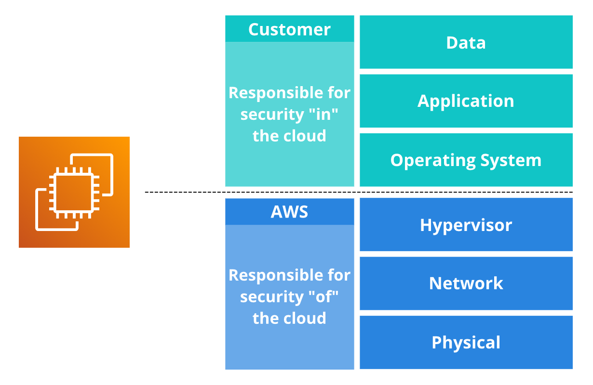

# Shared Responsibility Model
Sampai tahap ini, kita telah belajar tentang berbagai sumber daya yang dapat Anda buat di AWS Cloud, termasuk Amazon EC2 instance, Amazon S3 bucket, dan Amazon RDS database.

Nah, karena modul ini berbicara tentang keamanan, mari memulai materi kali ini dengan sebuah pertanyaan. Siapakah yang bertanggung jawab atas keamanan?

 - A. Anda sebagai pelanggan
 - B. AWS

Jawaban yang tepat adalah: Keduanya. Baik Anda maupun AWS bertanggung jawab untuk memastikan lingkungan cloud Anda aman.

Wah! Mungkin jika ada seorang pakar keamanan yang membaca tulisan ini, ia akan menggelengkan kepala dan berkata, “Tunggu! Dua entitas yang berbeda tidak boleh bertanggung jawab atas objek yang sama. Itu tak akan aman!”

Yup! AWS setuju dengan itu. Tetapi, ketahuilah! AWS tidak melihat lingkungan cloud Anda sebagai satu objek, melainkan kumpulan banyak bagian yang saling membangun. AWS bertanggung jawab 100% atas keamanan sebagian objek dan Anda bertanggung jawab untuk bagian lainnya. Inilah yang dikenal sebagai shared responsibility model atau model tanggung jawab bersama.

Bingung? Oke, anggaplah model ini sebagai pembagian tanggung jawab antara Anda--sang pemilik rumah--dan arsitek--yang membangun rumah. Arsitek (AWS) bertanggung jawab untuk memastikan rumah Anda dibangun dengan kokoh, sementara Anda (pelanggan AWS) bertanggung jawab untuk mengamankan seisi rumah dan mengunci pintu dengan benar. Mudah, ‘kan?

Begitu juga di AWS. Sebagai contoh, mari kita kupas setiap bagian Amazon EC2 berdasarkan shared responsibility model.

Amazon EC2 berjalan di data center AWS yang sangat aman. Ia memiliki jaringan dan hypervisor yang mendukung instance di atasnya beserta sistem operasinya. Di atas sistem operasi, Anda bisa menjalankan aplikasi dan mengelola data.

Bahkan tidak hanya Amazon EC2, setiap layanan AWS memiliki layering yang dibangun di atas satu sama lain. AWS 100% bertanggung jawab untuk bagian tertentu dan Anda bertanggung jawab untuk bagian lainnya.

Oke, supaya lebih jelas, mari kita uraikan setiap bagiannya:

  ## Physical
    Bagian ini terdiri dari berbagai komponen keamanan fisik, seperti gedung, sumber daya listrik, instalasi jaringan, sistem pendingin, penjagaan keamanan, dan lain sebagainya. Ini semua adalah tanggung jawab AWS.

  ## Network & Hypervisor
    Kita tidak akan membahas secara mendalam tentang bagaimana area ini diamankan. Tetapi pada dasarnya, AWS telah mempersiapkan teknologi tersebut dan membuatnya menjadi lebih cepat, lebih baik, lebih kuat, dan tahan kerusakan.

    AWS memiliki banyak auditor pihak ketiga yang memperhatikan dan mengawasi bagaimana infrastruktur AWS dibangun. Dan sehubungan dengan aspek tersebut, AWS dapat memberi Anda dokumentasi sesuai kebutuhan untuk struktur security compliance (kepatuhan keamanan). Ini juga adalah tanggung jawab AWS.
    
Oke, kita berhenti sejenak. Di sinilah garis pemisahnya. Sebelumnya kita telah menilik bagian yang menjadi tanggung jawab AWS, sekarang mari kita telaah bagian yang menjadi tanggung jawab Anda sebagai pelanggan.

  ## Operating System
    Dengan Amazon EC2, Anda bisa memilih sistem operasi yang ingin dijalankan. Ingat! AWS tidak memiliki akses sama sekali ke sistem Anda. Hanya Anda yang memiliki akses untuk masuk ke sistem operasi yang Anda jalankan.

    Lebih lanjut, Anda juga bertanggung jawab untuk melakukan patching (memperbaiki masalah dengan memperbarui program) terhadap sistem operasi tersebut. Jika ditemukan beberapa kerentanan baru di versi Windows, Anda yang perlu mencari solusinya dengan menerapkan patch terbaru.

    Ini adalah hal yang sangat bagus untuk keamanan. Tak akan ada yang dapat men-deploy (menerapkan) sesuatu sehingga mengganggu atau merusak sistem Anda.

  ## Application
    Di atas sistem operasi, Anda dapat menjalankan aplikasi apa pun yang diinginkan. Anda bertanggung jawab 100% untuk mengelolanya.

  ## Data
    Data adalah bagian terpenting dan sepenuhnya menjadi ranah Anda untuk mengontrolnya. Anda bisa membuat data dapat diakses oleh semua orang, beberapa orang, satu orang dengan kondisi tertentu, atau bahkan benar-benar menguncinya sehingga tidak ada yang dapat mengakses data tersebut. Plus, Anda juga dapat melakukan enkripsi pada data tersebut.

Shared responsibility model berguna untuk memastikan, baik AWS ataupun Anda--sebagai pelanggan--memahami tugasnya masing-masing dengan tepat. Pada dasarnya, AWS bertanggung jawab atas security of the cloud (keamanan dari cloud) dan Anda bertanggung jawab atas security in the cloud (keamanan di cloud).