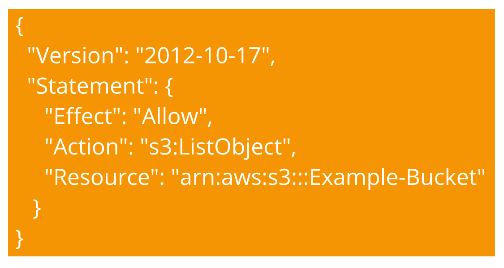
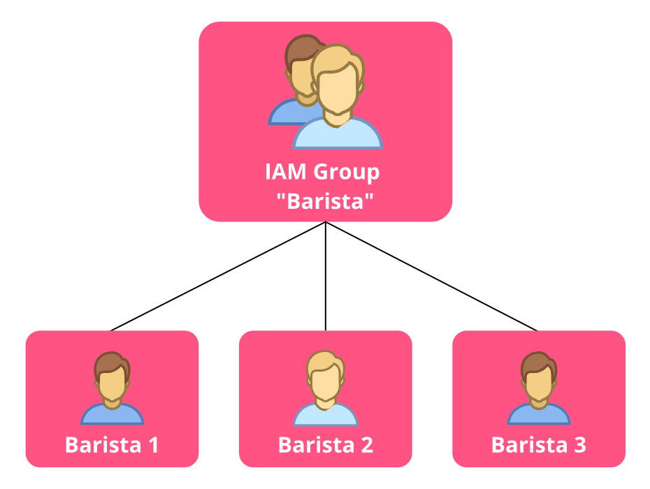

# Perizinan dan Hak Akses Pengguna
Pada skenario kedai kopi kita, setiap pegawai memiliki identitas dan akses sesuai perannnya masing-masing. Misalnya kita ambil contoh seorang kasir dan petugas gudang seperti berikut:

  - Seorang kasir bertugas untuk menerima pesanan sehingga ia memiliki akses ke mesin kasir.
  - Petugas gudang bertanggung jawab untuk memeriksa inventaris sehingga ia memiliki akses ke komputer gudang.

Mereka memiliki dua akses login dan dua set permission (izin) yang berbeda. Sehingga seorang kasir tidak akan diizinkan masuk ke sistem inventaris dan begitu juga sebaliknya.

Nah, mekanisme seperti itu juga bisa Anda implementasikan di AWS. Saat pertama kali membuat akun, Anda memulai dengan identitas sebagai AWS account root user atau bisa disederhanakan menjadi root user.

`Root user` adalah `pemilik akun AWS`. Ia memiliki permission untuk mengakses dan mengontrol seluruh sumber daya apa pun dalam akun tersebut, seperti menjalankan database, membuat EC2 instance, layanan blockchain, dan lain-lain.

Mudahnya, anggap saja root user sebagai pemilik kedai kopi. Ia bisa datang ke kedai dan melakukan apa pun, seperti mengoperasikan mesin kasir, menggunakan komputer gudang, atau hal-hal lainnya. Ia tidak akan mengalami pembatasan.

Nah, karena `root user ini sangat berkuasa`, AWS menyarankan Anda untuk `mengaktifkan multi-factor authentication` (MFA) guna memastikan agar akun tersebut aman. Apa itu MFA?

Begini. Pernahkah Anda login ke suatu website yang tak hanya meminta email dan password, melainkan juga melakukan verifikasi dua langkah dengan mengirimkan kode acak ke ponsel Anda? Nah, itulah contoh MFA. Ia berguna untuk memberikan lapisan keamanan tambahan untuk akun AWS Anda.

Tetapi, walaupun sudah mengaktifkan MFA, tentu Anda tak ingin memberikan akses root user ini ke semua pegawai di kedai kopi tersebut.

Masih ingat persoalan kita di awal? Kita tak ingin seorang kasir dapat mengakses komputer gudang. Lantas bagaimana solusinya?

Tenang, AWS memungkinkan Anda untuk dapat mengontrol akses secara terperinci dengan menggunakan layanan `AWS Identity and Access Management (AWS IAM)`. Penasaran, apa saja fitur yang ditawarkan oleh AWS IAM? Mari kita bahas di materi berikutnya!


# AWS Identity and Access Management (AWS IAM)
`AWS Identity and Access Management (AWS IAM)` dapat membantu Anda untuk mengelola akses ke layanan dan sumber daya AWS dengan aman.

IAM memberi Anda fleksibilitas untuk mengonfigurasi akses berdasarkan kebutuhan operasional dan keamanan yang spesifik. Di modul ini, kita akan membahas fitur-fitur IAM, seperti:

  - IAM users
  - IAM policies
  - IAM groups
  - IAM roles

Penasaran seperti apa? Mari kita bahas masing-masing fiturnya.

# IAM Users
Di `AWS Identity and Access Management (AWS IAM)` Anda dapat membuat `IAM users`. Ia mewakili orang (personal) yang berinteraksi dengan layanan dan sumber daya AWS.

IAM users secara default belum memiliki permission sama sekali. Ia tidak bisa masuk ke akun AWS, meluncurkan EC2 instance, atau bahkan membuat S3 bucket. Intinya, secara default semua tindakan yang dilakukan oleh IAM users akan ditolak.

Jika ingin membuat IAM users bisa melakukan sesuatu, maka Anda harus memberikan permission secara eksplisit. Lalu, bagaimana cara memberikan atau menolak permission? Jawabannya, Anda bisa mengaitkan IAM policies ke IAM users.

# IAM Policies
`IAM policies` adalah `dokumen JSON yang mengizinkan atau menolak aktivitas tertentu terhadap layanan dan sumber daya AWS`.

Tunggu, apa itu JSON? Sederhananya, JSON (JavaScript Object Notation) adalah format dokumen pertukaran data yang mudah dimengerti, baik oleh manusia maupun mesin.

Oke, kembali ke topik. Anda dapat menggunakan `IAM policies` untuk mengatur `akses user ke sumber daya AWS`. Misalnya, untuk mengizinkan user untuk mengakses beberapa atau spesifik salah satu Amazon S3 bucket dalam akun AWS Anda. Bingung? Tenang, mari kita lihat contoh singkat berikut: 
```json
{
  "Version":"2012-10-17",
  "Statement":{
    "Effect":"Allow",
    "Action":"s3:ListObject",
    "Resource":"arn:aws:s3:::Example-Bucket"
  }
}
```
Mungkin sekarang Anda sedang bergumam dan berkata, “Apa maksud dari pernyataan-pernyataan tersebut?” Oke, mari kita bedah.

  - Pada bagian “Effect”, Anda hanya bisa mengisinya dengan dua opsi: `Allow` (izinkan) atau `Deny` (tolak). Dalam kasus ini, kita memberikan izin kepada user untuk melakukan sesuatu.
  - Untuk “Action”, Anda dapat mengisinya dengan panggilan API apa pun. Di sini kita menuliskan `s3:ListObject`. Artinya, user dapat mengetahui objek-objek apa saja yang berada di S3 bucket tertentu.
  
Untuk bagian “Resource”, Anda bisa mengisinya dengan alamat sumber daya yang dimaksud. Di pernyataan tersebut kita bisa mengisinya dengan arn:aws:s3:::EXAMPLE-BUCKET, yaitu alamat ID unik dari S3 bucket tertentu.
Jadi, jika Anda melampirkan IAM policies tersebut ke IAM users, maka user tersebut dapat melihat daftar seluruh objek yang ada pada bucket yang bernama “EXAMPLE-BUCKET”.

Ingat! Saat memberikan permission, pastikan Anda mengikuti `“principle of least privilege”`. Maksudnya, `berikanlah akses sesuai dengan kebutuhan saat itu saja`.

Misalnya, jika seorang user hanya memerlukan akses ke bucket tertentu, maka berikanlah akses hanya untuk bucket tersebut di IAM policies, jangan ke semua bucket.


# IAM Groups
Salah satu cara yang dapat mempermudah pengelolaan user dan permission adalah dengan mengelompokkannya ke dalam IAM groups.

IAM groups adalah grup/kelompok yang berisi kumpulan dari user. Menariknya, Anda bisa melampirkan policy ke group sehingga semua user yang berada di group tersebut akan memiliki permission yang sama.

Mari kita ambil contoh kedai kopi. Katakanlah Anda memiliki banyak pegawai barista baru dan ingin memberikan permission kepada mereka. Nah, daripada memberikannya satu per satu, Anda bisa melakukan hal berikut:

  - Buat IAM groups bernama “Barista”.
  - Tambahkan semua user barista baru ke dalam group.
  - Lampirkan permission ke group tersebut.



Oke, sampai sini, kita sudah mengenal beberapa hal: IAM users, IAM groups, dan IAM policies. Tunggu, masih ada satu identitas utama lainnya, yaitu IAM roles.

# IAM Roles
Untuk memahami apa itu IAM roles, mari kita analogikan dengan kedai kopi. Katakanlah Anda memiliki beberapa kasir. Seperti yang kita tahu, tak setiap saat keadaan kedai itu ramai pengunjung, pada waktu-waktu tertentu justru cenderung sepi.

Oleh karena itu, saat kedai sedang sepi, Anda ingin menugaskan beberapa kasir tersebut untuk melakukan pekerjaan yang berbeda, seperti bersih-bersih, mengecek inventaris, atau menyambut pelanggan yang datang. Namun ini hanya sementara, mereka harus kembali ke mesin kasir saat kedai kembali ramai.

Nah, Anda--sebagai pemilik kedai kopi--memiliki wewenang untuk memberikan peran sementara ini kepada beberapa kasir tersebut. Hal seperti ini dapat Anda implementasikan di AWS dengan IAM roles.

IAM roles memiliki permission yang dapat mengizinkan tindakan tertentu yang dibutuhkan secara temporer atau sementara. Role ini juga sebenarnya mirip dengan user, bedanya, ia tak memiliki credential (username dan password).

IAM roles dapat Anda gunakan untuk memberikan akses sementara ke beberapa hal, seperti sumber daya AWS, user, eksternal user, aplikasi, bahkan layanan AWS lainnya.

Ketika sebuah identitas menggunakan IAM roles, identitas tersebut menanggalkan semua permission sebelumnya yang dimiliki dan mengambil permission dari role tersebut.

Tak hanya itu, Anda dapat memfederasikan/menggabungkan eksternal user ke akun Anda. Maksudnya, daripada terus membuat IAM users untuk setiap orang di organisasi, Anda dapat menggunakan regular corporate credential (kredensial perusahaan reguler) untuk login ke AWS dengan memetakan identitas perusahaan ke IAM roles.