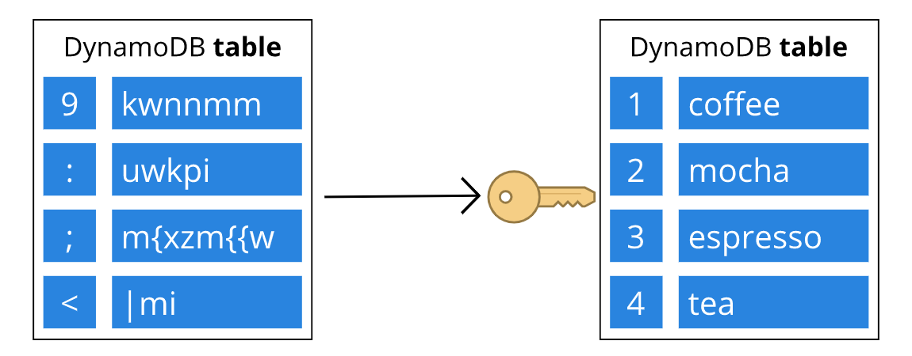
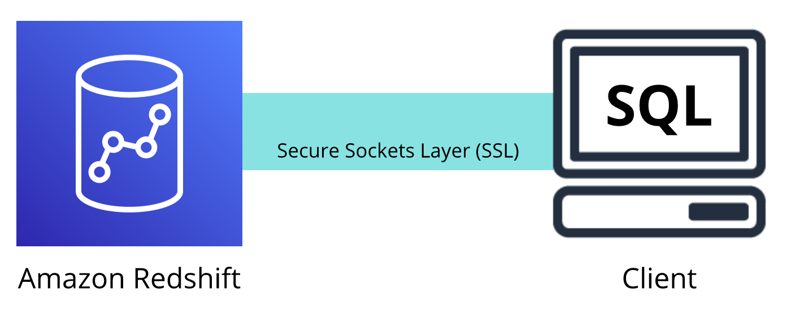
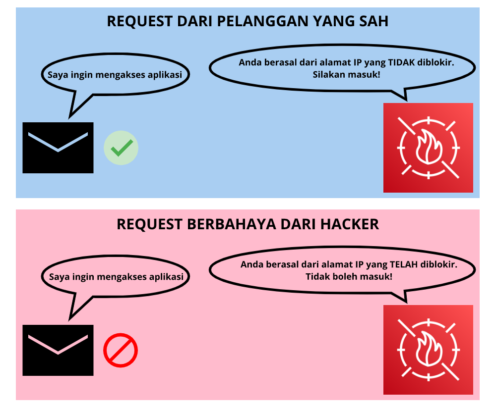

# Layanan Keamanan Tambahan
Hari silih berganti dan kedai kopi Anda semakin ramai. Banyak pelanggan yang datang dan pergi. Karena hal ini, tentu Anda ingin meningkatkan keamanan di sana, bukan?

Salah satu hal yang harus Anda amankan adalah biji kopi. Anda harus memastikan mereka aman, baik pada saat di gudang penyimpanan atau ketika proses pengiriman antar toko. Intinya, Anda tak ingin satu pun pelanggan memiliki akses ke biji kopi. Cara sederhana untuk mengamankannya adalah dengan mengunci pintu saat Anda pergi di malam hari.

Nah, begitu juga dengan data. Anda perlu mengamankannya, baik saat keadaan `at rest (diam)` maupun `in-transit (berpindah)`. Anda bisa melakukannya dengan enkripsi, yaitu mengamankan suatu pesan atau data yang hanya dapat diakses oleh pihak terotorisasi. Dengan melakukan enkripsi, pihak yang tak berwenang tidak akan bisa mengakses data Anda sama sekali.

Kalau Anda bingung, anggap saja enkripsi itu sebagai kunci dan pintu di kedai kopi. Jika Anda memiliki kuncinya, maka Anda dapat membuka pintu. Tetapi jika tidak, yup! Anda pasti sudah tahu jawabannya. Sederhana, ‘kan?

Di AWS, enkripsi hadir dalam dua varian: `at rest (saat diam)` dan `in-transit (dalam perjalanan)`. Mari kita bedah.

  - `Encryption at rest`

    Pada jenis ini, proses enkripsi terjadi saat data Anda dalam keadaan tidak bergerak (tersimpan dan tidak berpindah). Contohnya adalah `server-side encryption at rest (enkripsi at rest pada sisi server)` yang secara bawaan telah aktif untuk semua data di tabel DynamoDB.

    Data yang tersimpan di sana akan terenkripsi alias berubah menjadi serangkaian kata yang tak terbaca. Ini berguna untuk mencegah data Anda diakses oleh pihak yang tidak berwenang.

    `Enkripsi at rest` pada DynamoDB juga terintegrasi dengan `AWS Key Management Service (AWS KMS)` yang berguna mengelola key/kunci enkripsi untuk tabel Anda--nanti kita bahas. Kunci enkripsi ini berperan seperti kunci pintu, ingat? Tanpanya, Anda tak akan dapat mengakses data, jadi simpanlah dengan aman.
    

  - `Encryption in-transit`

    Proses enkripsi in-transit terjadi saat data Anda berpindah antara A dan B. A dan B ini bisa berupa apa pun, seperti layanan AWS dan klien yang mengakses layanan tersebut.

    Misalnya, Anda ingin menghubungkan Redshift instance dan SQL client. Untuk kasus tersebut, Anda bisa menggunakan koneksi SSL alias secure sockets layer. Dengan begitu, Anda dapat melakukan enkripsi data serta menggunakan sertifikat layanan untuk validasi dan otorisasi klien.
    
    Dengan demikian, data Anda akan terlindungi selama perjalanan antara Redshift dan klien. Ketahuilah! Fungsionalitas semacam ini tersedia di banyak layanan AWS lainnya seperti SQS, S3, RDS, dan banyak lagi.

# AWS Key Management Service (AWS KMS)
Sebelumnya kita telah menyinggung sedikit tentang layanan ini, sekarang mari kita selami lebih dalam tentangnya.

`AWS Key Management Service (AWS KMS)` adalah `layanan yang memungkinkan Anda untuk melakukan enkripsi menggunakan cryptographic key (kunci kriptografi)`. Kunci `kriptografi` adalah `rangkaian angka acak yang digunakan untuk mengunci (mengenkripsi) dan membuka kunci (mendekripsi) data`.

Dengan AWS KMS, Anda dapat mengontrol penggunaan kunci kriptografi di berbagai layanan ataupun di dalam aplikasi Anda.

Selain itu, Anda juga dapat memilih tingkat kontrol akses tertentu yang Anda perlukan untuk kunci tersebut. Misal:

  - Anda bisa menentukan IAM users dan IAM roles mana yang dapat mengelola kunci; atau
  - Anda dapat menonaktifkan kunci untuk sementara sehingga tidak ada yang bisa menggunakannya.

Kunci kriptografi yang Anda simpan di AWS KMS akan senantiasa aman dan terlindungi.

# AWS Web Application Firewall (AWS WAF)
`AWS Web Application Firewall` alias `AWS WAF` memungkinkan Anda untuk dapat memantau request/permintaan jaringan yang masuk ke aplikasi web.

Masih ingatkah Anda tentang `network access control list` (`network ACL`) yang telah kita pelajari di modul sebelumnya? AWS WAF ini bekerja dengan cara yang mirip dengan network ACL, yaitu `memblokir atau mengizinkan lalu lintas. Bedanya, ia menggunakan web access control list (web ACL) untuk melindungi sumber daya AWS` Anda.

Berikut adalah contoh bagaimana Anda dapat menggunakan AWS WAF untuk mengizinkan dan memblokir request tertentu.

Anggaplah aplikasi Anda telah menerima request jaringan berbahaya dari beberapa alamat IP. Tentu, Anda ingin mencegah request ini, bukan? Tetapi, Anda juga ingin memastikan user sah masih dapat mengakses aplikasi.

Nah untuk masalah ini, Anda dapat mengonfigurasi web ACL yang dapat mengizinkan semua request kecuali dari alamat IP yang telah Anda tentukan.

Saat sebuah request hendak masuk ke aplikasi Anda, AWS WAF akan memeriksa daftar pengaturan yang telah Anda atur di web ACL.

Jika request tersebut bukan berasal dari salah satu alamat IP yang diblokir, maka ia diizinkan masuk ke aplikasi. Namun, jika sebaliknya, ia akan ditolak.

# Amazon Inspector
Mari kita awali modul ini dengan sebuah analogi kedai kopi. Misalkan Anda sedang mengembangkan dan menguji aplikasi pemesanan baru. Anda ingin memastikan rancangan aplikasi tersebut sesuai dengan praktik keamanan terbaik. Namun, Anda tidak memiliki banyak waktu untuk melakukan penilaian manual.

Nah, sekarang pertanyaannya, bagaimana cara menilai keamanan secara otomatis?

AWS memberikan solusi terbaik, yaitu dengan layanan `Amazon Inspector`. Ia dapat membantu Anda untuk melengkapi pemahaman kita untuk meningkatkan keamanan dan `compliance/kepatuhan` aplikasi dengan menjalankan penilaian keamanan secara otomatis terhadap infrastruktur Anda.

Amazon Inspector bekerja dengan cara memeriksa aplikasi terhadap kerentanan dan penyimpangan praktik terbaik keamanan. Contohnya seperti akses yang terbuka ke Amazon EC2 instance atau penginstalan versi software yang memiliki kerentanan keamanan.

Setelah melakukan penilaian, Amazon Inspector memberikan Anda daftar temuan keamanan yang diprioritaskan menurut tingkat keparahan. Daftar ini juga berisi deskripsi mendetail tentang setiap masalah keamanan dan rekomendasi cara memperbaikinya.

Namun ingat, AWS tidak menjamin bahwa dengan mengikuti rekomendasi tersebut dapat menyelesaikan setiap potensi masalah keamanan. Tentu Anda masih ingat, berdasarkan shared responsibility model, pelanggan AWS bertanggung jawab atas keamanan aplikasi, proses, dan tools yang berjalan di layanan AWS.

# Amazon GuardDuty
Layanan keamanan lain nan tak kalah penting adalah `Amazon GuardDuty`. Ia adalah `layanan yang menyediakan deteksi ancaman cerdas untuk infrastruktur dan sumber daya AWS` Anda.

Layanan ini mengidentifikasi ancaman dengan senantiasa memantau aktivitas jaringan dan perilaku akun di dalam lingkungan AWS Anda.

Amazon GuardDuty menggunakan integrated threat intelligence (kecerdasan ancaman terintegrasi) seperti alamat IP berbahaya, deteksi anomali, dan machine learning untuk mengidentifikasi ancaman dengan lebih akurat.

Nah, saat GuardDuty mendeteksi suatu ancaman, Anda dapat meninjau temuan mendetail dari AWS Management Console. Temuan ini juga mencakup langkah-langkah rekomendasi yang bisa Anda tindak lanjuti.

Tunggu, masih ada bagian terbaiknya. Layanan ini berjalan secara independen dari layanan AWS yang lain. Jadi, ia tak akan memengaruhi kinerja, ketersediaan, dan beban kerja infrastruktur Anda.
