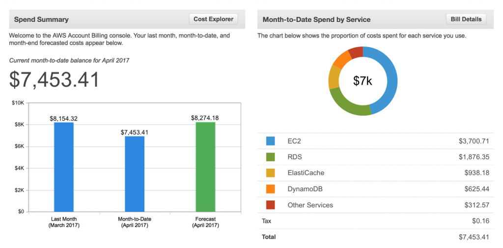
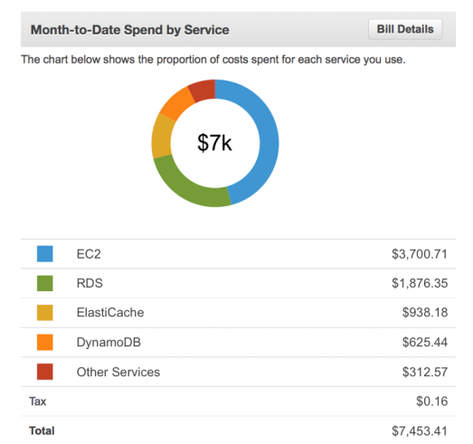
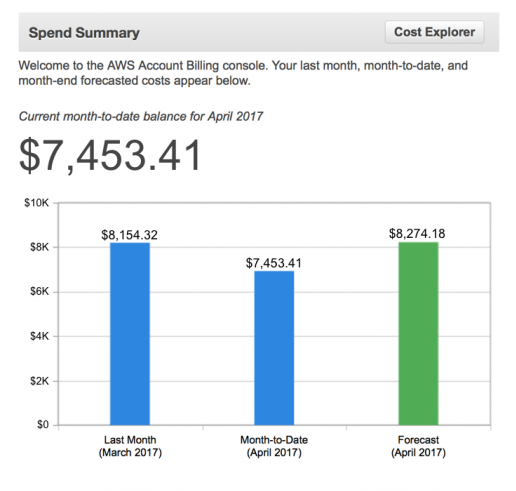
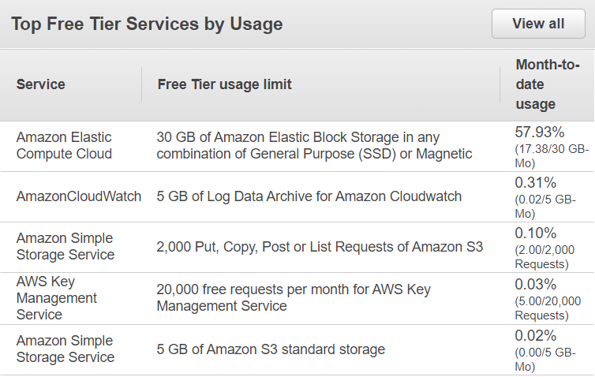
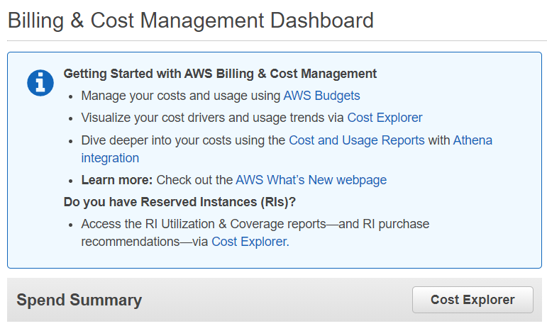
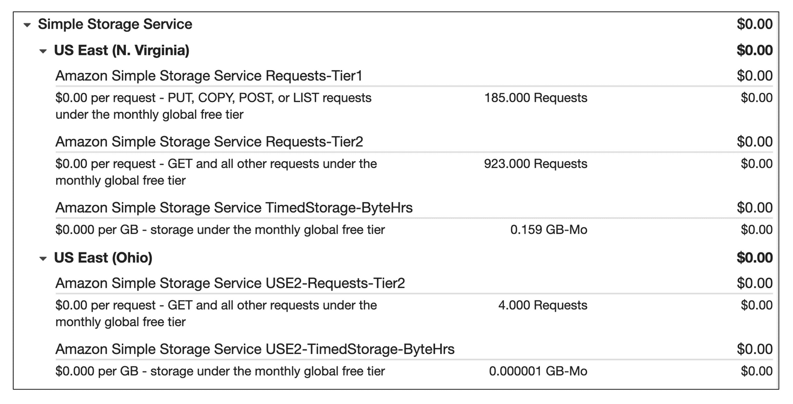

# Billing Dashboard
Halo, pecinta AWS! Saat memulai perjalanan cloud di AWS, tentu Anda ingin tahu tentang informasi penagihan pada akun AWS Anda, bukan?

Nah, di modul ini kita akan lihat seperti apa billing dashboard atau dashboard penagihan di AWS. Siap? Mari kita mulai!

Perkenalkan, AWS Billing and Cost Management dashboard. Ia adalah layanan yang dapat Anda gunakan untuk melihat informasi penagihan, membayar tagihan AWS, memantau penggunaan, menganalisis, dan mengontrol biaya.

Supaya lebih jelas, silakan amati gambar berikut:

Catatan: Gambar-gambar yang ada di modul ini adalah tampilan demo agar mudah Anda bayangkan.

Gambar di atas adalah halaman utama dari layanan AWS Billing and Cost Management. Di sana, Anda memiliki beberapa informasi yang bermanfaat. Yuk kita telaah!

  - Di sebelah kanan terdapat informasi pembelanjaan bulanan Anda sekaligus mengurutkan layanan yang memiliki pengeluaran terbesar.
  

  - Di sebelahnya, Anda dapat membandingkan pengeluaran pada bulan sebelumnya, bulan ini, dan perkiraan bulan depan.
  

  - Anda dapat melihat penggunaan AWS Free Tier berdasarkan layanan. Bahkan, Anda bisa melihat persentase penggunaan bulanan. Keren, ‘kan?
  

  - Anda juga memiliki akses ke layanan penagihan lain, seperti AWS Cost Explorer, AWS Budgets, dan sebagainya.
  

  - Di AWS Billing and Cost Management, Anda juga dapat melihat tagihan secara lebih detail. Biaya yang harus Anda bayarkan telah dikelompokkan menurut Region.
  

  Diambil dari `E-learning AWS Cloud Practitioner Essentials`.

Nah, itulah cara sederhana yang dapat Anda lakukan untuk memeriksa pengeluaran dan tagihan di AWS.

