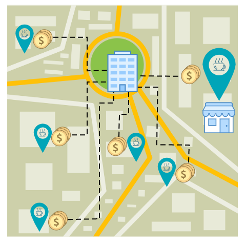
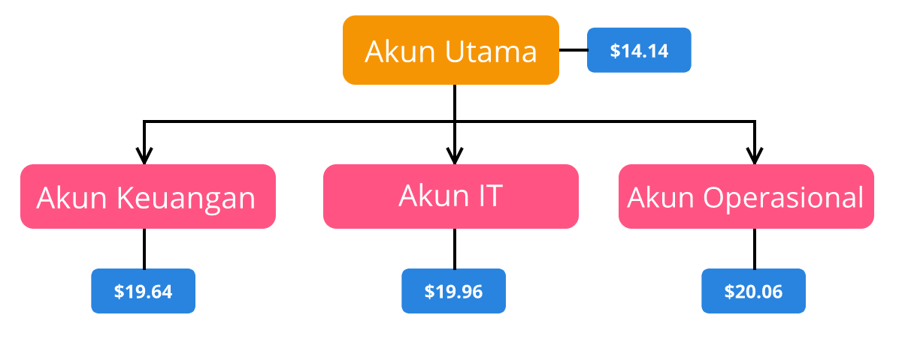
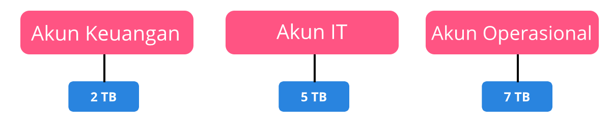
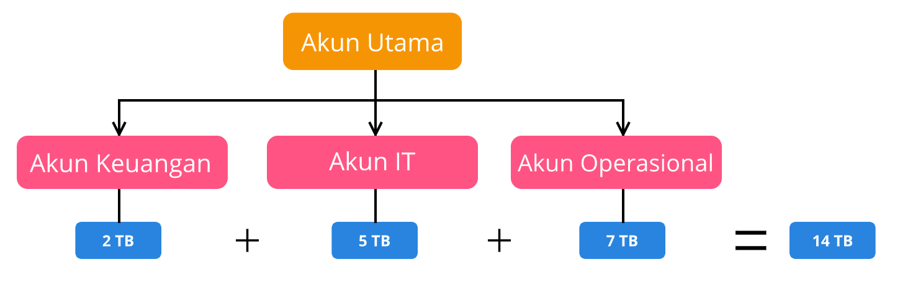

# Consolidated Billing
Masih ingatkah kedai kopi yang Anda miliki di seluruh kota? Kita telah membahasnya di Modul Infrastruktur Global dan Keandalan.

Setiap kedai kopi tersebut memiliki pengeluaran dan keuntungannya masing-masing. Oleh karena itu, Anda ingin uang tersebut mengalir ke dan dari satu rekening utama, yaitu rekening Anda selaku pemilik semua kedai kopi itu.

Misalnya, ada seorang petugas reparasi datang untuk memperbaiki mesin kopi yang rusak di kedai kopi A. Anda ingin orang itu menagih langsung kepada Anda, bukan ke pegawai kedai kopi A. Bagaimana caranya?

Nah, ide tersebut dapat Anda wujudkan dengan AWS Organizations. Seperti yang telah kita pelajari sebelumnya, layanan ini dapat mengelola beberapa akun dari satu lokasi terpusat. Ia juga memiliki sejumlah fitur menarik, salah satunya adalah consolidated billing (tagihan terkonsolidasi). Apa itu?

`Consolidated billing` adalah `fitur yang memungkinkan Anda untuk mendapatkan satu tagihan untuk semua akun AWS yang ada di organisasi`. Dengan demikian, Anda tak perlu membayar tagihan untuk setiap akun. Contoh, jika memiliki 100 akun AWS, Anda tak akan mendapatkan 100 tagihan, melainkan hanya satu tagihan terpusat. Keren, ‘kan? Tentunya ini akan mempermudah Anda dalam melacak dan mengelola tagihan.

Bahkan tak hanya itu, manfaat lain dari consolidated billing adalah Anda dapat mendistribusikan bulk discount pricing (harga diskon massal), Savings Plans, dan Reserved Instances di seluruh akun pada organisasi Anda.

Maksudnya begini. Satu akun AWS saja mungkin tidak akan memiliki penggunaan bulanan yang cukup untuk memenuhi syarat diskon. Namun, jika beberapa akun digabungkan, penggunaannya dapat menghasilkan manfaat yang berlaku untuk semua akun yang ada di dalam organisasi.

Tunggu, masih ada bagian terbaiknya. Fitur ini gratis dan mudah digunakan. Nice!

# Studi Kasus: Consolidated Billing
Selamat datang kembali di Modul Studi Kasus. Kali ini kita akan membahas tentang penggunaan consolidated billing di kehidupan nyata.

Katakanlah Anda memiliki perusahaan yang menaungi semua kedai kopi di seluruh kota. Sebagai seorang pemimpin, Anda ingin mengawasi setiap tagihan yang terjadi pada masing-masing akun AWS perusahaan.

Anda memiliki 3 akun (di luar akun utama) untuk setiap departemen: Keuangan, IT, dan Operasional. Anda memutuskan untuk membuat organisasi di AWS Organizations dan menambahkan tiga akun tersebut.

Setiap bulan, AWS melakukan penagihan terhadap akun utama Anda untuk semua akun yang ada di organisasi dengan consolidated billing. Amati gambar berikut:

Perhatikan gambar di atas. Sebagai pemegang akun utama, Anda bisa mendapatkan laporan biaya terperinci untuk setiap akun, termasuk akun utama.

Bisa Anda lihat bahwa setiap akun memiliki pengeluaran yang bervariasi:

  - Akun Utama : $14.14
  - Akun Keuangan : $19.64
  - Akun IT : $19.96
  - Akun Operasional : $20.06

Jadi, total biaya yang harus Anda keluarkan pada akun utama adalah $73.80.

Selain itu, consolidated billing juga memungkinkan Anda untuk berbagi volume pricing discounts (diskon harga volume) di seluruh akun. Contohnya, beberapa layanan AWS (seperti Amazon S3) dapat memberikan harga yang lebih rendah saat Anda semakin sering menggunakannya.

Di Amazon S3 setelah menggunakan 10 TB data dalam sebulan, Anda bisa membayar harga transfer per GB lebih rendah untuk 40 TB data berikutnya.

Perhatikan gambar berikut:

Gambar di atas adalah contoh dari proses transfer data pada akun departemen Anda ketika tidak menggunakan consolidated billing.

Selama bulan ini setiap akun mentransfer sejumlah data yang berbeda di Amazon S3:

  - Keuangan mentransfer data sebesar 2 TB.
  - IT mentransfer data sebesar 5 TB.
  - Operasional mentransfer data sebesar 7 TB.

Nah, karena tak ada satu akun pun yang melewati jumlah transfer 10 TB, Anda tidak akan memperoleh harga transfer per GB yang lebih murah untuk 40 TB data berikutnya.

Sekarang mari kita contohkan proses transfer data pada akun departemen Anda ketika menggunakan consolidated billing.

Ketika penggunaan Amazon S3 untuk ketiga akun tersebut digabungkan, yakni (2 + 5 + 7), ia menghasilkan jumlah transfer data sebesar 14 TB. Artinya, angka ini telah melebihi ambang batas 10 TB sehingga Anda akan mendapat harga transfer per GB yang lebih rendah untuk data transfer 40 TB berikutnya.

Dengan consolidated billing, AWS akan menggabungkan penggunaan dari semua akun untuk menentukan tingkat harga volume mana yang akan diterapkan. Bahkan, ia juga dapat memberikan harga keseluruhan yang lebih rendah bila memungkinkan. Kemudian, AWS akan mengalokasikan sebagian dari keseluruhan diskon volume untuk setiap akun berdasarkan penggunaan.

Pada contoh di atas, akun Operasional akan menerima porsi yang lebih besar karena ia telah melakukan transfer data sebesar 7 TB. Jumlah ini lebih banyak dibandingkan dengan Keuangan (2 TB) dan IT (5 TB).