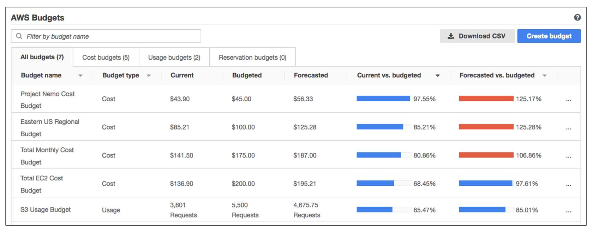

# AWS Budgets
Semakin meningkatnya produktivitas di AWS, Anda mungkin ingin memastikan bahwa uang yang dikeluarkan tidak akan melebihi anggaran.

Misalnya Anda ingin membuat suatu anggaran untuk penggunaan Amazon EC2. Anda tak ingin biayanya melebihi 1 juta rupiah. Nah, bagaimana kita bisa mewujudkan kebutuhan semacam ini di AWS?

Perkenalkan, AWS Budgets. Ia sangat mudah digunakan, bahkan segampang membuat anggaran untuk pengeluaran pribadi Anda sendiri. Tentu Anda sudah merasa familier ‘kan?

AWS Budgets dapat membantu Anda untuk menetapkan anggaran pada berbagai skenario, seperti biaya atau penggunaan layanan. Bahkan, layanan ini bisa mengirimkan notifikasi saat penggunaan Anda sudah melebihi jumlah batas anggaran.

Sekarang silakan amati gambar berikut:

Diambil dari `E-learning AWS Cloud Practitioner Essentials`.

Gambar di atas adalah contoh anggaran yang dibuat dengan AWS Budgets. Terdapat beberapa informasi penting yang perlu Anda tinjau, perhatikan baris anggaran teratas bernama `Project Nemo Cost Budget`.

  - Jumlah pengeluaran pada kolom current (terkini) adalah sebesar $43.90.
  - Total pengeluaran pada kolom forecasted (perkiraan) untuk bulan ini adalah $56.33. Jumlah ini adalah hasil kalkulasi dari pola penggunaan sumber daya Anda.
  - Anda juga bisa melihat perbandingan antara pengeluaran current vs budgeted (dianggarkan), dan forecasted vs budgeted. Pada gambar di atas, komparasi untuk total forecasted vs budgeted adalah 125.17%. Wah besar sekali ya. Ini terjadi karena jumlah forecasted ($56.33) melebihi jumlah yang telah dianggarkan alias budgeted ($45.00). Tentu, ini sudah melebihi anggaran yang direncanakan sebelumnya.

Nah, itulah materi kita kali ini tentang AWS Budgets. Semangat ya, kita sudah setengah jalan di modul ini. Keep the spirit high!