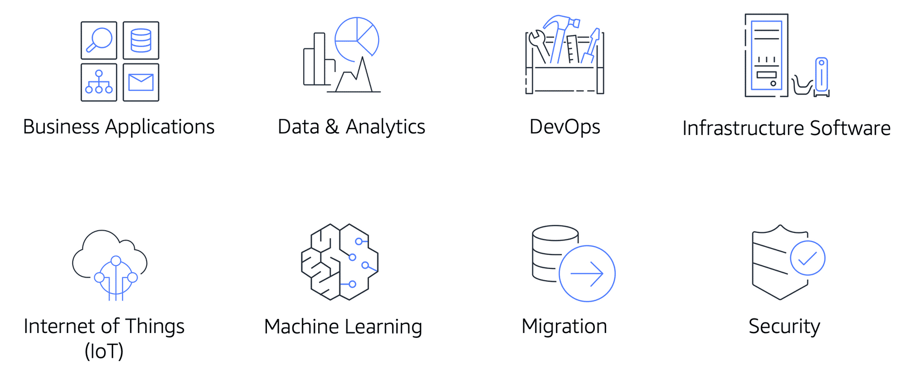

# AWS Marketplace
Cara lain yang dapat membantu Anda untuk menjalankan beban kerja di AWS adalah melalui AWS Marketplace. Ia adalah katalog digital pilihan yang memiliki ribuan perangkat lunak dari berbagai vendor.

Layanan ini dapat menyederhanakan langkah Anda guna menemukan, melakukan pengujian, dan membeli software pihak ketiga yang berjalan di arsitektur AWS.

Untuk setiap software yang ada di AWS Marketplace, Anda dapat mengakses rincian informasi terkait opsi harga, dukungan yang tersedia, dan ulasan dari pelanggan AWS lainnya. 

Layanan ini dapat membantu Anda untuk meningkatkan kecepatan dan ketangkasan Anda dalam menggunakan AWS. Ketimbang harus membangun, menginstal, dan memelihara infrastruktur dasar yang diperlukan untuk menjalankan aplikasi pihak ketiga, Anda bisa melakukan one-click deployment (proses deploy sekali klik) untuk produk dari ribuan vendor.

Sebagian besar vendor di AWS Marketplace menawarkan mekanisme pay-as-you-go (bayar sesuai pemakaian). Bahkan, beberapa di antaranya juga menyediakan free trials (uji coba gratis) atau paket Quick Start (mulai dengan cepat) untuk membantu Anda bereksperimen dan mempelajari produk mereka.

AWS Marketplace menyajikan produk dalam beberapa kategori, seperti Infrastructure Software, Business Applications, Data & Analytics, DevOps, dll.

Diambil dari `E-learning AWS Cloud Practitioner Essentials`.

Selain itu, Anda juga dapat menjelajahi solusi perangkat lunak berdasarkan industri dan kasus penggunaan. Misalnya, jika Anda memiliki perusahaan yang bergerak di industri perawatan kesehatan, Anda dapat meninjau beberapa kasus penggunaan, seperti:

  - Menerapkan solusi untuk melindungi catatan pasien.
  - Menggunakan model machine learning untuk menganalisis riwayat medis pasien.
  - Memprediksi kemungkinan risiko kesehatan pasien.