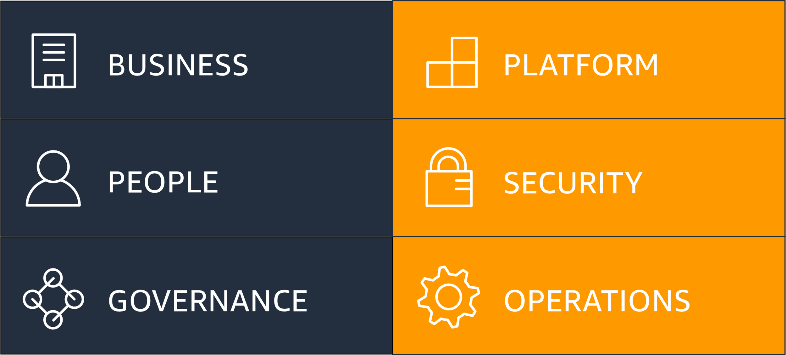
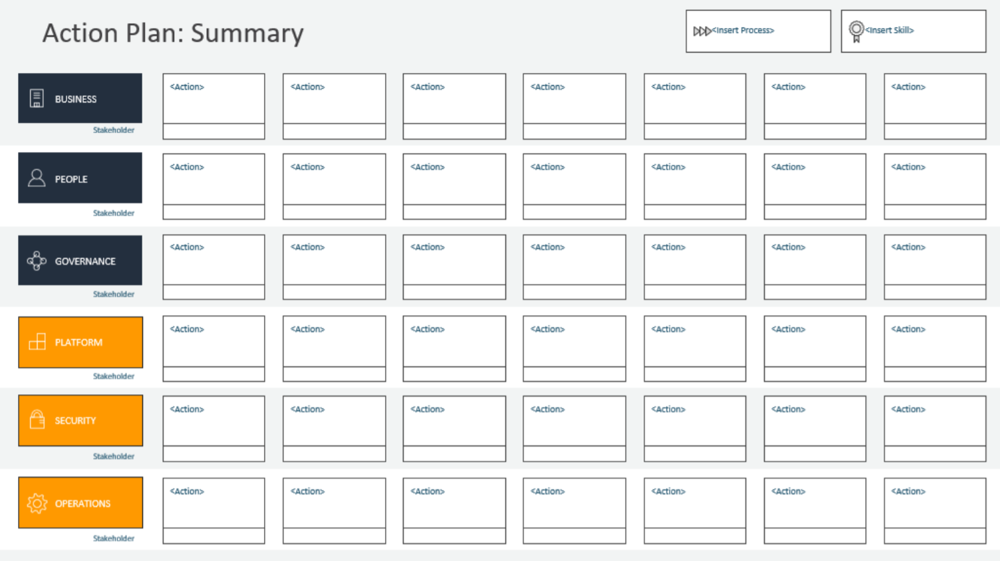

# AWS Cloud Adoption Framework (AWS CAF)
Proses migrasi ke cloud bukanlah suatu hal yang instan. Tak bisa hanya sekadar menjentikkan jari dan boom! Secara ajaib semuanya berjalan di AWS. Tentu, Anda memerlukan upaya dan keahlian ekstra untuk melakukan proses migrasi.

Untungnya, sudah banyak orang yang berhasil melakukan migrasi cloud dan membagikan kisahnya. Dengan demikian, Anda bisa mendapatkan banyak wawasan sehingga tidak akan salah langkah.

Mari kita buat skenario. Katakanlah kedai kopi Anda sudah memiliki banyak cabang yang tersebar di seluruh kota. Semua kedai tersebut berada di bawah naungan perusahaan Anda. Nah, setelah mempelajari tentang AWS, Anda pun semakin mantap untuk melakukan migrasi ke AWS.

Agar proses tersebut terlaksana dengan baik, Anda pun membentuk tim khusus dan melibatkan banyak pegawai dari departemen yang berbeda.

Oke, berangkat dari kasus tersebut, timbul satu pertanyaan di benak Anda, “Bagaimana agar proses migrasi cloud ini dapat berjalan sukses?”

Simak baik-baik! Setiap posisi pada suatu perusahaan akan memiliki peran dan perspektif yang berbeda terkait proses migrasi cloud. Misalnya, seorang developer tentu akan mempunyai sudut pandang yang berlainan dibandingkan dengan arsitek cloud, analis bisnis, dan analis keuangan.

Perbedaan perspektif ini bukanlah masalah. Justru yang terpenting adalah Anda perlu memastikan setiap orang di dalam tim memiliki tujuan yang sama, yakni keberhasilan migrasi cloud.

Jangan khawatir! Tim layanan profesional AWS telah menciptakan AWS Cloud Adoption Framework (AWS CAF). Fungsinya untuk memberikan Anda panduan agar proses migrasi ke AWS menjadi lebih cepat dan lancar.

Framework atau kerangka kerja tersebut membagi panduan menjadi 6 area yang disebut dengan perspektif. Masing-masing perspektif meliputi tanggung jawab dari kelompok yang berbeda.

Secara umum, ia mencakup perspektif Business, People, dan Governance berfokus pada kemampuan bisnis. Lalu, perspektif Platform, Security, dan Operations berfokus pada kemampuan teknis.

Diambil dari `AWS Migration Whitepaper: The AWS Cloud Adoption Framework (AWS CAF)`.

Agar dapat memahami lebih jelas, mari kita uraikan setiap perspektif tersebut:

  - `Business (Bisnis)`
    Perspektif ini membantu Anda untuk beralih dari strategi yang semula memisahkan antara bisnis dan IT menjadi model bisnis yang mengintegrasikan strategi IT.
    Peran umum dalam perspektif Business meliputi:
    - Manajer bisnis
    - Manajer keuangan
    - Budget owners (pemilik anggaran)
    - Strategy stakeholders

  - `People (Orang)`
    Perspektif ini dapat membantu Anda dalam mempersiapkan tim dengan memperbarui skill staf dan proses organisasi untuk migrasi cloud. Perspektif ini juga membantu Anda dalam memprioritaskan pelatihan, kepegawaian, dan perubahan organisasi.

    Berikut adalah peran umum yang ada di dalam perspektif People:
    - HR (Human Resource/Sumber Daya Manusia)
    - Staf
    - Manajer personalia

  - `Governance (Tata Kelola)`
    Perspektif Governance berfokus pada mengintegrasikan IT Governance (Tata Kelola IT) dengan Organizational Governance (Tata Kelola Organisasi). Perspektif ini juga memberikan panduan untuk mengidentifikasi dan menerapkan praktik terbaik untuk IT Governance serta mendukung proses bisnis dengan teknologi.

    Anda juga dapat menggunakan perspektif Governance untuk memahami cara pembaruan keterampilan staf dan proses yang diperlukan untuk memastikan Business Governance (Tata kelola Bisnis) di cloud.

    Peran umum perspektif Governance ini mencakup:
    - CIO (Chief Information Officer)
    - Manajer program
    - Manajer proyek
    - Analis bisnis
    - Manajer portofolio

  - `Platform`
    Perspektif Platform dapat membantu Anda untuk merancang, menerapkan, dan mengoptimalkan arsitektur teknologi AWS berdasarkan sasaran bisnis. Ia juga bisa memberikan panduan strategis untuk desain, prinsip, layanan, dan kebijakan yang akan Anda gunakan untuk menentukan infrastruktur AWS.

    Selain itu, perspektif ini juga mencakup prinsip dan pola yang berguna untuk mengimplementasikan solusi baru atau migrasi beban kerja on-premise Anda ke cloud.

    Beberapa peran umum perspektif Platform meliputi:
    - CTO (Chief Technology Officer)
    - Manajer IT
    - Arsitek cloud

  - `Security (Keamanan)`
    Perspektif Keamanan akan memastikan organisasi/perusahaan Anda memenuhi tujuan keamanan untuk visibilitas, kemampuan audit, kontrol, dan ketangkasan (agility).

    Peran umum perspektif ini di antaranya:
    - CISO (Chief Information Security Officer)
    - Manajer keamanan IT
    - Analisis keamanan IT

  - Operations (Operasi)
    Perspektif Operasi dapat membantu Anda dalam mengaktifkan, menjalankan, menggunakan, mengoperasikan, dan memulihkan beban kerja IT ke tingkat yang disepakati dengan business stakeholder (pemangku kepentingan bisnis) Anda.

    Wawasan yang diperoleh melalui perspektif ini akan menentukan prosedur operasi Anda serta mengidentifikasi perubahan proses dan pelatihan supaya terwujudlah adopsi cloud yang sukses.

    Peran umum perspektif Operasi meliputi:
    - IT Operations Manager
    - IT Support Manager

Setiap perspektif tersebut dapat Anda gunakan untuk memperlihatkan celah pada proses yang terjadi di perusahaan sebelum migrasi ke cloud. Hal tersebut nantinya dapat Anda catat sebagai masukan pada pembuatan AWS Cloud Adoption Framework Action Plan.

Diambil dari `The AWS Cloud Adoption Framework: Creating an Action Plan`.

Nah, AWS CAF Action Plan inilah yang berguna untuk memandu proses migrasi, seperti manajemen perubahan organisasi pada perjalanan cloud Anda.

Oke, migrasi ke cloud memang bisa menjadi hal yang rumit. Tetapi, tenang! Tersedia banyak sumber yang dapat membantu Anda untuk memulai. Salah satu solusi yang tepat adalah dengan menggunakan AWS Cloud Adoption Framework.