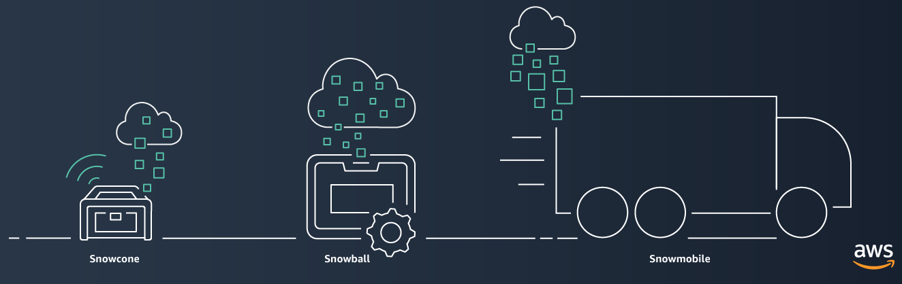
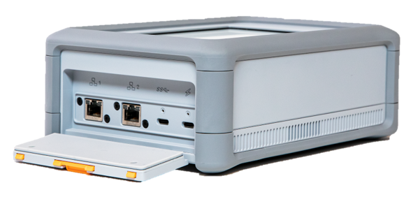
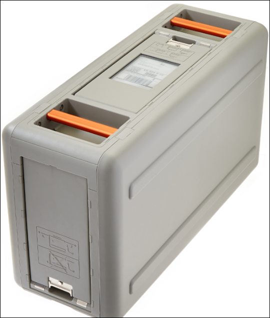
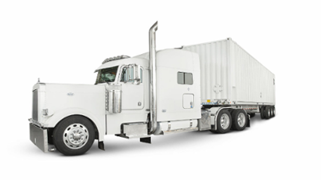

# AWS Snow Family
Beberapa pelanggan memerlukan suatu cara yang dapat mengirimkan data ke AWS dengan cara yang efisien dan cepat. Apakah Anda juga termasuk jenis pelanggan tersebut?

Metode yang biasanya dilakukan adalah melakukan transfer data yang diperlukan melalui internet atau AWS Direct Connect--telah kita bahas di Modul Jaringan. Namun, dengan keterbatasan bandwidth (jumlah maksimum data yang dapat dikirim), secara umum proses tersebut dapat memakan waktu berhari-hari, berminggu-minggu, atau bahkan berbulan-bulan.

Misalnya, untuk memindahkan 1 PB (petabyte) data, koneksi jaringan yang memiliki kecepatan 1 Gbps (gigabit per second) secara teori membutuhkan waktu sekitar 100 hari. Di dunia nyata, itu bisa memakan waktu lebih lama dan bahkan menguras biaya yang besar

Nah, maka dari itu, AWS memperkenalkan perangkat AWS Snow Family. Layanan ini adalah kumpulan perangkat fisik yang dapat membantu Anda untuk memindahkan data sampai dengan ukuran exabyte ke dalam dan keluar AWS.

AWS Snow Family terdiri dari AWS Snowcone, AWS Snowball, dan AWS Snowmobile.

Diambil dari `AWS Snow Family`.

Perangkat-perangkat tersebut menawarkan kapasitas yang berbeda dan sebagian besarnya menyertakan kemampuan komputasi built-in. Perangkat Snow Family juga terintegrasi dengan kemampuan keamanan, pemantauan, dan manajemen penyimpanan AWS.

Oke, sekarang mari kita bedah masing-masing perangkat tersebut.

# AWS Snowcone

Diambil dari AWS Snow Family.

AWS Snowcone merupakan penawaran yang terbaru di AWS Snow Family. AWS Snowcone adalah perangkat yang kecil, kokoh, dan aman.

AWS Snowcone dapat menampung data sampai dengan ukuran 8 TB (terabyte) dan berisi edge computing (sistem komputasi yang dapat melakukan pemrosesan dan analisis data sedekat mungkin ke lokasi yang dibutuhkan).

Perangkat ini memiliki fitur sebagai berikut:

HDD (hard disk drive)  : 8 TB
vCPU (virtual CPU)     : 2 vCPU
Memory                 : 4 GB

Lalu, bagaimana cara Anda untuk mendapatkan perangkat AWS Snowcone? Mudah saja, tahapannya adalah

  1. pesan melalui AWS Management Console;
  2. AWS mengirimkannya kepada Anda;
  3. salin data ke perangkat tersebut; dan
  4. kirimkan kembali kepada AWS.

Saat perangkat tiba di AWS Region, AWS akan menyalin data ke Amazon S3 bucket yang Anda miliki dan boom! Data Anda pun siap untuk digunakan.

Pelanggan AWS biasanya menggunakan perangkat ini untuk mengirimkan informasi yang besarnya dalam jumlah terabyte seperti data analitik, kumpulan video, koleksi gambar, dan bahkan backups (cadangan).

Tetapi, bagaimana jika 8 TB itu tidak cukup? Oh, tenang! AWS memiliki produk yang dapat memenuhi kebutuhan tersebut, yaitu AWS Snowball.

# AWS Snowball

Diambil dari AWS Snowball Edge Developer Guide: Receiving the Snowball Edge.

AWS Snowball hadir dalam 2 versi: Snowball Edge Storage Optimized dan Snowball Edge Compute Optimized. Mari kita kupas keduanya.

  - Snowball Edge Storage Optimized
    Selain berfungsi sebagai penyimpanan (storage) lokal dengan kebutuhan kapasitas yang lebih tinggi, perangkat ini sangat ideal untuk migrasi data berskala besar dan alur kerja transfer yang berulang.

    Berikut adalah fitur yang terdapat pada perangkat jenis ini:
     HDD (Hard Disk Drive)   : 80 TB
     SSD (Solid State Drive) : 1 TB
     vCPU (virtual CPU)      : 40 vCPU
     Memory                  : 80 GB

  - Snowball Edge Compute Optimized
    Jenis ini menyediakan sumber daya komputasi yang kuat untuk kasus penggunaan seperti machine learning, analisis data, pemrosesan, dan penyimpanan lokal.
     HDD (Hard Disk Drive)   : 42 TB
     SSD (Solid State Drive) : 7,68 TB
     vCPU (virtual CPU)      : 52 vCPU
     Memory                  : 208 GB
     GPU                     : NVIDIA V100 (opsional)

# AWS Snowmobile

Diambil dari `AWS Snow Family`.

AWS Snowmobile adalah layanan transfer data dengan skala exabyte yang digunakan untuk memindahkan data dalam jumlah besar ke AWS. Seperti namanya, perangkat ini disimpan di dalam kontainer pengiriman yang kokoh sepanjang 45 kaki dan ditarik oleh truk semi-trailer.

AWS Snowmobile dapat menampung 100 PB (100.000 TB) data, ini membuatnya sangat ideal untuk migrasi secara masif dari data center Anda ke cloud.

Mungkin Anda akan bertanya-tanya, “Bagaimana cara kerjanya?” Oke, begini penjelasannya:

  1. Pertama, AWS mengirimkan truk ke lokasi data center Anda.
  2. Lalu, Personel AWS akan menghubungkannya ke jaringan lokal Anda.
  3. Kemudian, mulailah mentransfer data Anda ke Snowmobile.
  4. Selanjutnya, Snowmobile akan dibawa kembali ke AWS untuk diimpor ke Amazon S3.
  
AWS Snowmobile menggunakan beberapa lapisan keamanan guna melindungi data Anda, di antaranya termasuk personel keamanan khusus, pelacakan GPS, pemantauan alarm, pengawasan video 24/7, dan pengawalan (opsional) dengan kendaraan keamanan pada saat dalam perjalanan.

Catat! Semua perangkat AWS Snow Family dirancang agar aman dan tahan kerusakan saat berada di lokasi Anda atau dalam perjalanan. Semua data yang disimpan akan terenkripsi secara otomatis menggunakan encryption key (kunci enkripsi) 256-bit. Anda dapat mengontrol kunci enkripsi menggunakan layanan AWS Key Management Service (AWS KMS).

Bagaimana? Sudah siap migrasi?