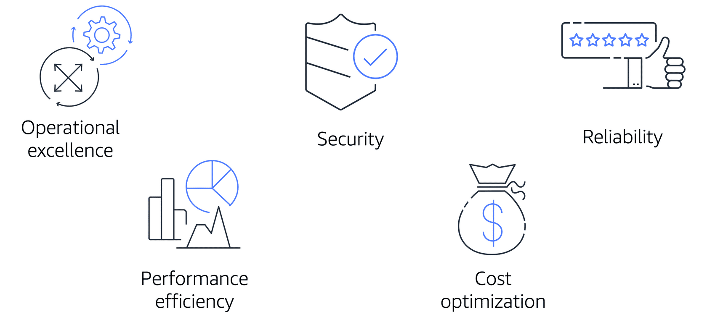
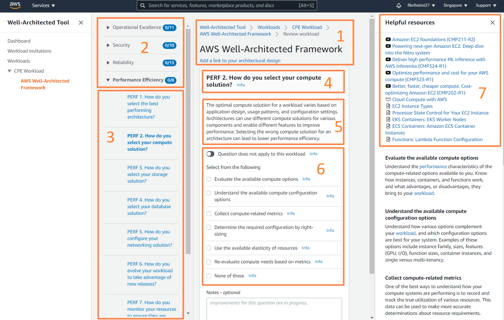
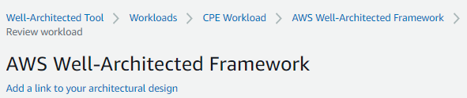
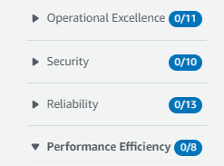
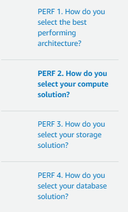
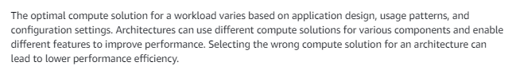
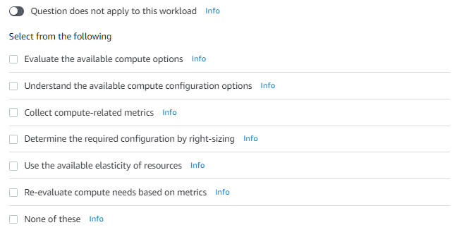
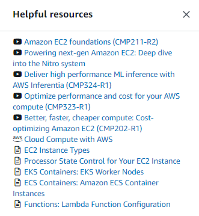

# AWS Well-Architected Framework
AWS Well-Architected Framework dirancang untuk membantu Anda memahami bagaimana cara merancang dan mengoperasikan sistem yang andal, aman, efisien, dan hemat biaya di AWS Cloud.

AWS Well-Architected Framework terdiri dari 5 pilar guna memastikan pendekatan yang konsisten untuk meninjau dan merancang arsitektur.

Diambil dari E-learning AWS Cloud Practitioner Essentials.

Mari kita uraikan 5 pilar tersebut:

  - `Operational Excellence` (Keunggulan Operasional)
    Pilar ini berfokus untuk menjalankan dan memantau sistem guna memberikan nilai bisnis serta terus meningkatkan proses dan prosedur.

    Misalnya, melakukan operation as code (operasi sebagai kode), membuat anotasi dokumentasi, mengantisipasi kegagalan, dan sering memperbaiki prosedur operasi.

  - `Security` (Keamanan)
    Seperti yang telah kita pelajari sebelumnya, keamanan adalah prioritas nomor 1 di AWS. Pilar ini akan melindungi informasi, sistem, dan aset Anda sekaligus memberikan nilai bisnis melalui risk assessment (penilaian risiko) dan strategi mitigasi.

    Saat mempertimbangkan keamanan arsitektur, implementasikan praktik terbaik berikut:
     - Terapkan keamanan di semua lapisan arsitektur Anda.
     - Lakukan automasi terhadap praktik terbaik keamanan.
     - Lindungi data in-transit dan at rest (sudah kita pelajari di Modul Keamanan).

  - `Reliability` (Keandalan)
    Pilar ini mencakup kemampuan sistem untuk memastikan beban kerja melakukan fungsi yang diinginkan dengan benar dan konsisten sesuai harapan.

    Beberapa contohnya adalah seperti berikut:
     - Pemulihan otomatis dari kegagalan infrastruktur atau layanan.
     - Horizontal scaling--telah dibahas pada Modul Komputasi di Cloud--untuk meningkatkan ketersediaan beban kerja.
     - Pengujian prosedur pemulihan.

  - `Performance Efficiency` (Efisiensi Kinerja)
    Pilar ini berfokus pada penggunaan sumber daya IT dan komputasi secara efisien untuk memenuhi kebutuhan.

    Misalnya, menggunakan arsitektur serverless (tanpa server), melakukan eksperimen lebih sering, dan merancang sistem agar dapat mendunia dalam hitungan menit.

  - `Cost Optimization` (Pengoptimalan Biaya)
    Pilar ini berfokus untuk mengontrol ke mana uang dibelanjakan guna menghindari biaya yang tak perlu.

    Misalnya, menerapkan manajemen keuangan cloud, menganalisis pengeluaran, dan menggunakan managed service (layanan terkelola) untuk mengurangi biaya kepemilikan.

Itulah 5 pilar yang dimiliki oleh AWS Well-Architected Framework. Sebelumnya, untuk mengevaluasi pilar-pilar tersebut, Anda perlu meminta bantuan dari seorang Solutions Architect (perancang solusi teknis di AWS Cloud).

Namun, AWS mendengarkan feedback dari pelanggan dan memutuskan untuk merilis alat Framework as a self-service (Framework/Kerangka kerja sebagai layanan mandiri), yakni AWS Well-Architected Tool.

Anda dapat mengakses AWS Well-Architected Tool melalui AWS Management Console. Cara kerjanya pun sederhana, cukup buat workload (beban kerja) dan jalankan di akun AWS Anda. Lalu, layanan ini akan menghasilkan laporan dan menunjukkan area mana saja yang harus Anda tangani.

Sama seperti sistem lampu lalu lintas, Well-Architected Tool akan mengindikasikan hasil evaluasi dengan berbagai warna:

  - Hijau berarti, “Bagus, pertahankan!”
  - Oranye artinya, “Anda mungkin harus melihat ini karena masih ada yang harus diperbaiki.”
  - Merah maksudnya, “Oke, Anda harus melihat ini segera karena ada sesuatu yang berisiko!”

Warna-warna di atas menunjukkan potensi masalah pada area yang dideteksi oleh AWS Well-Architected Tool. Ketiga warna tersebut berisikan rencana tentang cara merancang arsitektur menggunakan praktik terbaik yang telah tersedia.

Oke, agar lebih memperjelas, mari kita tilik gambar berikut:

Gambar di atas adalah tampilan dari layanan Well-Architected Framework. Mari kita jabarkan menurut tiap bagiannya.

 1. `Bagian 1` memperlihatkan nama dari workload (beban kerja) yang kita miliki.
    
 2. `Bagian 2` menunjukkan 5 pilar dari Well-Architected Framework serta menu drop-down yang berisi berbagai pertanyaan--lihat bagian selanjutnya.
    
 3. `Bagian 3` berisi pertanyaan dari setiap pilar Well-Architected Framework. Contoh di bawah ini adalah beberapa pertanyaan dari pilar Performance Efficiency.
    
 4. Bagian 4 adalah pilar dan inti pertanyaan.
    
 5. Bagian 5 menunjukkan sedikit latar belakang dan rekomendasi.
    
 6. Bagian 6 berisi pilihan yang bisa Anda centang/jawab terkait dengan pertanyaan. Bagian ini cukup penting karena dapat memengaruhi skor Anda secara keseluruhan.

    Di bagian ini hadir juga tombol yang dapat mengesampingkan pertanyaan jika memang tidak berlaku atau tak bisa diterapkan untuk beban kerja Anda.
	
 7. Terakhir, Bagian 7 menyajikan video pendek seputar cara untuk menjawab pertanyaan tertentu.
    

Oke, itulah pembahasan kali ini tentang AWS Well-Architected Framework dan AWS Well-Architected Tool. Semoga Anda menikmati belajar bagaimana cara untuk mengevaluasi beban kerja. Sampai bertemu di modul berikutnya!