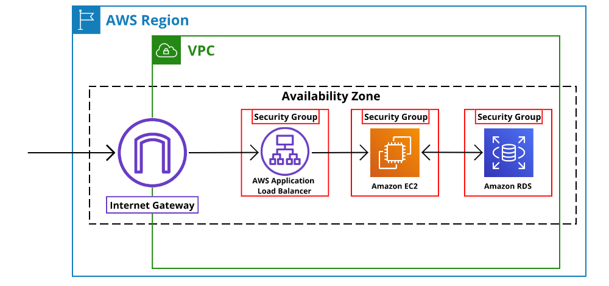
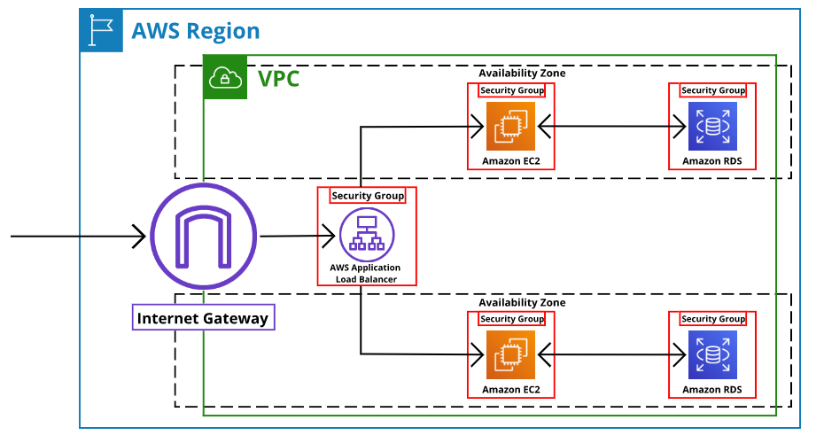

# Pengantar
Dalam modul ini, Anda akan mempelajari beberapa materi, di antaranya:

  - Lima pilar Well-Architected Framework.
  - Enam manfaat komputasi cloud.

Penasaran seperti apa penjelasannya? Yuk kita melangkah ke materi berikutnya!

# Pengenalan ke Perjalanan Cloud
Bagaimana perjalanan Anda dalam menempuh materi-materi di kelas ini? Semoga aman dan mulus ya.

Sejauh ini, kita telah menelaah berbagai layanan AWS. Setiap layanan tersebut dapat menjadi esensi untuk solusi yang akan Anda bangun di AWS.

Selain itu, ada berbagai arsitektur yang bisa Anda buat untuk menyelesaikan beragam masalah. Anda bisa membuatnya dengan cara yang sederhana atau kompleks sekali pun.

Oke, memiliki banyak pilihan memang menarik, tetapi bagaimana cara mengetahui bahwa arsitektur yang dibuat itu bagus?

Untuk menjawabnya, silakan tinjau arsitektur sederhana berikut:

Apakah arsitektur di atas terlihat bagus? Mari kita bedah. Gambar di atas adalah contoh dari three-tier architecture atau arsitektur tiga tingkat. Kita memiliki load balancer, instance, dan database.

Apakah Anda bisa menemukan kekurangannya di mana? Oke, coba jawab pertanyaan berikut, “Bagaimana jika Availability Zone (AZ) yang menopang aplikasi Anda mengalami masalah?”

Yup! Mungkin sekarang Anda akan mengangguk-angguk. Dengan arsitektur tersebut, aplikasi Anda bisa berhenti atau tak tersedia jika AZ mengalami masalah.

Terus, bagaimana dong solusinya? Jawabannya ada di arsitektur berikut:

Berbeda dengan arsitektur sebelumnya, sekarang sumber daya telah tereplikasi di seluruh AZ yang mana ini sangat penting untuk menjaga keandalan. Kini, jika salah satu AZ mengalami masalah, aplikasi Anda akan tetap aktif dan berjalan di AZ kedua.

Nah, dari uraian di atas dapat kita ambil pelajaran bahwa menemukan kekurangan pada arsitektur adalah hal yang penting.

Tapi, ingat! Faktanya, Anda akan menghadapi kasus yang tak sesederhana contoh di atas. Untungnya, AWS menghadirkan alat yang dapat membantu Anda untuk membuat arsitektur terbaik, yakni AWS Well-Architected Framework.

AWS Well-Architected Framework adalah layanan untuk mengevaluasi arsitektur yang Anda bangun terhadap keunggulan pada beberapa kategori atau disebut dengan pilar, di antaranya:

  - Operational Excellence (Keunggulan Operasional)
  - Security (Keamanan)
  - Reliability (Keandalan)
  - Performance Efficiency (Efisiensi Kinerja)
  - Cost Optimization (Pengoptimalan Biaya)
  
Simpan dulu kopi dan cemilan Anda karena pada materi berikutnya kita akan membahas sesuatu yang cukup serius.