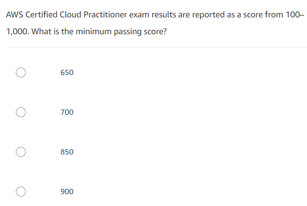
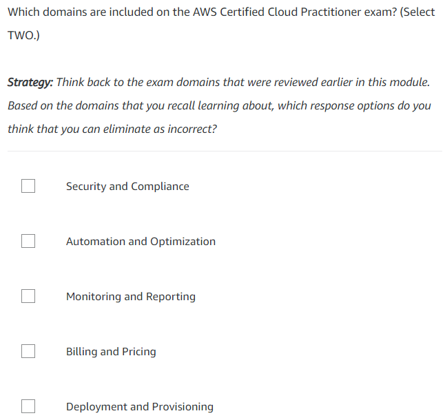

# Strategi Menghadapi Ujian
Sekarang kita akan membahas beberapa strategi yang dapat membantu Anda dalam meraih kelulusan ujian. Simak uraian berikut:

  - Baca pertanyaan secara lengkap
    Pastikan Anda membaca setiap pertanyaan secara lengkap. Jika Anda membacanya secara terburu-buru atau tidak utuh, kemungkinan akan ada kata kunci atau frase yang tidak terbaca. Sehingga, membuat Anda memilih opsi jawaban yang salah.

  - Prediksikan jawabannya sebelum meninjau pilihan jawaban
    Cobalah untuk memprediksi jawaban yang benar terlebih dahulu sebelum melihat pilihan jawabannya.

    Strategi ini membantu Anda untuk mengasah langsung pengetahuan dan keterampilan tanpa harus terganggu dengan pilihan jawaban yang salah.

    Jika prediksi Anda ternyata ada di salah satu opsi jawaban tersebut, maka pilihlah. Namun, untuk lebih memastikan, Anda juga perlu meninjau opsi jawaban yang lain.

  - Hilangkan opsi jawaban yang salah
    Sebelum memilih jawaban atas suatu pertanyaan, hilangkan opsi jawaban yang Anda yakini salah.

    Strategi ini membantu Anda untuk fokus pada opsi yang benar (atau opsi, untuk pertanyaan dengan banyak respons) dan memastikan bahwa Anda telah memenuhi semua persyaratan pertanyaan.

# Contoh Pertanyaan
Seperti yang telah disebutkan sebelumnya, ujian AWS Certified Cloud Practitioner akan berisi 2 tipe soal, yakni multiple choice (pilihan ganda) dan multiple response (jawaban ganda).

Nah, untuk memperjelas perbedaan di antara keduanya, silakan amati dua gambar berikut:

## Multiple choice

Diambil dari `E-learning AWS Cloud Practitioner Essentials`.

Multiple response

Diambil dari `E-learning AWS Cloud Practitioner Essentials`.

Bagaimana? Sudah jelas kan perbedaan kedua tipe soal tersebut?

Sekarang, untuk mengetes kemampuan Anda dalam menghadapi ujian AWS Certified Cloud Practitioner, silakan tinjau beberapa contoh pertanyaan ujian beserta detail penjelasannya di tautan AWS Certified Cloud Practitioner (CLF-C01) Sample Exam Questions.

1) Why is AWS more economical than traditional data centers for applications with varying compute
workloads?
  A) Amazon EC2 costs are billed on a monthly basis.
  B) Users retain full administrative access to their Amazon EC2 instances.
  C) Amazon EC2 instances can be launched on demand when needed.
  D) Users can permanently run enough instances to handle peak workloads.

2) Which AWS service would simplify the migration of a database to AWS?
  A) AWS Storage Gateway
  B) AWS Database Migration Service (AWS DMS)
  C) Amazon EC2
  D) Amazon AppStream 2.0

3) Which AWS offering enables users to find, buy, and immediately start using software solutions in their
AWS environment?
  A) AWS Config
  B) AWS OpsWorks
  C) AWS SDK
  D) AWS Marketplace

4) Which AWS networking service enables a company to create a virtual network within AWS?
  A) AWS Config
  B) Amazon Route 53
  C) AWS Direct Connect
  D) Amazon Virtual Private Cloud (Amazon VPC)

5) Which of the following is an AWS responsibility under the AWS shared responsibility model?
  A) Configuring third-party applications
  B) Maintaining physical hardware
  C) Securing application access and data
  D) Managing guest operating systems

6) Which component of the AWS global infrastructure does Amazon CloudFront use to ensure low-latency
delivery?
  A) AWS Regions
  B) Edge locations
  C) Availability Zones
  D) Virtual Private Cloud (VPC)

7) How would a system administrator add an additional layer of login security to a user's AWS
Management Console?
  A) Use Amazon Cloud Directory
  B) Audit AWS Identity and Access Management (IAM) roles
  C) Enable multi-factor authentication
  D) Enable AWS CloudTrail

8) Which service can identify the user that made the API call when an Amazon EC2 instance is
terminated?
  A) AWS Trusted Advisor
  B) AWS CloudTrail
  C) AWS X-Ray
  D) AWS Identity and Access Management (AWS IAM)

9) Which service would be used to send alerts based on Amazon CloudWatch alarms?
  A) Amazon Simple Notification Service (Amazon SNS)
  B) AWS CloudTrail
  C) AWS Trusted Advisor
  D) Amazon Route 53

10) Where can a user find information about prohibited actions on the AWS infrastructure?
  A) AWS Trusted Advisor
  B) AWS Identity and Access Management (IAM)
  C) AWS Billing Console
  D) AWS Acceptable Use Policy

Answers
1) C – The ability to launch instances on demand when needed allows users to launch and terminate instances in
response to a varying workload. This is a more economical practice than purchasing enough on-premises servers
to handle the peak load.
2) B – AWS DMS helps users migrate databases to AWS quickly and securely. The source database remains
fully operational during the migration, minimizing downtime to applications that rely on the database. AWS DMS
can migrate data to and from most widely used commercial and open-source databases.
3) D – AWS Marketplace is a digital catalog with thousands of software listings from independent software
vendors that makes it easy to find, test, buy, and deploy software that runs on AWS.
4) D – Amazon VPC lets users provision a logically isolated section of the AWS Cloud where users can launch
AWS resources in a virtual network that they define.
5) B – Maintaining physical hardware is an AWS responsibility under the AWS shared responsibility model.
6) B – To deliver content to users with lower latency, Amazon CloudFront uses a global network of points of
presence (edge locations and regional edge caches) worldwide.
7) C – Multi-factor authentication (MFA) is a simple best practice that adds an extra layer of protection on top of a
username and password. With MFA enabled, when a user signs in to an AWS Management Console, they will be
prompted for their username and password (the first factor—what they know), as well as for an authentication
code from their MFA device (the second factor—what they have). Taken together, these multiple factors provide
increased security for AWS account settings and resources.
8) B – AWS CloudTrail helps users enable governance, compliance, and operational and risk auditing of their
AWS accounts. Actions taken by a user, role, or an AWS service are recorded as events in CloudTrail. Events
include actions taken in the AWS Management Console, AWS Command Line Interface (CLI), and AWS SDKs
and APIs.
9) A – Amazon SNS and Amazon CloudWatch are integrated so users can collect, view, and analyze metrics for
every active SNS. Once users have configured CloudWatch for Amazon SNS, they can gain better insight into the
performance of their Amazon SNS topics, push notifications, and SMS deliveries.
10) D – The AWS Acceptable Use Policy provides information regarding prohibited actions on the AWS
infrastructure.