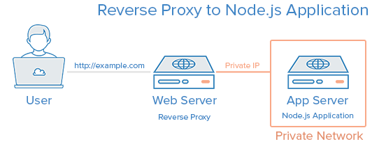

Introduction
Node.js is an open source Javascript runtime environment for easily building server-side and networking applications. The platform runs on Linux, OS X, FreeBSD, and Windows, and its applications are written in JavaScript. Node.js applications can be run at the command line but we will teach you how to run them as a service, so they will automatically restart on reboot or failure, so you can use them in a production environment.

In this tutorial, we will cover setting up a production-ready Node.js environment that is composed of two CentOS 7 servers; one server will run Node.js applications managed by PM2, while the other will provide users with access to the application through an Nginx reverse proxy to the application server.

The Ubuntu version of this tutorial can be found here.

Prerequisites
This guide uses two CentOS 7 servers with private networking (in the same datacenter). Private networking can be configured on new servers when they are being created (in the Select additional options section). We will refer to them by the following names:

app: The server where we will install Node.js runtime, your Node.js application, and PM2.
web: The server where we will install the Nginx web server, which will act as a reverse proxy to your application. Users will access this server’s public IP address to get to your Node.js application.
Note: Refer to the DigitalOcean Documentation - How to Enable Private Networking on Droplets if you intend on using an existing server that doesn’t currently have private networking configured.

Before you begin this guide, you should have a regular, non-root user with sudo privileges configured on both of your servers—this is the user that you should log in to your servers as. You can learn how to configure a regular user account by following our initial server setup guide for CentOS 7.

Commands executed on the app server:

an_example_command_on_app
 
Commands executed on the web server:

an_example_command_on_web
 
It is possible to use a single server for this tutorial, but you will have to make a few changes along the way. Simply use the localhost IP address, i.e. 127.0.0.1, wherever the app server’s private IP address is used.

Here is a diagram of what your setup will be after following this tutorial:
 
Reverse Proxy to Node.js Application

If you want to be able to access your web server via a domain name, instead of its public IP address, purchase a domain name then follow these tutorials:

How To Set Up a Host Name with DigitalOcean
How to Point to DigitalOcean Nameservers From Common Domain Registrars
Let’s get started by installing the Node.js runtime on the app server.