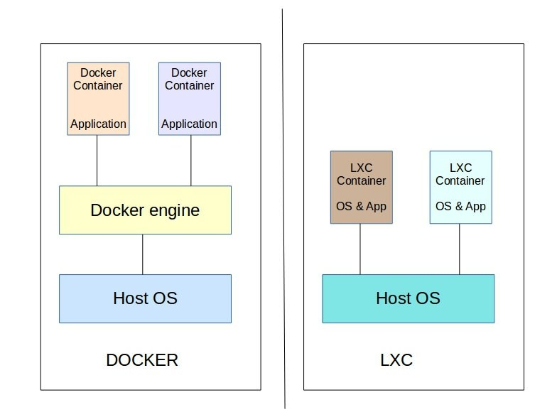

## Perbedaan Docker vs LXC



Gambar Perbedan Arsitektur Docker vs LXC 

## Activasi LXD
## Pemberian Hak Akses LXD ke User
```
sudo gpasswd -a username lxd
```
cek
```
getent group lxd
```
## Setup LXD
```
lxd init
```
## Cek Versi
```
lxd --version
```
```
lxc --version
```
## Bantuan Perintah
```
lxd help
```
```
lxc help
```
## Melihat Storage List
```
lxc storage list
```
## Repository LXC
```
lxc remote list
```
## Melihat image/os list lokal
```
lxc image list
```
## Melihat image/os list online
```
lxc image list images:
```
## Membuat Container
```
lxc launch images:ubuntu/18.04 namacontainer
```
## List Container
```
lxc list
```
## Stop Container
```
lxc stop namacontainer
```
## Start Container
```
lxc start namacontainer
```
## Hapus Container
```
lxc delete namacontainer
```
## Copy Container
```
lxc copy namacontainer copy-namecontainer
```
## Rename Container
```
lxc rename namacontainer
```
## Masuk ke Container via root
```
lxc exec namacontainer bash
```
## Masuk ke Container via user
```
lxc exec namacontainer su ~ ubuntu
```
## Menampilkan Info
```
lxc info namacontainer
```
## Membuat limitasi
```
lxc config set namacontainer limits.memory 512MB
```
## Menampilkan Profile
```
lxc profile list
lxc profile show default
```
## Meng-copy profile
```
lxc profile copy default p2
```
## Edit konfigurasi profile
```
lxc profile edit p2
```
## Pembuatan Container dengan profile
```
lxc launch ubuntu:18.04 c1 --profile p2
```
## Cara membuat file
```
lxc file push namefile nanacontainer/home/ubuntu
```
## Membuat dan Restore snapshot
```
lxc snapshot namecontainer s1
```
restore
```
lxc restore namecontainer s1
```